# 교차 엔트로피
## 엔트로피
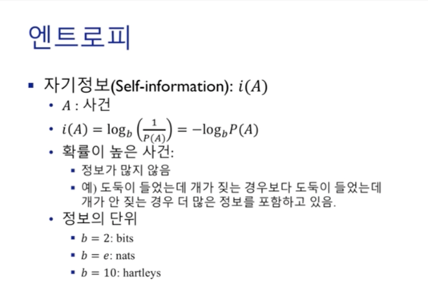
엔트로피를 파악하기 위해서는 자기 자신(사건)에 대한 정보를 파악해야 한다.
i(A)는 -log_{b}{P(A)}로 정의된다. P(A)는 0과 1사이 값이므로 결국에는 i(A)는 양수가 된다.
P(A)가 클수록 1에 근접하기 때문에 자기 자신의 정보는 작아지게 된다. (정보가 많지 않음) (확률과 정보는 반비례)  
위 예에서 도둑이 보통 들게되면 개가 짖는데 짖지않는 경우 일반적이지 않은 사건이므로 더 많은 정보를 포함한다. (이를테면 도둑이 가족이라든지..)
통상 정보의 단위는 비트로 생각한다.  

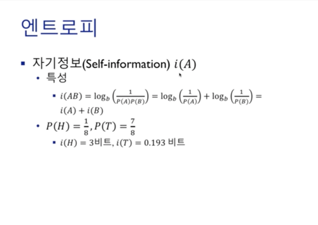  
(사건 A와 B는 독립) A와 B가 동시에 일어났을 때의 정보는 각 사건에 대한 정보의 합과 동일하다.  
동전을 던질때 만약 앞면이 나올 확률이 1/8, 뒷면이 나올 확률이 7/8이라고 가정하자.
그 경우 각 사건이 포함하는 정보의 양은, log_{2}{8} = 3bit, log_{2}{8/7} = 0.193bit가 된다.  

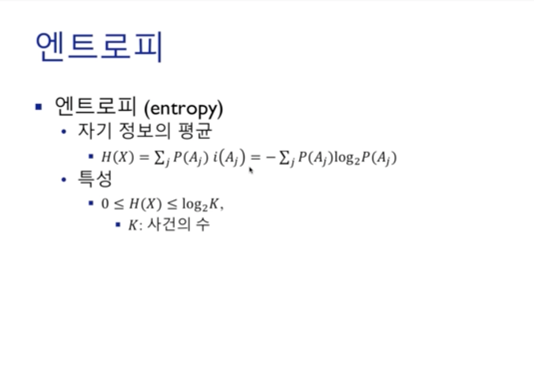  
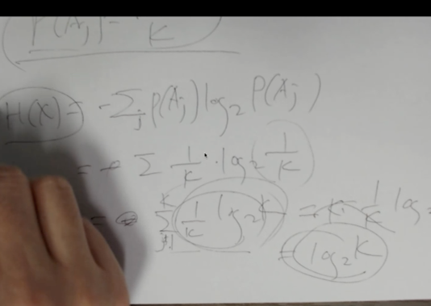  
  
엔트로피는 각각의 사건의 확률과 정보량 곱의 합으로 정의된다.
모든 사건의 확률이 1일 경우 i(Aj)는 0이 되므로 엔트로피는 0부터 
사건 K개의 모든 확률이 동일할 때에는 log_{2}{K}로 최대가 된다.  

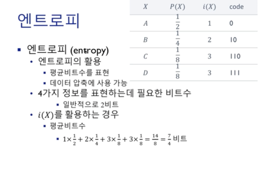  
예를 들어 문자 4개가 있다고 가정한다.
각각의 문자가 나오는 빈도수는 1/2, 1/4, 1/8, 1/8이라고 하자.
그리고 각각의 정보량을 계산하면 -log_{2}{1/2}=1bit, -log_{2}{1/4}=2bit, -log_{2}{1/8}=3bit, -log_{2}{1/8}=3bit 이 된다.
**이 정보량을 통해 각각의 문자는 1bit, 2bit, 3bit, 3bit만 사용하는 것이 최적이라는 결과를 도출한다.**  
이 경우 평균적으로 사용되는 비트수는 각 정보량과 해당 사건에 대한 확률들을 곱한 합을 계산하면 된다.

## 교차 엔트로피
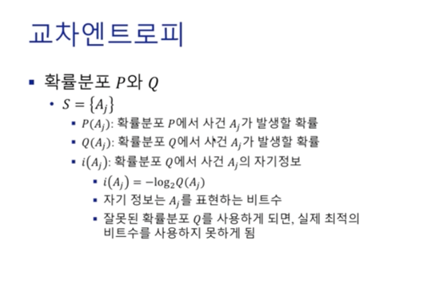  
사건 집합 S에서 각 사건에 대해 P(정확한 확률분포)와 Q 분포를 사용했을 때 정확한 확률분포를 사용하지 않으면 최적의 결과에 도달할 수 있다.  

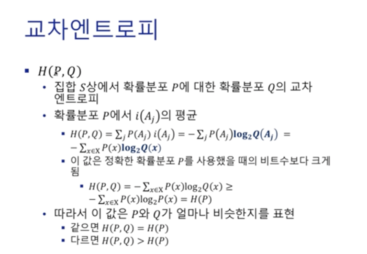  
확률분포 P에서의 i(Aj)의 평균을 의미한다. 여기서 중요한 점은 **i(Aj)는 확률분포 Q**를 사용한 정보량을 의미한다.
그리고 교차 엔트로피는 두 확률분포의 유사도를 보기 때문에 확률분포 P와 Q가 다를수록 교차 엔트로피는 증가한다.  

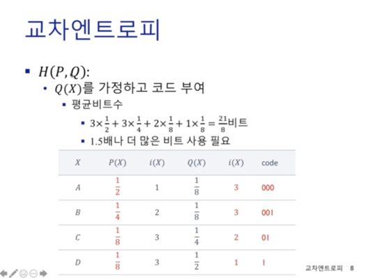  
  
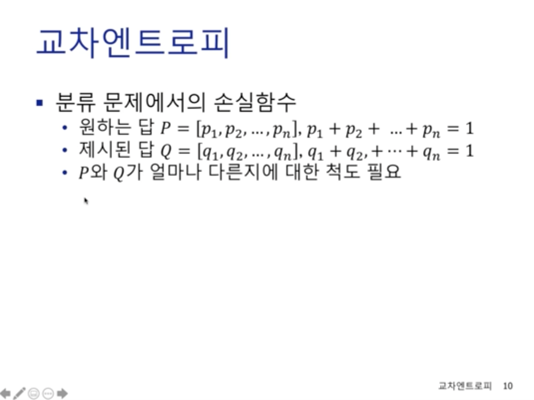  
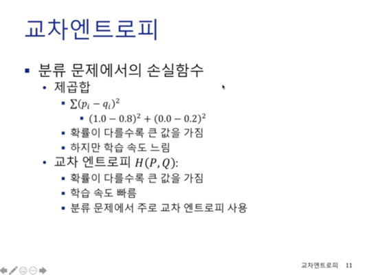  
제곱합 (sum of square)은 학습 속도가 느리다. 왜? ..  

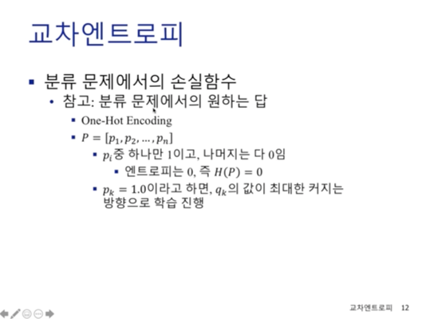  
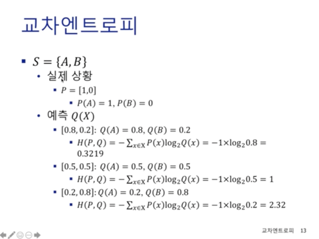  

