# 선형시스템 이론 및 실습
## 선형시스템 소개
우리가 초중등과정에서 배운 다항함수나 (미지수를 소거하는)연립방정식같은 개념들은 결국 선형시스템 안에 속한다. 
단지 미지수의 개수가 적을 뿐이다. 우리의 궁극적인 목적은 미지수의 갯수가 많을 경우 선형시스템을
사용하여 해를 구하는 것이다. 이러한 방법은 **가우스 소거법**을 통해 아무리 미지수가 많아도 시스템적으로 해결할 수 있는 
로직이 있다.  

선형대수의 목적은 어떤 연립일차방정식, 즉 **선형시스템을 정형적인 방법으로 표현하고 해결하는 방법**을 배우는 것이다.  


## 선형시스템의 구성요소
다음과 같은 **선형시스템**(linear system)이 있다고 가정해보자.  
```
3x + y + z = 4
x - 2y - z = 1
x + y + z = 2
```
이때 각각의 방정식들을 **선형방정식**(linear equation)이라고 한다. 즉, 선형시스템은 여러개의 선형방정식들로 구성된 것이다.  

그리고 우리가 이 선형시스템에서 알아내기 위한 미지수 x, y, z가 있다. 이 미지수들은 **unknown 혹은 variable** 이라고 한다.  

3개의 linear equation 과 3개의 unknown 으로 구성된 것을 3 x 3 linear system 이라고 표현한다.  

```
ex)
1 x 2 linear system)
3x + y + z = 4
x - 2y - z = 1

1 x 2 linear system)
2x + y = 3

3 x 2 linear system)
3x + y = 2
x - 2y = 3
2x - 4y = 6

non linear equation)
sin(x) + y = 2

non linear equation)
3x + y^3 = 2

non linear equation)
xy + z = 3
위의 방정식의 xy항(쌍곡선)은 실제로 미지수로 따지면 2승에 해당하기 때문에 비선형방정식이다.
```
## 선형시스템의 표현 (연립일차방정식의 대수적 표현)
대수적인 표현은 **Ax = b** 형태로 표현하는 것을 의미한다.  
```
3x + y = 2
x - 2y = 3
2x - 4y = 6
```
다음과 같은 3 x 2 linear system 이 있다고 가정해보자. 대수적 표현을 하기 위해서는 우선
1. linear system 의 unknown 들을 모아 **column vector(x)** 로 표현한다. **미지수벡터**라고도 한다.
2. 각 linear equation 의 coefficients(계수)들을 모아 **row vector(A)** 로 표현한다. **계수행렬**이라고도 한다.
3. constant(상수)들을 모아 **b** 로 표현한다. **상수벡터**라고도 한다.  

```
linear system의 대수적 표현)

|3  1|  |x|   |2|
|1 -1|      = |3|
|2 -4|  |y|   |6|

  A      x  =  b
```

## 선형시스템의 해 구하기
선형시스템을 대수적으로 표현할 경우 Ax = b 형태로 표현할 수 있다. 이 경우 각 요소는 수가 아닌 
행렬의 형태를 지니고 있다. 우리가 알고자 하는 것은 미지수 형태인 x 벡터이다. 고로, 양변에 계수행렬의 역행렬인
A^-1을 곱하면 된다.  
```
Ax = b
A^-1 * A * x = A^-1 * b
x = A^-1 * b
(*는 행렬곱을 의미한다.)
```

# 선형시스템의 해 구하기 (가우스 소거법 - Gauss Elimination)
## 선형시스템의 해
선형시스템의 해의 경우는 크게 3가지로 분류된다.  
1. 해가 하나일 경우 (unique solution)  
   eg) 3x = 6
2. 해가 존재하지 않는 경우 (no solution)  
   eg) 0x = 6
3. 해가 여러개인 경 (infinitely many solutions)  
   eg) 0x = 0
   
2번과 3번같이 a가 0일 경우 **특이**(**singular**)하다고 표현한다. a에 대한 역수가 존재하지 않기 때문이다.  

해가 존재하는 경우는 linear system 이  **consistent** 하다 표현하고, 존재하지 않으면 **inconsistent** 하다고 표현한다.

행렬도 위와 마찬가지이다.  
```
해가 하나인 경우(consistant)

|1  3| |x1|   |2|
|    | |  | = | |
|-2 1| |x2|   |3|

해가 없는 경우(inconsistant) & 역행렬이 존재하지 않음(singular)

|1 3| |x1|   |2|
|   | |  | = | |
|2 6| |x2|   |5|

해가 여러개인 경우(consistant) & 역행렬이 존재하지 않음(singular)

|1 3| |x1|   |2|
|   | |  | = | |
|2 6| |x2|   |4|
```

## 가우스 소거법 (Gauss Elimination)
가우스 소거법은 m x n linear system 의 해를 구하는 대표적인 방법이다. 가우스 소거법은 다음 두 단계로 진행된다.
1. 전방소거법 (Forward elimination) : 주어진 선형시스템을 아래로 갈수록 더 단순한 형태의 선형방정식을 가지도록 변형한다.  

우리가 선형시스템에서 해를 바로 구하지 못하는 이유는 계수행렬의 수가 너무 많기 때문이다. 그래서 그 수를 Forward 방향으로 줄이는 것이 목표이다.
Forward 방향은 기본적으로 **계수행렬의 위에서 아래방향, 왼쪽에서 오른쪽 방향**으로 정의한다.
그럼 다음과 같은 형태의 linear system 을 볼 수 있을 것이다.  
```
|?1 ?2 ?3| |x1|   |?a|
|0  ?4 ?5| |x2| = |?b|
|0   0 ?6| |x3|   |?c|
```
전방소거법을 마친 상태에서 가장 아래의 선형방정식을 확인해보면 ?6 * x3 = ?c 형태의 아주 간단한 방정식이 되어있을 것이다.


2. 후방대입법 (Back-substitution) : 아래서부터 위로 미지수를 실제 값으로 대체한다.
```
|?1 ?2 ?3| |x1|   |?a|
|0  ?4 ?5| |x2| = |?b|
|0   0 ?6| |x3|   |?c|
```
(?1 ~ ?6, ?a ~ ?c 는 전부 상수라 가정)  
다음과 같은 linear system 이 있을 때 최하단의 linear equation 을 통해 x3를 구하는 것은 아주 쉬운 일이다.
그 위의 linear equation 에 x3를 대입하면 x2 또한 쉽게 구할 수 있다. 마찬가지로 최상단의
linear equation 에 앞서 구한 x2와 x3를 대입하면 x1도 쉽게 구할 수 있다.

### 기본행연산 (ERO - Elementary Row Operations)
전방소거법은 **기본행연산**을 기반으로 하고 있다.  

  

1. Interchange (교환)
2. Scaling (스케일링)
3. Replacement (치환)

### 전방소거법 예시

```
|1 2  1| |x1|   | 1| -> r1
|1 2  3| |x2| = | 3| -> r2
|2 3 -1| |x3|   |-3| -> r3
```
다음과 같은 linear system이 있다고 가정할 때, 전방소거법을 먼저 진행해보자.
우선 우리는 **주대각이 1이고, 그 아래의 수는 0**으로 바꾸어 역삼각형 형태의 행렬을 만드는 것이 목적이다.
2번 행(r2)에서 1번 행(r1)을 빼면 다음과 같은 형태로 변할 것이다.

```
<< R12(-1) :  r2 = r2 - r1 >>

|1 2  1| |x1|   | 1|
|0 0  2| |x2| = | 2|
|2 3 -1| |x3|   |-3|
```
이로써 주대각선의 첫 번째 요소에 해당하는 (1, 1)요소의 값을 1로, 그 밑의 (1, 2)요소의 값을 0으로 바꾸었다.
(1, 3)요소의 값을 0으로 바꿀 차례이다.
r3에서 r1에 2를 곱하여 빼면 (1, 3)요소가 0으로 소거될 것이다.

```
<< R13(-2) : r3 = r3 - 2*r1 >>

|1  2  1| |x1|   | 1|
|0  0  2| |x2| = | 2|
|0 -1 -3| |x3|   |-5|
```
그러나 지금 주대각선의 두 번째 요소인 (1, 2)요소가 0이므로 값을 존재하게 하기 위해 r2와 r3의 자리를 바꾼다.

```
<< R23 : r2 <-> r3 >>

|1  2  1| |x1|   | 1|
|0 -1 -3| |x2| = |-5|
|0  0  2| |x3|   | 2|
```
주대각선의 두 번째 요소(1, 2)를 1로 맞추기 위해 r2에 -1을 곱한다.

```
<< R2(-1) : r2 = r2 * (-1) >>

|1  2  1| |x1|   |1|
|0  1  3| |x2| = |5|
|0  0  2| |x3|   |2|
```
주대각선의 세 번째 요소(1, 3)를 1로 맞추기 위해 r3에 (1/2)를 곱한다.

```
<< R3(1/2) : r3 = r3 * (1/2) >>

|1  2  1| |x1|   |1|
|0  1  3| |x2| = |5|
|0  0  1| |x3|   |1|
```
계수행렬(row vector)이 상삼각형태(upper triangular form)로 변형된 모습다. 

### 후방대입법 예시
```
|1  2  1| |x1|   |1|
|0  1  3| |x2| = |5|
|0  0  1| |x3|   |1|
```
전방소거법을 통해 다음과 같은 형태의 계수행렬(row vector)을 만들었다. 이제 unknown에 실제 상수를 대입하는 과정이다.
r3를 보면 x3 = 1인 것을 바로 알 수 있기 때문에 미지수벡터(column vector)의 x3에 대입한다.  

```
|1  2  1| |x1|   |1|
|0  1  3| |x2| = |5|
|0  0  1| | 1|   |1|
```
r2 = x2 + 3 = 5 이므로 x2는 2임을 바로 알 수 있다.  

```
|1  2  1| |x1|   |1|
|0  1  3| | 2| = |5|
|0  0  1| | 1|   |1|
```
r3 = x1 + 4 + 1 = 1 이므로 x1은 -4임을 바로 알 수 있다.

```
|1  2  1| |-4|   |1|
|0  1  3| | 2| = |5|
|0  0  1| | 1|   |1|
```
최종적으로 column vector를 구한 상태이다.  

### 전방소거법의 가치
1. 주어진 linear system 을 가장 풀기 쉬운 형태로 변형해준다.
2. 주어진 linear system 의 rank 를 알려준다.
3. linear system 에 해가 있는지 (consistent) 없는지 (inconsistent) 알려준다.

#### Rank
전방소거법(forward elimination)을 마친 row vector 가 0으로 이루어진 row를 제외한 row의 갯수이다.
이것이 필요한 이유는?  

예를 들어보자.
```
rank = 2)

| 1 3| |x1|   |2|  forward elimination  | 1 3| |x1|   |2|
|    | |  | = | |  -------------------> |    | |  | = | |
|-2 1| |x2|   |3|                       | 0 1| |x2|   |1|
```

```
rank = 1)

|1 3| |x1|   |2|  forward elimination  | 1 3| |x1|   |2|
|   | |  | = | |  -------------------> |    | |  | = | |
|2 6| |x2|   |4|                       | 0 0| |x2|   |0|
```
두 linear system 모두 2개의 linear equation 과 2개의 unknown 이 존재하기 때문에
2 by 2 linear system 이다. 하지만 두 번째 linear system 을 forward elimination 한
결과 첫 번째 linear equation 을 두 배하면 두 번째 linear equation 이 나오므로 **실질적으로 
하나의 linear equation 이 존재**하는 것이나 다름없다. 이 경우 rank 가 1이라고 정의한 것이다.

#### Notice Consistent / Inconsistent
```
Consistent)

|1 3| |x1|   |2|  forward elimination  | 1 3| |x1|   |2|
|   | |  | = | |  -------------------> |    | |  | = | |
|2 6| |x2|   |4|                       | 0 0| |x2|   |0|
```
forward elimination 을 마친 마치막 linear equation 을 보면
0x1 + 0x2 = 0 인 것을 알 수 있다. 이는 어떠한 x1, x2를 대입하여도
만족하다는 의미이기 때문에 해가 무수히 많을 뿐 존재한다는 것을 알 수 있다.

```
Inconsistent)

|1 3| |x1|   |2|  forward elimination  | 1 3| |x1|   |2|
|   | |  | = | |  -------------------> |    | |  | = | |
|2 6| |x2|   |5|                       | 0 0| |x2|   |1|
```
반면 forward elimination 을 마친 마치막 linear equation 을 보면
0x1 + 0x2 = 1 다. 이는 어떠한 x1, x2를 대입하여도
만족할 수 없는 의미이기 때문에 해가 존재하지 않는다는 것을 알 수 있다.  

# LU 분해 (LU Decomposition)
## LU 분해의 정의
LU 분해는 **Gauss Elimination 을 행렬이라는 자료구조로 표현한 것**을 의미한다.
숫자는 인수분해가 가능하다. 행렬도 숫자와 마찬가지로 분해가 가능하다. 행렬을 분해하는 방법에는 대표적으로 세 가지가 있다.
* LU Decomposition
* QR Decomposition
* SVD (Singular Value Decomposition) : 특이값 분해  

QR Decomposition과 SVD는 직교분할과 관련이 있다.  

LU 분해는 인수분해를 하듯 **Lower triangular matrix**와 **Upper triangular matrix**의 곱으로 분해하는 것이다.  
```
|* * *| LU Decomposition  |* 0 0| |* * *|
|* * *| ----------------> |* * 0| |0 * *|
|* * *|                   |* * *| |0 0 *|
                             L       U
```
이 과정은 실제로 Gauss Elimination의 Forward Elimination과 밀접한 관련이 있다. 
Upper triangular matrix는 **Forward Elimination의 결과물**에 해당하고, 
Lower triangular matrix는 **Forward Elimination을 수행하는 과정**을 행렬로써 표현한 것이다.  

## LU 분해의 장점
**Ax = b** 형태의 linear system이 있다고 가정해보자. 우리의 궁극적인 목표는 *x를 구하는 것*이다.  

A row vector를 LU Decomposition이 가능하다고 가정하면,
**LUx = b** 과 같은 형태로 표현할 수 있다. 결합법칙을 적용하여 **L(Ux) = b**로 표현할 수 있다. Ux를 하나의 벡터 y로 가정하면
**Ly = b**로 정의할 수 있다.  

```
(b는 상수로 이루어진 벡터)

Ax = b
|* * *| |x1|   |b1|
|* * *| |x2| = |b2|
|* * *| |x3|   |b3|

LUx = b
|* * *| LU Decomposition  |* 0 0| |* * *|
|* * *| ----------------> |* * 0| |0 * *|
|* * *|                   |* * *| |0 0 *|
                             L       U

단, Ux = y
|* * *| |x1|   |y1|
|0 * *| |x2| = |y2|
|0 0 *| |x3|   |y3|
              
L(Ux) = b  -> Ly = b
|* 0 0| |y1|   |b1|
|* * 0| |y2| = |b2|
|* * *| |y3|   |b3|
```
위 행렬을 보면 알 수 있듯이 Ly = b 형태를 이용하면, **전방대치법(Forward-substitution)을 통해 y 벡터**를 구할 수 있다.
그리고, **y 벡터를 Ux = y에 실제값으로써 대입하면 x 벡터**도 쉽게 구할 수 있다.  

## LU 분해의 의미
* L : A row vector를 전방소거하는데 쓰인 **replacement와 scaling에 대한 EROs**를 기록한 행렬
* U : A row vector를 전방소거 한 후 남은 **upper triangular matrix**
* P(Permutation) : A row vector를 전방소거하는데 쓰인 **interchange에 대한 EROs**를 기록한 행렬 (Optional)

## LU 분해의 활용
* 수치적 안정성 : 선형시스템 Ax = b의 해를 A^-1을 통해 직접 구하는 것 보다 PLU분해를 사용하는 것이 수치적으로 안정적이다.
* b가 자주 업데이트되는 경우 : 선형시스템 Ax = b에서 A는 고정되어 있고 b가 업데이트되는 경우가 자주 있다.
이런 경우 행렬 A를 PLU로 미리 분해해놓으면 b가 업데이트될때마다 실시간으로 해 x를 구할 수 있다.  
  (y 구할때 forward-substitution, x 구할때 back-substitution)  
  
# 행렬연산과 선형조합(Linear Combination)
## 행렬 표기법과 관련 용어
```
|3  1|
|1 -2|
|2 -4|
```
다음은 3개의 row(행)과 2개의 column(열)로 이루어진 3 x 2 행렬이다.
각 숫자들은 행렬의 요소(entry)라고 한다.
행렬은 벡터의 리스트로도 볼 수 있다.
  
```
4차원 행 벡터)
|2 1 0 -3|  

2차월 열 벡터)
|1|
|3|
```
행렬은 각 하나의 행(row vector) 혹은 하나의 열(column vector)을 가지고 있는 경우가 있다.

```
|4|
```
1 x 1 행렬은 스칼라이다.


## 벡터 표기법
보통 **소문자 볼드체**로 표기한다.
* 벡터라고 하면 보통 열벡터를 의미한다.
* n-벡터는 n개의 스칼라로 구성된 벡터를 의미한다.

## 전치 행렬 (Transpose Matrix)
m x n 행렬 A에 대한 전치행렬 A^T는 행렬 A의 행을 열로, 열을 행으로 가지는 n x m 행렬이다.
```
    |1 3 5|
A = |     |
    |2 4 6|
    
      |1  2|
A^T = |3  4|
      |5  6|
```

## 영행렬 (Zero Matrix)
행렬의 모든 요소가 0이면 영행렬이라 부르고 O로 표기한다.  
A + O = O + A = A  
영행렬은 **행렬 덧셈연산에 대한 항등원** 역할을 한다.

## 정방행렬 (Square Matrix)
행렬의 행의 갯수와 열의 갯수가 동일한 행렬을 의미한다.
행의 갯수가 n일 경우 n차 정방행렬이라 한다.  
aii(i = 1, 2, ..., n)을 주대각선(main diagonal)이라고 한다.

## 항등행렬 (Identity Matrix)
주대각선의 모든 요소가 1이고 나머지 요소는 0인 n차 정방행렬을 항등행렬이라고 한다.  
항등행렬은 **행렬 곱셈연산에 대한 항등원** 역할을 한다.

## 행렬의 곱
```
     A : m x r            B : r x n           C : m x n
|a11 a12 a13 .. a1r| |b11 b12 b13 .. b1n|   |c11 ... c1n|
| .   .   .  ..  . | | .   .   .  ..  . |   | .  ...  . |
| .   .   .  ..  . | | .   .   .  ..  . | = | .  ...  . |
| .   .   .  ..  . | | .   .   .  ..  . |   | .  ...  . |
|am1  .   .  .. amr| |br1 b12 b13 .. brn|   |cm1 ... cmn|

cij = ai1*b1j + ai2*b2j + ... air*brj
```
행렬 C의 각 요소 cij는 행렬 A의 i번째 행 벡터와 행렬 B의 j번째 열 벡터의 내적(inner product)이다.
행렬의 곱은 **병렬처리로 가속화**할 수 있다.

# 스칼라, 벡터, 행렬, 텐서 계층적 구조 이해하기
## 스칼라 -> 벡터 -> 행렬
스칼라는 숫자 하나로 이루어져 있다.
```
7
```

이 스칼라를 백터로 표현하면 구성요소가 1개인 벡터가 된다.
```
[7]
```

이 스칼라를 행렬로 표현하면 구성요소가 1개인 행렬이 된다.
```
[7]1x1
```

## 벡터 -> 행렬
```
|1|
|2|
|3|
|4|
```
다음과 같은 벡터가 있다고 가정해보자.

```
|1|
|2|
|3|     |1 2|     |1 3|
|4|4x1  |3 4|2x2  |2 4|2x2  |1 2 3 4|1x4  
```
해당 벡터를 행렬로 표현하면 다음과 같이 다양한 모양으로 표현할 수 있다.

## 행렬 -> 벡터
```
|1 2 3|
|4 5 6|2x3

|1|  |1|
|2|  |4|
|3|  |2|
|4|  |5|
|5|  |3|
|6|  |6|
```
위와 같은 2 x 3 행렬을 행 기준으로 혹은 열 기준으로 읽냐에 따라 다음과 같은 벡터로 변환할 수 있다.

## 텐서 (Tensor)
스칼라, 벡터, 행렬을 아우르는 개념이다. 숫자가 **늘어설 수 있는 방향이 k개면 k-텐서**이다.  
* 0-텐서 : 스칼라
* 1-텐서 : 벡터
* 2-텐서 : 행렬


각 요소가 벡터로써의 형태를 지닐 때, 해당 벡터가 늘어나는 방향을 채널 방향이라고 한다. (R채널, G채널, B채널, Alpha채널)  

  

3-텐서의 대표적인 예는 컬러영상이다. pij가 3-벡터이면 RGB, 4-벡터라면 RGBA 영상이다.  
RGB e.g) p11 = [0, 0, 0]  -->  black  
RGBA e.g) p12 = [255, 255, 255, 80]  -->  white, alpha 80  

4-텐서의 예시로는 동영상이 다. 3-텐서에서 새로운 방향(시간 축)이 추가된 형태이다.

의문) 2-텐서(행렬)를 나열해도 3-텐서를 구성할 수 있는 아닌가?
```
    |m1|
T = |m2|
    |m3|
    
m1~m3는 행렬이라고 전재하면, m1, m2, m3는 R, G, B에 대응할 수 있다.
```

# 분할행렬 (Partitioned Matrix)

행렬을 조각단위로 분할하여 생각해도 무방하다. 이런 관점에서 본다면 행렬을 부분행렬(submatrix)로 이루어진 직사각형 구조로 확장해서 생각할 수 있다. 
이렇게 행렬을 구조적인 방법으로 보는 방법을 분할행렬(Partitioned Matrix) 혹은 블록행렬(Block Matrix)라고 한다.

  
  
파티션만 잘 나눈다면 이것을 행렬의 곱으로도 확장할 수 있다.  

## 분할행렬로 행렬의 곱 이해하기
### matrix-column vector products

행렬 B는 행렬의 곱에서 열을 가져와서 곱해지는 구조이다. 그래서 행렬 B를 행렬이 아닌 컬럼들의 리스트로 해석하면 다음과 같이 표현할 수 있다.  


### row vector-matrix products

행렬 A는 행렬의 곱에서 행을 가져와서 곱해지는 구조이다. 그래서 행렬 A를 행렬이 아닌 로우들의 리스트로 해석하면 다음과 같이 표현할 수 있다.  


# 선형조합 (Linear Combination)
Ax는 A의 열벡터에 대한 선형조합  

## 행렬을 구조적으로 보기
행렬을 구조적으로 바라보는 가장 효과적인 방법은 **행렬을 열벡터의 리스트**로 보는 것이다.  
```
    | a11 a12 a13 |
A = |   .   .   . | = | a1 a2 a3 |
    | an1 an2 an3 |
```
ai는 행렬 A의 i번째 열벡터를 의미한다. 각 열벡터는 m-벡터이기 때문에, m x n 행렬은 m-벡터가 n개라고 해석하면 된다.  

## 행렬@벡터 연산을 구조적으로 보기
이제, Ax를 다음과 같이 구조적으로 볼 수 있다.  
Ax는 행렬 A가 가지고 있는 열벡터의 선형조합이다.  
```
     | a11 a12   . a1n | |x1|                   |x1|                                |a11|      |a12|           |a1n|
Ax = |   .   .   .   . | | .| = | a1 a2  . an | |  | = x1a1 + x2a2 + .. + xnan = x1 |  .| + x2 |  .| + .. + xn |  .|
     | am1 am2   . amn | |xn|                   |xn|                                |am1|      |am2|           |amn|
```
선형대수에서는 이처럼 벡터들에 대한 가중치 합을 선형조합이라고 부른다.  

## 선형시스템 Ax = b를 선형조합 관점에서 바라보기
```
linear system)
|-1  3  2| |x1|   | 1|
| 1  2 -3| |x2| = |-9|
| 2  1 -2| |x3|   |-3|

좌항 - 선형조합으로 해석한 Ax)
   |-1|      | 3|      | 2|
x1 | 1| + x2 | 2| + x3 |-3|
   | 2|      | 1|      |-2|
   
우항 - b)
| 1|
|-9|
|-3|

해 (solution) - consistent)
    | 2|
x = |-1|
    | 3|
```
행렬 A의 열벡터를 가중치합으로 선형조합할 때 벡터 b를 만들 수 있는 가중치 조합이 존재한다면
선형시스템 Ax = b의 해는 존재한다. 그 해는 가중치 xi들로 구성된 x이다.

```
|-1  3  2| |x1|   | 1|
| 1  2 -3| |x2| = |-9|
| 0  0  0| |x3|   |-3|

선형조합으로 해석)
   |-1|      | 3|      | 2|   | 1|
x1 | 1| + x2 | 2| + x3 |-3| = |-9|
   | 0|      | 0|      | 0|   |-3|
   
x1*0 + x2*0 + x3*0 = -3 을 만족할 수 없다.
```
다음과 같은 선형시스템은 해가 존재하지 않는다. (inconsistent)  

## 열 공간 (Column Space)
행렬 A의 열벡터들에 대한 가능한 모든 선형조합의 결과를 모아 집합으로 구성할 수 있을 것이다. 
이를 집합을 column space라 한다.  

-> 열 공간은 Ax = b 선형시스템에서 행렬 A로 b를 도출해낼 수 있는 행렬 A의 조합(경우)을 의미한다.

* 열 공간 표기  
  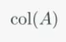  
  

* Consistent Linear System  
  선형시스템 Ax = b가 해를 가지면(consistent) 다음을 만족한다.  
  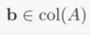
  

* Inconsistent Linear System  
선형시스템 Ax = b가 해가 없으면(inconsistent) 다음을 만족한다.    
  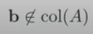
  
```
    |-1  3  2|
A = | 1  2 -3|
    | 2  1 -2|
    
위 행렬의 col(A)는 3차원 공간이다. 
세 개의 열벡터가 존재하기 때문에 3가지 방향으로 갈 수 있기 때문이다.
     |-1|      | 3|      | 2|
a1 = | 1| a2 = | 2| a3 = |-3|
     | 2|      | 1|      |-2|

따라서, 어떤 3-벡터 b를 이용해 선형시스템 Ax = b를 구성한다고 하더라도, 
해당 선형시스템의 해는 존재한다.
```

```
    |-1  3  2|
A = | 1  2 -3|
    | 0  0  0|
 
위 행렬의 col(A)는 xy-평면이다.
세 개의 열벡터가 z값이 0이기 때문에 xy-평면에 머물러 있기 때문이다.

     |-1|      | 3|      | 2|
a1 = | 1| a2 = | 2| a3 = |-3|
     | 0|      | 0|      | 0|
     
따라서 xy-평면을 벗어난 3-벡터 b를 이용해 선형시스템 Ax = b를 구성하면
해당 선형시스템의 해는 존재하지 않난다.
```
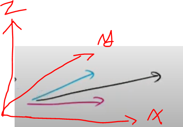  
z값이 0인 열벡터 리스트

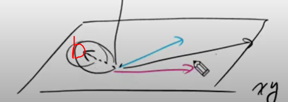  
그림과 같이 3-벡터 b가 xy-평면상에 놓여있을 경우에만 해(x)가 존재한다.

# 좌표계 변환 (Change of Basis) : 좌표계 :: 좌표값 = 행렬 :: 벡터
linear system은 Ax = b의 형태를 지니고 있다. 여기서 우리는 A를 좌표계로 해석할 것이고, x를 좌표값으로 해석하는 관점을 기를 것이다.  

## 벡터의 물리적, 수학적 표현
### 벡터의 물리적 표현
벡터는 **방향**과 **크기**(스칼라)를 동시에 지닌 개념으로 물리적으로는 화살표를 통해 그린다. 
이는 추상적으로써 이해하기에는 직관적이지만 programmable하지는 않다.  

### 벡터의 수학적 표현
물론 벡터의 덧셈같은 연산을 이해하기 위해 그림으로 표현하는 경우가 있지만 이러한 벡터들을 수치적으로 표현할 수 있어야 한다. 
그래서 **좌표계**를 먼저 도입한 뒤 **벡터의 시작점을 원점을 기준**으로 하고, 벡터의 **끝점의 좌표**를 벡터의 방향과 크기로써 정의한다.  
화살표의 길이 : 벡터의 크기  
화살표의 방향 : 벡터의 방향 (방향벡터)  

### 좌표계 (Coordinate System)
예를 들어 임의의 2-벡터가 주어져 있다고 가정하자. 이 벡터는 xy-평면상에 원점(0, 0)에서 (a, b)에 끝나느 벡터를 의미한다.
여기에는 실제로 좌표계가 숨겨져 있다. 단위행렬은 xy-직교좌표계를 의미한다.
```
    |a|   |1 0||a|    |1|    |0|
v = | | = |   || | = a| | + b| |
    |b|   |0 1||b|    |0|    |1|
```  

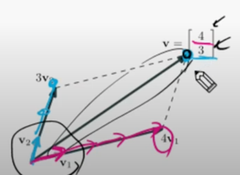  
좌표계는 반드시 직교할 필요는 없다. 위 그림처럼 v1 방향벡터와 v2 방향벡터를 좌표계로써 설정할 수 있다.
이 좌표계에서 (4, 3) v 벡터는 v1 축(방향)으로 4번, v2 축(방향)으로 3번을 이동한 것이다.  
(**v = 4v1 + 3v2**)  

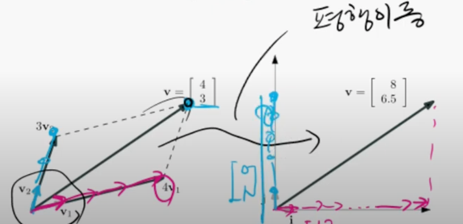
v 벡터를 직교좌표계로 평행이동 했다고 가정해보자. 해당 벡터를 직교 좌표계에 대입한 결과 i축 방향으로 8번, j축 방향으로 6.5번에 해당하는 좌표가 나왔다.
이로써 좌표계에 따라 해당 벡터는 다른 좌표값을 가지고 있다는 것을 알 수 있다.  
(**v = 8i + 6.5j**)  

사실은 v = 4v1 + 3v2는 linear combination(선형조합)의 형태를 띄고있다. (v1과 v2의 가중치 곱의 합)  
```
        |4|         |a|
|v1 v2| | | = |v| = | |    <--->       v = 4v1 + 3v2
        |3|         |b|
              
              행렬          <---->      선형조합
```

```
        |4|                                          |a|
|v1 v2| | |                            =     |e1 e2| | | 
        |3|                                          |b|

v1과 v2를 기저(basis)로 가지는 좌표계        =    e1(1, 0)과 e2(0, 1)을 기저(basis)로 가지는 좌표계
```

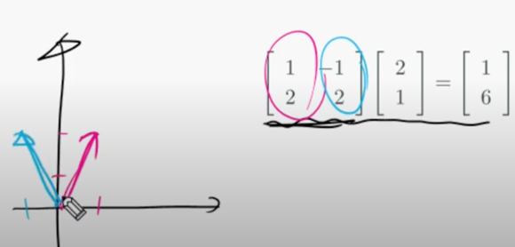  
실제로 임의의 좌표계를 그려보면 다음과 같이 표현할 수 있다.
빨간색 열 벡터를 직교좌표계 기준으로 그려보면 (1, 2)의 벡터를 얻을 수 있다.
파란색 열 벡터를 직교좌표계 기준으로 그려보면 (-1, 2)의 벡터를 얻을 수 있다. 
두 열 벡터를 좌표계의 축으로 적용시킬 수 있다.
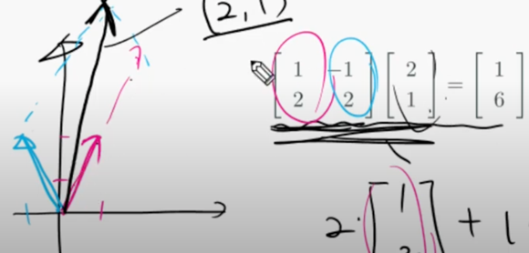    

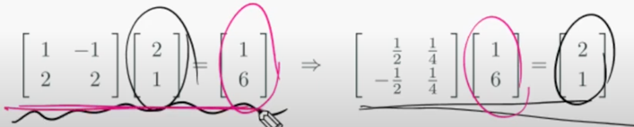  
**역행렬을 통해 해를 구하는 것도 좌표계 변환으로 해석**할 수 있다.  

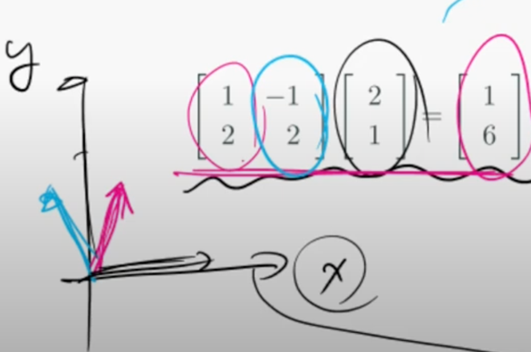  
xy-직교좌표계 기준에서 임의의 좌표계를 바라보면 다음과 같이 보일 것이다. 하지만..  

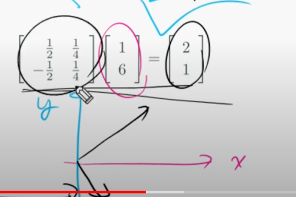  
역행렬을 통해 xy-직교좌표계에서의 해를 구한다고 가정할 때에 임의의 좌표계는 그림처럼 빨간색, 파란색 축이 직교좌표계처럼 보일 것이고, 
실제 x, y축은 역행렬에 의해 (1/2, -1/2), (1/4, 1/4) 벡터로 보일 것이다. (상대적인 개념)  

정리하자면, 해를 구하는 과정은 임의의 좌표계에서 **실제좌표계(xy-직교좌표계) 역행렬**을 **임의의 좌표계의 값**을 곱하면 나온다.  

# 선형변환 (Linear Transform)
행렬을 **함수**로 보자는 관점이다.  

## 함수에 대한 리뷰
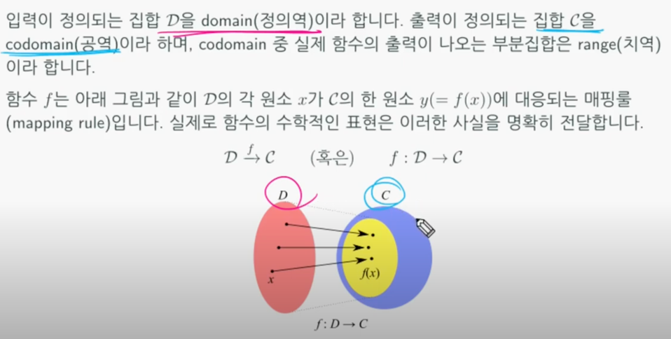  
두 집합(Domain:정의역, Codomain:공역)간의 **1대 1 매핑관계**를 함수라고 정의한다.  

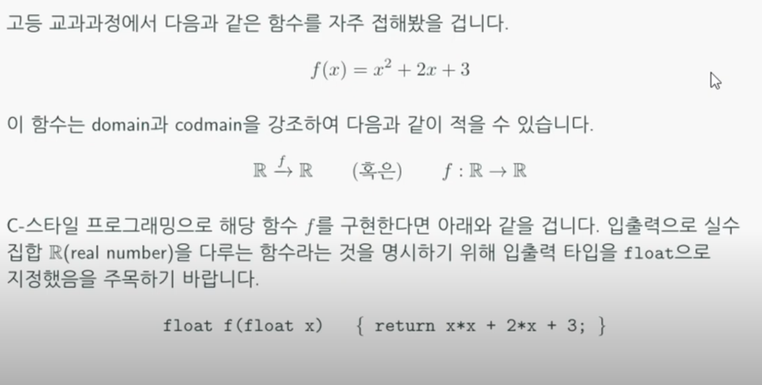  
