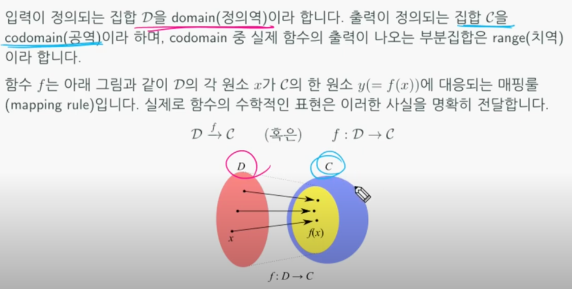
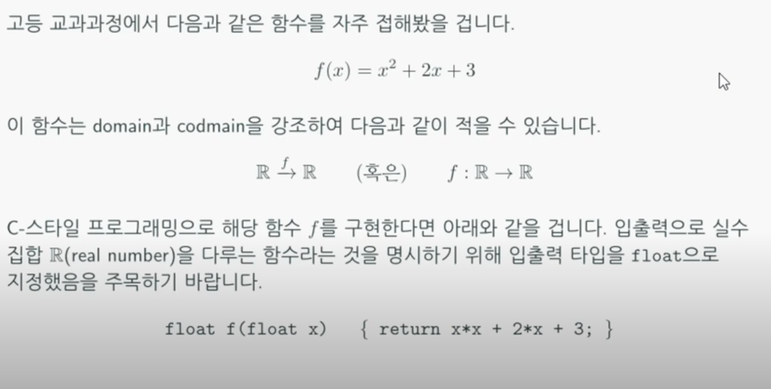
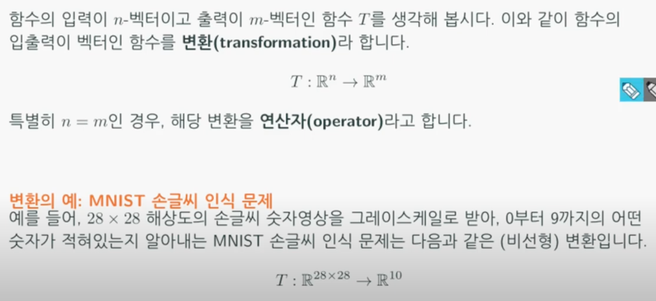
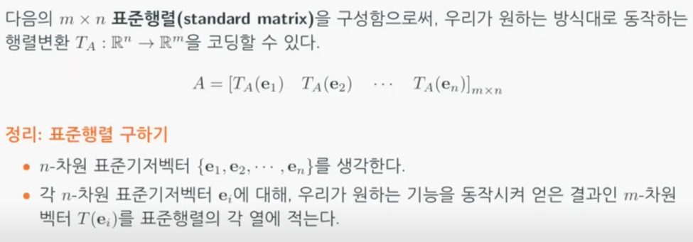
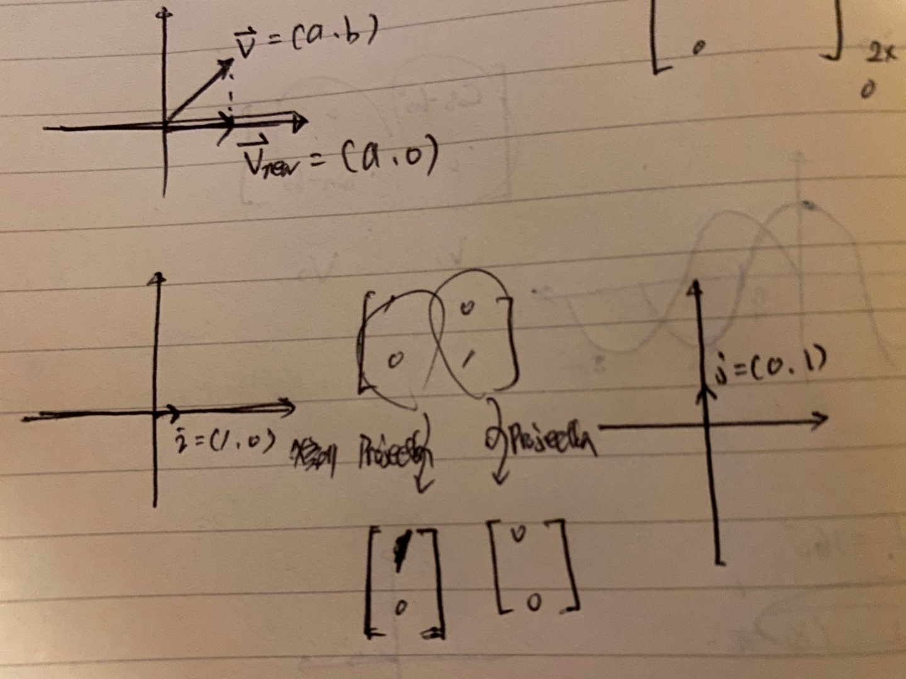
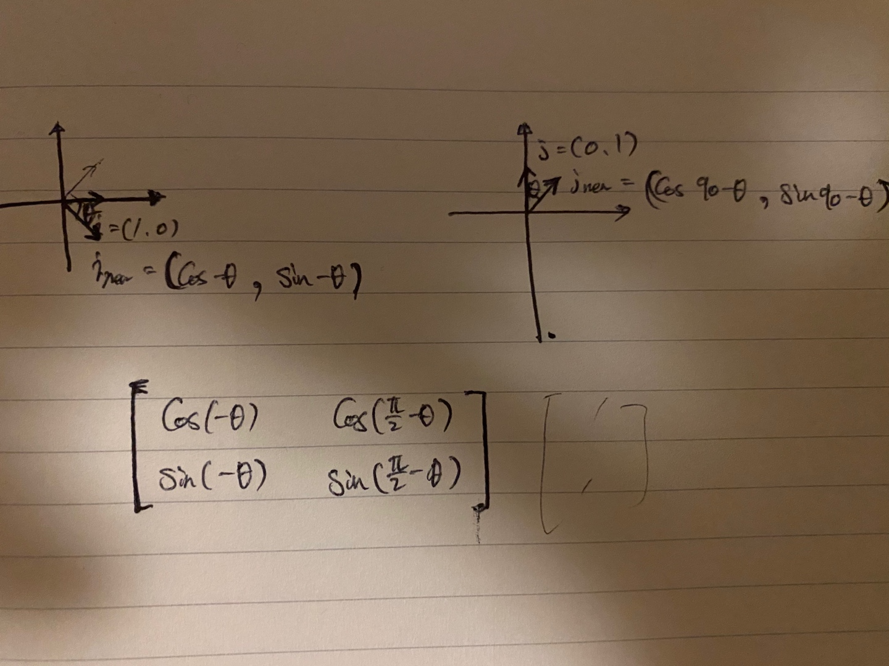
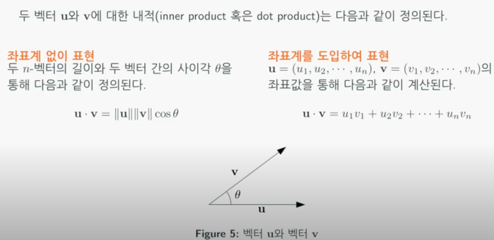

# 선형변환 (Linear Transform)
행렬을 **함수**로 보자는 관점이다.  

## 함수에 대한 리뷰
  
두 집합(Domain:정의역, Codomain:공역)간의 **1대 1 매핑관계**를 함수라고 정의한다.  

  

## 선형함수 (Linear function)
선형함수를 만족하기 위한 두 가지 조건이 있다.
* f(x+y) = f(x) + f(y)
* f(cx) = cf(x)

## 선형변환 : 행렬은 선형변환의 구현체
### 변환 (Transformation)
  
**입력과 출력이 벡터인 함수**를 function이라는 표현보다 transformation이라는 표현을 사용한다. 
그러나 **벡터의 입출력 차원**이 같을 경우 연산자(Operator)라고 한다. gradient descent 도 operator의 일종이다.  

R^28x28의 의미는 MNIST의 각 픽셀이 그레이스케일 (0~255)사이의 숫자들로 28 x 28로 이루어진 것을 의미한다.
즉, R은 Real number로 0~255 사이의 실수를 의미한다. 출력값으로 R^10이 나오는데 이것은 0~9사이의 숫자(10개의 숫자)가 맞을 확률을 의미한다.  

  
행렬의 특성은 선형함수의 특징을 만족한다. 고로 행렬변환은 선형변황과 동치관계에 있다. 선형변환을 표현하기에 가장 적합한 자료구조가 행렬이기에 
행렬은 선형변환의 구현체이기도 하다.

## 선형변환 코딩하기
특정 기능을 하는 행렬(함수역할을 하는 linear transform)을 프로그래밍의 형태로 코딩한다.  
  
  
표준기저벡터는 x, y, z 축에 대한 단위벡터를 의미한다. 즉, 항등행렬(Identity matrix)의
각 열벡터를 의미한다. 두 가지 예를 들어보자.  

1. 2차원 벡터를 받아 x축에 프로젝션하는 linear transform을 구현해보자.
  
표준기저벡터 i를 x축에 projection할 때 결과는 (1, 0)이 나올 것이다.  
표준기저벡터 j를 x축에 projection할 때 결과는 (0, 0)이 나올 것이다.  
고로 두 열벡터를 쌓아서 [[1, 0], [0, 0]] 형태의 선형변환을 구현할 수 있다.  
   

2. 2차원 벡터를 입력으로 받아 해당 벡터를 반시계 방향으로 theta만큼 움직이는 linear transform을 구현해보자.
  
표준기저벡터 i를 theta만큼 반대로 회전시킬 때 결과는 (cos(-theta), sin(-theta))이 나올 것이다.  
표준기저벡터 j를 theta만큼 반대로 회전시킬 때 결과는 (cos(90-theta), sin(90-theta))이 나올 것이다.  
고로 두 열벡터를 쌓아서 [[cos(-theta), cos(90-theta)], [sin(-theta), sin(90-theta)]] 형태의 선형변환을 구현할 수 있다.  
   
# 벡터
  
벡터는 크기(스칼라)와 방향을 지닌 물리량으로 정의된다.  
벡터의 크기는 각 요소의 제곱의 합, 방향은 해당 벡터 요소를 벡터의 크기로 나눈다(길이가 1인 방향을 지닌 단위벡터로써).  

## 벡터의 내적
  
두 벡터의 길이곱과 cos(theta)를 하게 되면 최종적으로 스칼라 형태의 산출물이 나온다. 내적은 코사인 법칙을 사용하여 유도할 수 있다.
  
theta가 90도일 경우 코사인 값은 0을 띄기 때문이다.