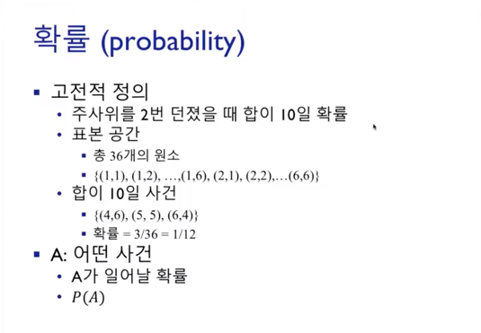
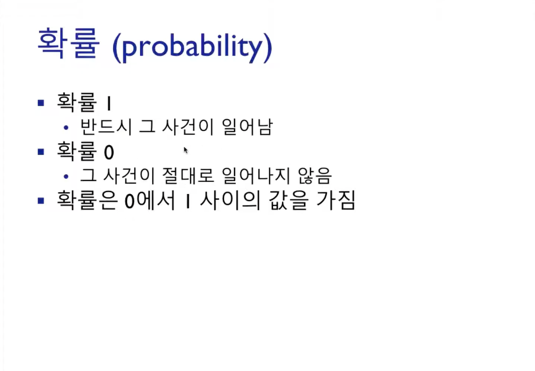
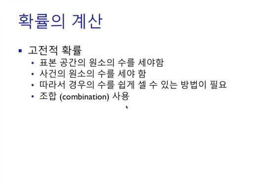

# 통계학의 기본 개념
## 통계학 (Statistics)
데이터의 수집(collect), 구성(organization), 분석(analysis), 해석(interpretation),
표현(presentation)에 관한 학문

## 통계학의 분류
* 기술 통계학 (descriptive statistics)  
  수집된 데이터를 설명하기 위한 통계학 (해석단계)
* 추측 통계학 (inferential statistics)  
  해석을 통한 데이터를 토대로 추론하는 통계학 (추론단계)

## 개념 정의
* 모집단 (population)  
  어떤 질문이나 실험을 위해 관심의 대상이 되는 개체나 사건의 집합  
  ex) 전교학생의 키
* 모수 (parameter)  
  (모집단을 하나로 표현하기 위한) 모집단의 수치적인 특성  
  ex) 키의 평균, 분산, 표준편차 ..
* 표본 (sample)  
  모집단에서 선택된 개체나 사건의 집합  
  ex) 전교 남학생
  
보통 모수를 파악하기 위해 모집단을 전부 분석하는 것이 아니라 모집단으로부터 **표본을 추출하여 모수를 추론**한다.  

## 도수 (Frequency)
어떤 사건이 실험이나 관찰로부터 발생한 횟수  
ex) 전교생의 키를 분석할 때 160~170 사이의 학생이 몇 명이 존재하는지  

### 표현방법
* 도수분포표 (Frequency Distribution Table) - 질적 데이터  
    
  각 범주의 데이터가 몇번 발생했는지를 표시  
* 막대그래프 (Bar graph) - 질적 데이터  
    
  범주로 구분  
  ex) 남자와 여자, 소설책의 분류
* 히스토그램 (Histogram) - 양적 데이터  
    
    
  숫자의 **구간**으로 구분, 구간을 먼저 설정해야 한다.  
  ex) 남학생의 키
  
* 줄기-잎 그림 (Stem and Leaf Diagram) - 양적 데이터  
    
  앞부분은 stem (구간의 역할을 하는 줄기), 뒷부분은 leaf (해당 구간의 세부데이터 역할을 하는 잎)  
  ex) 16이라는 구간은 18전까지를 의미한다. (1.6~1.7)
