# 통계학의 기본 개념
## 통계학 (Statistics)
데이터의 수집(collect), 구성(organization), 분석(analysis), 해석(interpretation),
표현(presentation)에 관한 학문

## 통계학의 분류
* 기술 통계학 (descriptive statistics)  
  수집된 데이터를 설명하기 위한 통계학 (해석단계)
* 추측 통계학 (inferential statistics)  
  해석을 통한 데이터를 토대로 추론하는 통계학 (추론단계)

## 개념 정의
* 모집단 (population)  
  어떤 질문이나 실험을 위해 관심의 대상이 되는 개체나 사건의 집합  
  ex) 전교학생의 키
* 모수 (parameter)  
  (모집단을 하나로 표현하기 위한) 모집단의 수치적인 특성  
  ex) 키의 평균, 분산, 표준편차 ..
* 표본 (sample)  
  모집단에서 선택된 개체나 사건의 집합  
  ex) 전교 남학생
  
보통 모수를 파악하기 위해 모집단을 전부 분석하는 것이 아니라 모집단으로부터 **표본을 추출하여 모수를 추론**한다.  

## 도수 (Frequency)
어떤 사건이 실험이나 관찰로부터 발생한 횟수  
ex) 전교생의 키를 분석할 때 160~170 사이의 학생이 몇 명이 존재하는지  

### 표현방법
* 도수분포표 (Frequency Distribution Table) - 질적 데이터  
  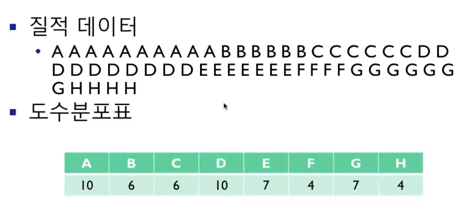  
  각 범주의 데이터가 몇번 발생했는지를 표시  
* 막대그래프 (Bar graph) - 질적 데이터  
  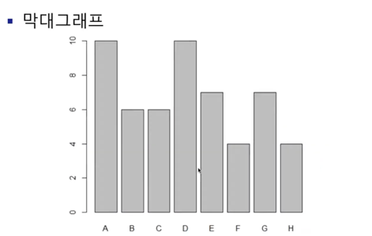  
  범주로 구분  
  ex) 남자와 여자, 소설책의 분류
* 히스토그램 (Histogram) - 양적 데이터  
  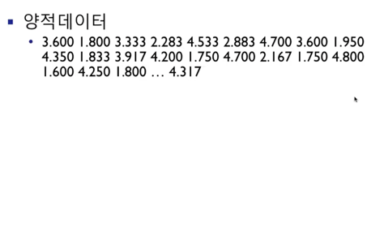  
    
  숫자의 **구간**으로 구분, 구간을 먼저 설정해야 한다.  
  ex) 남학생의 키
  
* 줄기-잎 그림 (Stem and Leaf Diagram) - 양적 데이터  
  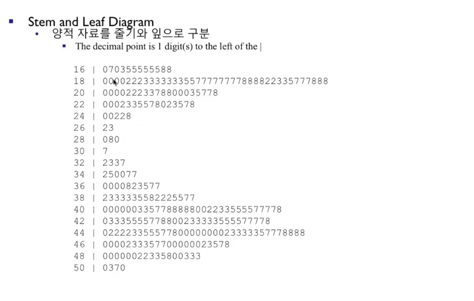  
  앞부분은 stem (구간의 역할을 하는 줄기), 뒷부분은 leaf (해당 구간의 세부데이터 역할을 하는 잎)  
  ex) 16이라는 구간은 18전까지를 의미한다. (1.6~1.7)

## 상대도수 (Relative Frequency)
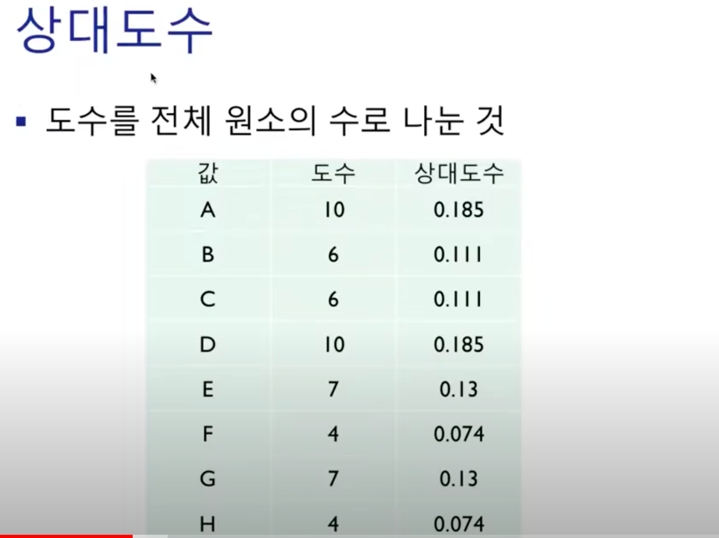  
위 그림에서 도수의 총합은 54이다. 도수를 상대도수로 표현하면 다른 도수와의 비율을 상대적으로 파악하기 쉽다.

## 평균 (Mean)
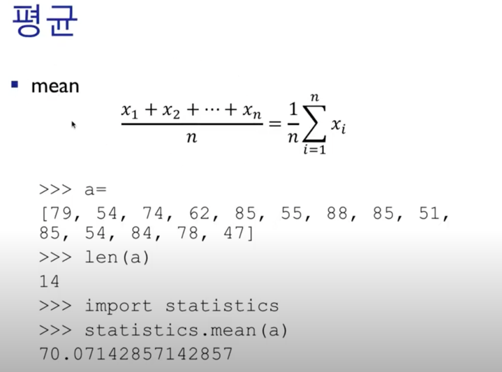  
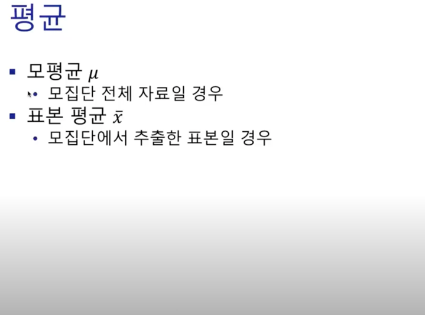  
평균은 **모평균**과 **표본평균**으로 나눌 수 있다. 
모평균은 모집단으로부터 추출한 평균값을 의미하고, 
표본평균은 모집단으로부터 추출한 표본집단의 평균값을 의미한다.

## 중앙값 (Median)
  
평균값은 **극단적으로 크거나 작은 값에 영향을 많이 받는다.** 이러한 단점을 보완할 수 있는 개념이 중앙값이다.
데이터의 수가 짝수개일 경우 n/2번째 값과 n/2+1번째 값의 중앙값이 된다.  
데이터의 수가 홀수개일 경우 (n+1)/2번째 값이 된다.

## 분산 (Variance)
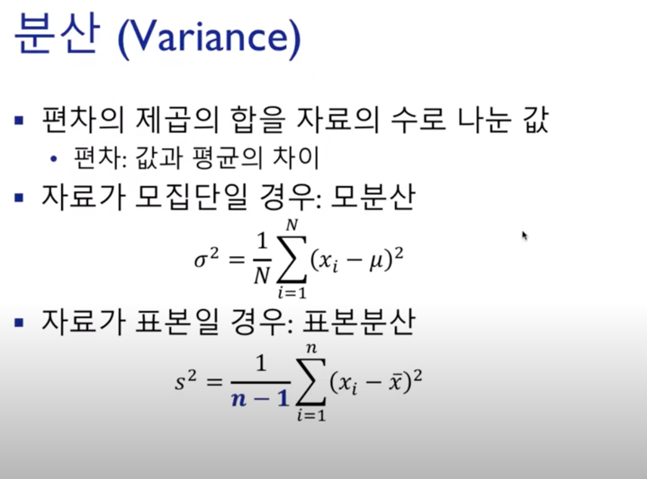
값이 어느정도 퍼저있는 지를 **산포**라고 표현한다. 산포를 정량적으로 표현할 수 있는 방법이 **분산**이다.  
표본분산에 n-1을 나누는 이유 : https://m.blog.naver.com/95khc/220282362093  

## 표준편차 (Standard Deviation)
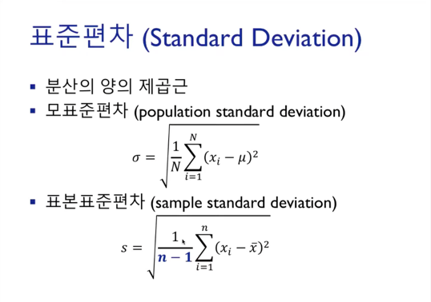  

## 범위 (Range)
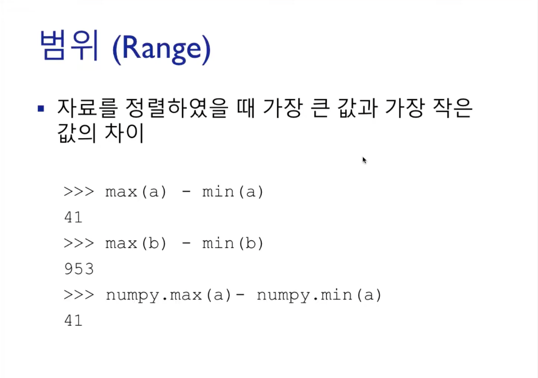  

## 사분위수 (Quartile)
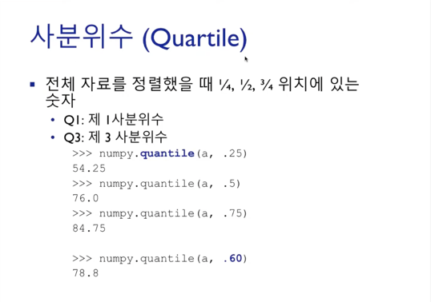  
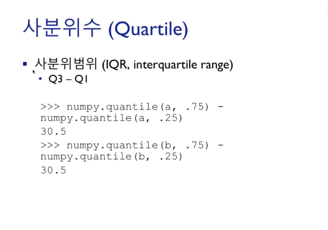  

## z-score
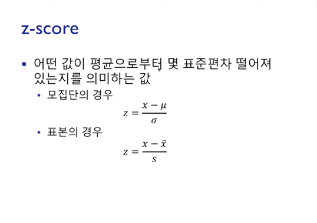

# 확률
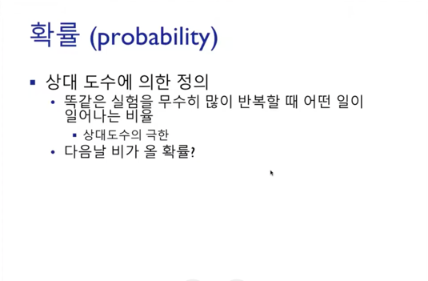  
데이터를 토대로 추론을 할 때 그 추론의 정확성을 파악하기 위함이다.  

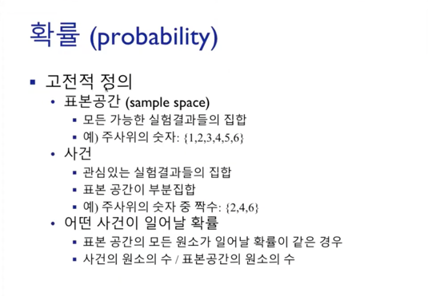  
사건은 표본 공간의 부분집합이다.  
(사건의 원소 수 / 표본공간의 원소 수) : **표본 공간의 모든 원소가 일어날 확률이 같은 경우**라는 전재가 깔려야 유의미한 공식이 된다.

  

## 확률의 계산
  
**조합**을 사용하여 경우의 수 계산을 편하게 한다.  

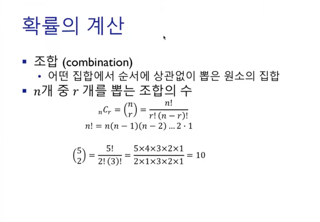  
ex) 1~10 까지의 공에서 두번을 뽑았을 때, 1과 3을 뽑을 확률 (1, 3으로 뽑든 3, 1로 뽑든 상관없음)
10C2

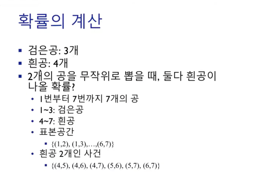  
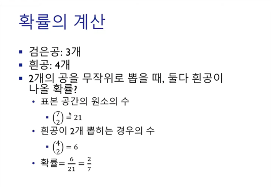

> 검은공 하나, 흰공 하나일 확률은?  
(3C1 * 4C1) / 7C2  
> (검은공에서 뽑는 경우의수 * 흰공에서 뽑는 경우의수) / (전체에서 2개 뽑는 경우의수)

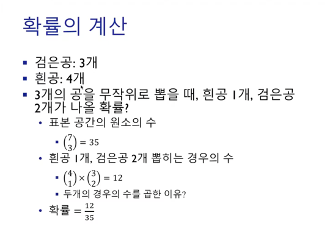  

## 덧셈법칙
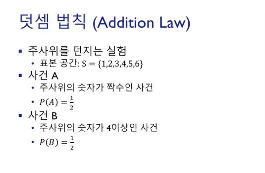  
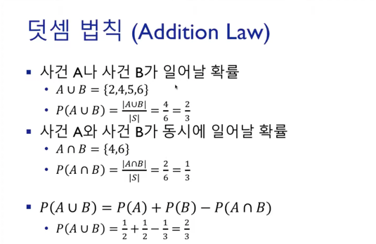  
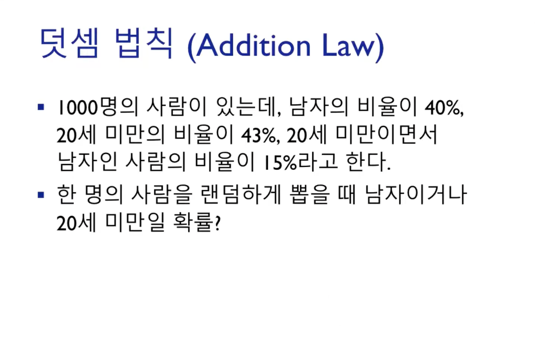  
P(남자) = 0.4 / P(20세 미만) = 0.43 / P(남자 and 20세 미만) = 0.15  
P(남자 or 20세 미만)  
= P(남자) + P(20세 미만) - P(남자 and 20세 미만)  
= 0.4 + 0.43 - 0.15  
= 0.68

## 서로 배반
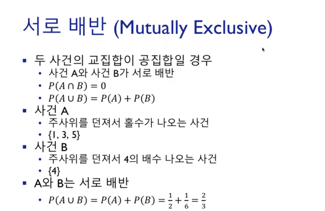  
집합 간에 겹치는 부분이 없는 경우 
**하나의 사건에 대해 공통분모가 없는 경우**

## 조건부 확률
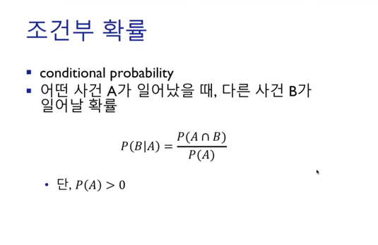  
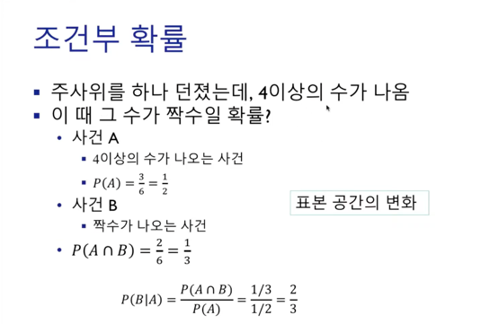  
표본공간의 변화 : 전체표본공간(1, 2, 3, 4, 5, 6) -> 4이상의표본공간(4, 5, 6)  
사건 A가 발생할 것을 전재로 깔기 때문에 분모에 P(A)가 온다.  
A와 B가 동시에 일어날 확률 / A가 일어날 확률

## 곱셈법칙
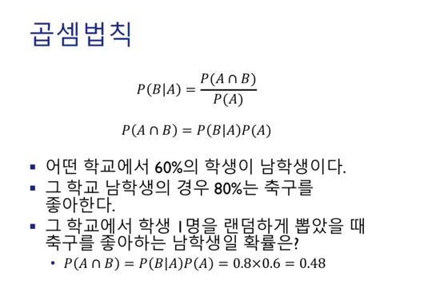  
P(남자) = 0.6 / P(남자 bar 축구) = 0.8  
P(남자 and 축구)  
= P(남자) * P(남자 bar 축구) = 0.8 * 0.6  
= 0.48

## 서로 독립
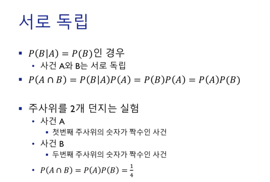  
**A가 일어났을 때 B가 일어나는 확률**이랑 **A가 일어나는 안일어나든 B가 일어날 확률**이랑 같음을 의미.  
**하나의 사건이 다른 사건에 영향을 주지 않음.**  
P(B bar A) = P(A and B) / P(A) = P(B)  
P(A and B) = P(A) * P(B)

## 여사건
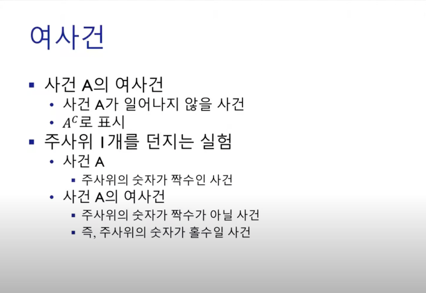  
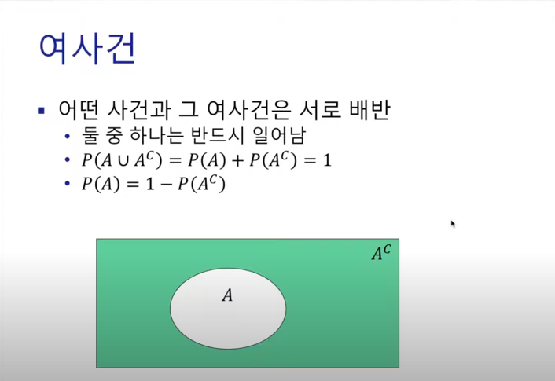  

## 확률의 분할법칙
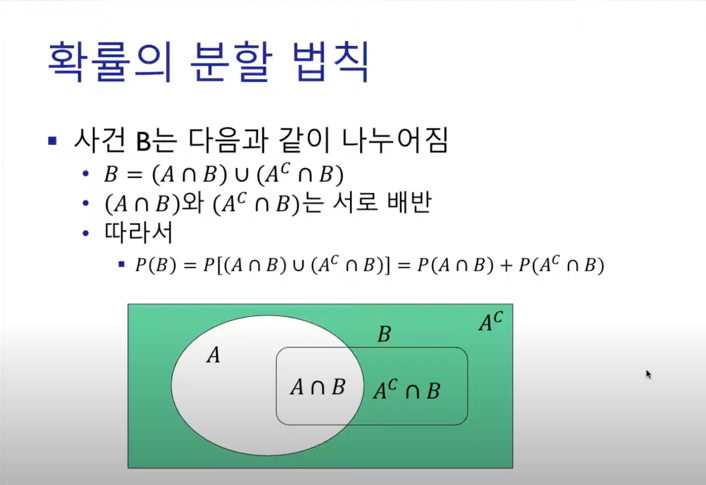  
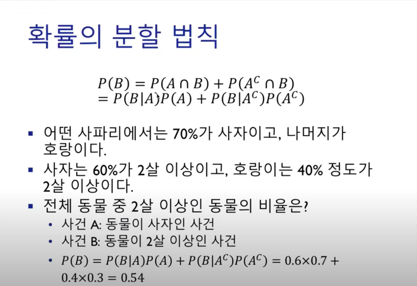  

## 베이즈 정리
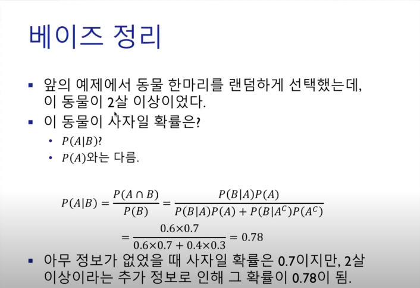  
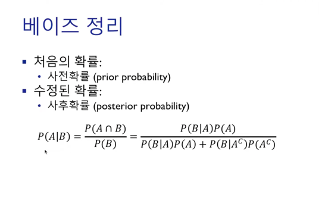  
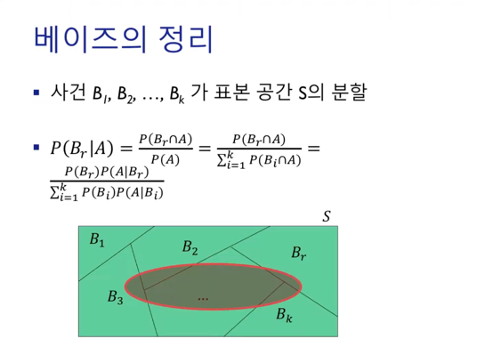  
2살 이상인 동물을 선택했을 때 그것이 사자일 조건부확률  
사전확률 : P(A)  
사후확률 : P(A|B)  
사후확률과 사전확률의 관계를 정의하기 위한 개념.  
사전확률에 증거(Evidence)가 추가되며 확률이 갱신됨.

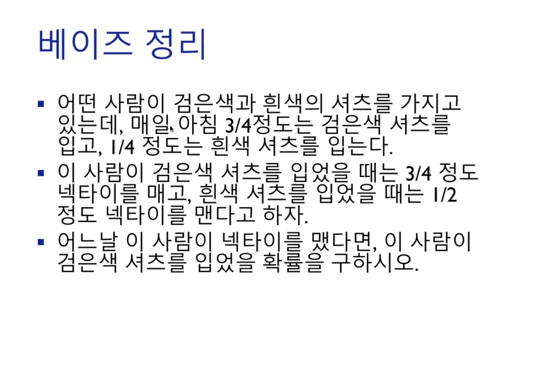  
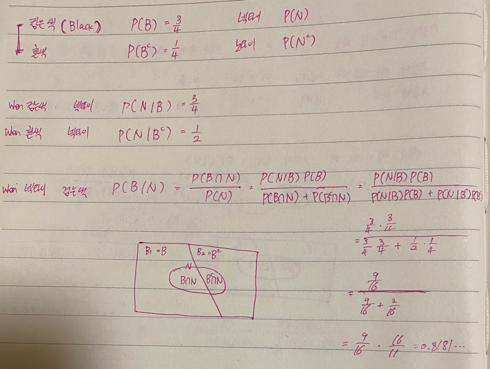

## 확률 변수 (random variable)
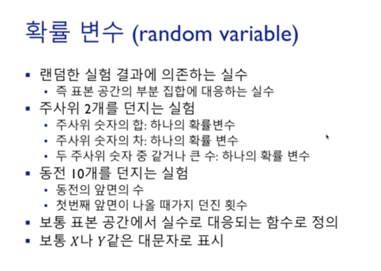  
확률변수는 표본공간에서 랜덤하게 추출한 요소중 특정 조건을 만족하는 것(관계)을 정의해두는 것을 의미한다.  
**확률변수는 실수다.**

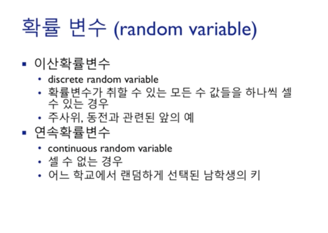  
이산확률변수 : 관계로 정의된 요소들의 값 범위(도메인)가 이산적으로 떨어져있는 경우 (불연속성)  
연속확률변수 : 관계로 정의된 요소들의 값 범위(도메인)가 연속적으로 구성되어 있는 경우

## 확률 분포 (Probability Distribution)
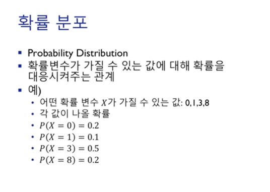  
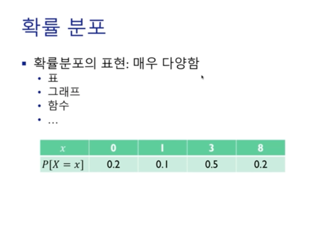  
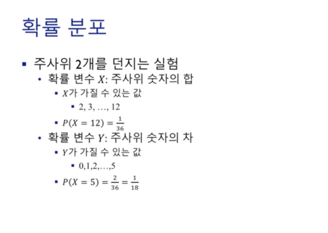  
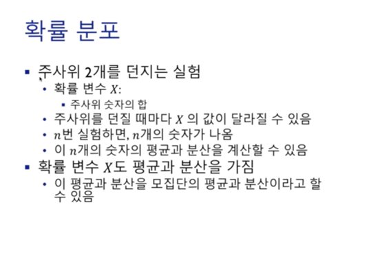  
표본평균과 표본분산이 모평균과 모분산에 대응.

## 이산확률변수
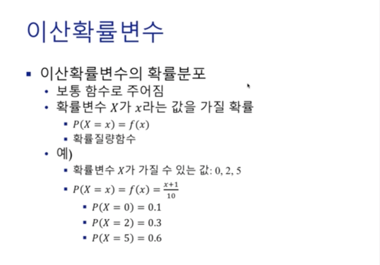  
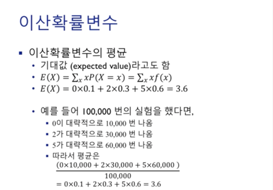  
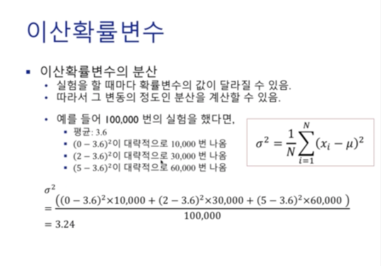  
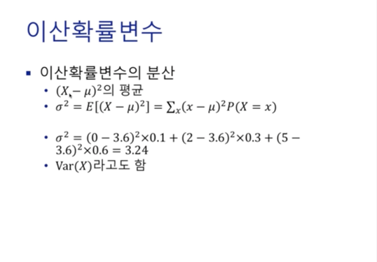  
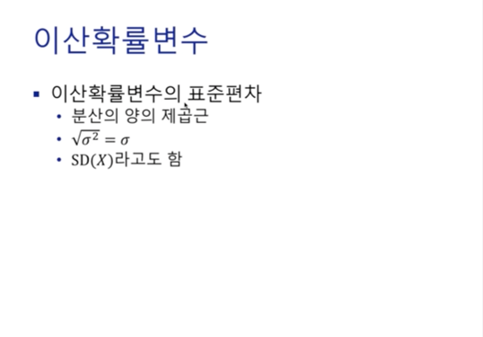  
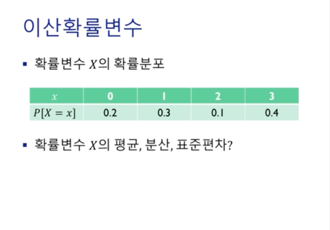  
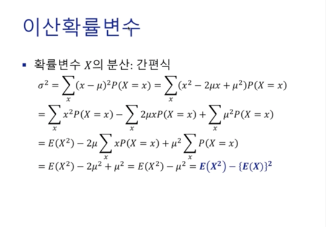

## 결합확률 분포
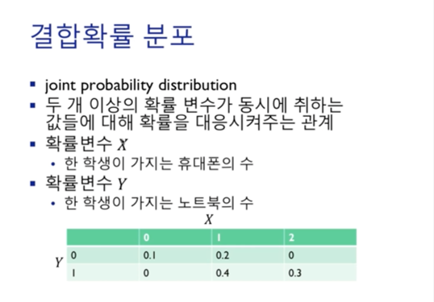  
  
주변확률 분포를 도출하려면 다른 확률변수를 무시하고 다 더하면 된다.  
예를 들어, X의 확률 분포를 구한다고 가정하면  
x = 0 : 0.1 + 0 = 0.1  
x = 1 : 0.2 + 0.4 = 0.6  
x = 2 : 0 + 0.3 = 0.3  

Y의 확률 분포를 구할 때는  
y = 0 : 0.1 + 0.2 + 0 = 0.3  
y = 1 : 0 + 0.4 + 0.3 = 0.7  

## 공분산
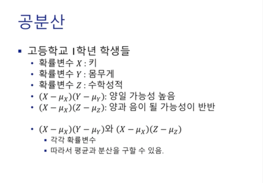  
두 개의 확률분포가 어떤 관계를 가지고 있는지 확인할 수 있다.  
(X - E(X))(Y - E(Y))가 양일 가능성이 높은 이유는 키가 크면 몸무게가 그에 비례하기 높을 가능성이 크기 때문이다. (키가 평균보다 클 경우)  
반면, (X - E(X))(Z - E(Z))가 양과 음이 될 가능성이 반반인 이유는 키와 성적은 관련이 없기 때문이다.  

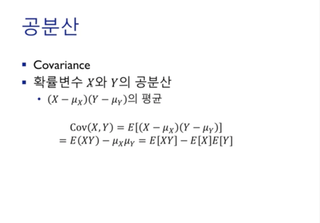  
공분산의 값이 0에 가까울수록 두 확률변수는 관련이 없다.  
관련없는 두 확률변수의 편차의 곱(X - E(X))(Z - E(Z))(X - E(X))(Z - E(Z))은 양과 음이 될 가능성이 반반이기 때문에 평균은 0이 되기 때문이다.  

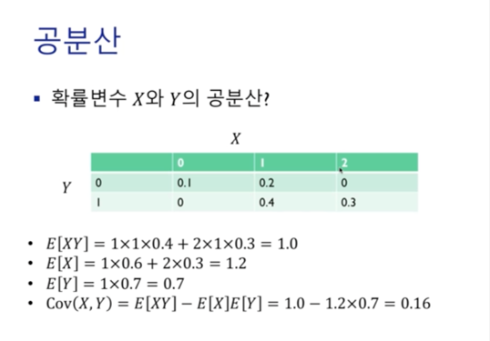  
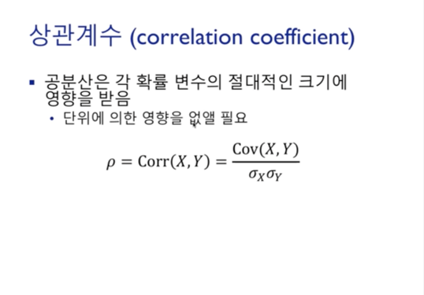  
공분산은 확률변수의 크기가 급격하게 커지면 영향을 받을 수 있다. 
예를 들면, 위에 표는 X의 확률 변수는 0, 1, 2지만 0, 100, 200일 경우 1x100x0.4 + 1x200x0.3 ..  
이러한 영향을 없애주기 위해 일종의 정규화과정을 거쳐야 한다. 확률변수가 크면 표준편차도 크게 나올것이기 때문에 이러한 영향을 상쇄시켜줄 수 있다.  

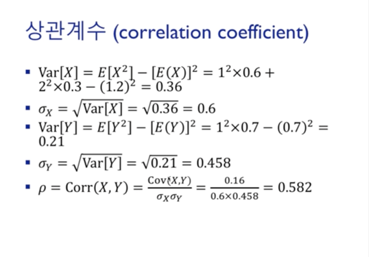

# 확률분포
## 이항분포
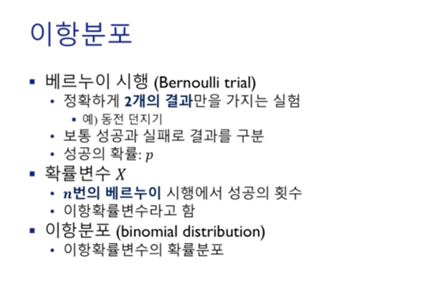  
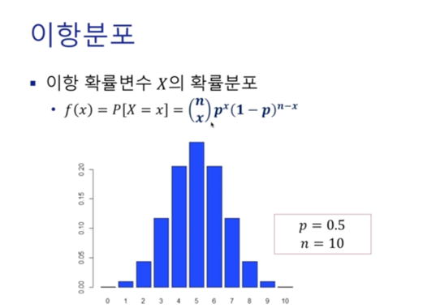  
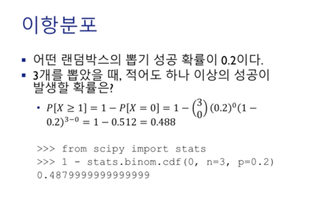  
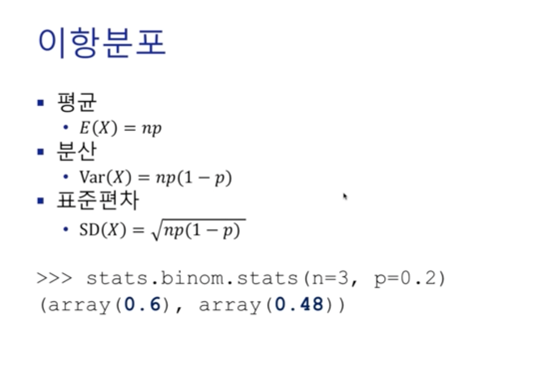

## 정규분포
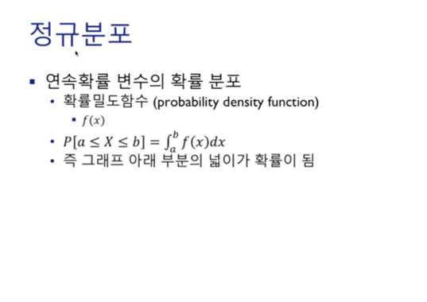  
연속확률분포는 셀 수 없기 때문에 적분을 통해 도출된 면적을 확률로 해석한다.
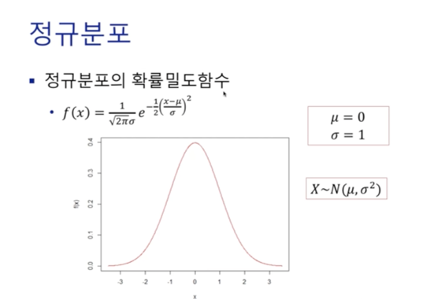  
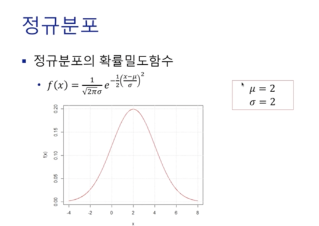  
확률밀도함수로써 가장 많이 사용되는 것이 정규분포이다. 해당 함수는 적분을 통해 확률을 계산하는것 보다는 표준정규분포표를 봐야한다.  
X~N(평균, 분산)  

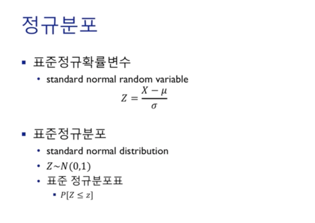  
Z 정규화, X는 정규확률분포를 따르는 확률변수를 의미한다. 뮤는 평균, 시그마는 표준편차이다. Z 정규화를 하게되면 **평균이 0, 분산이 1**인 확률밀도함수(표준정규분포)로 변형된다.  
확률을 확인하기 위해 표준정규분포표를 참고하면 된다.  
ex) 0.75는 0.75보다 작을 확률을 의미한다.  

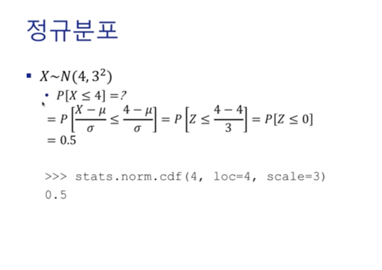  
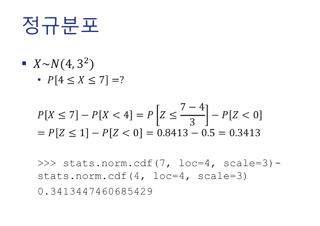  
  

## 포아송(Poison) 분포
## 지수분포
