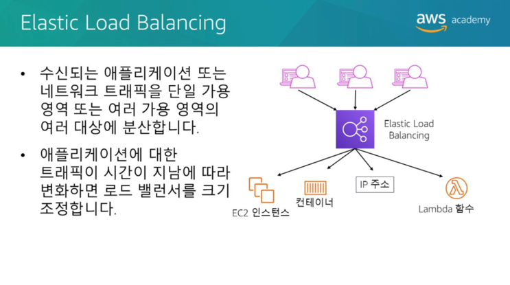
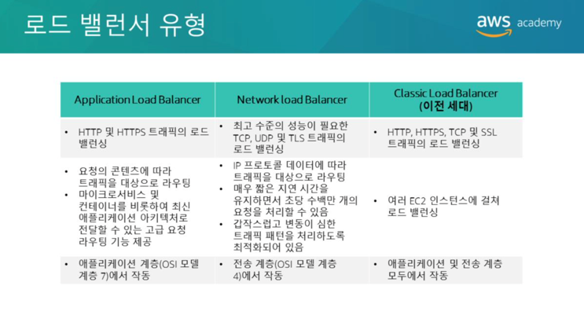
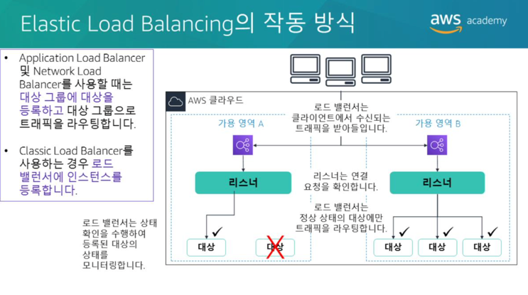
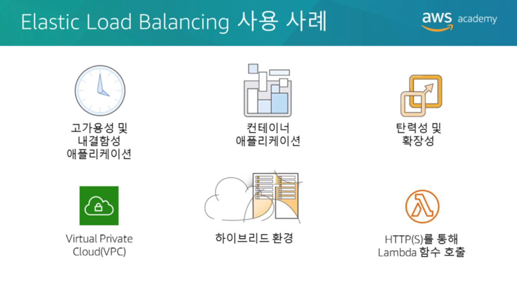
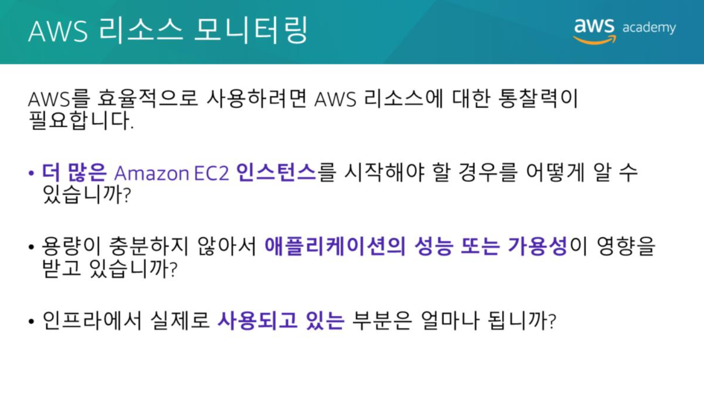
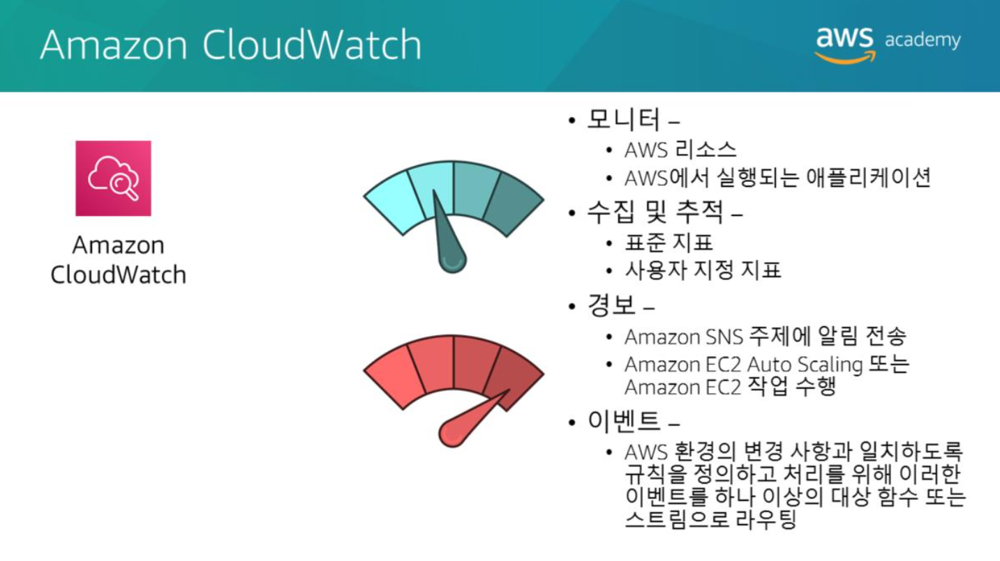
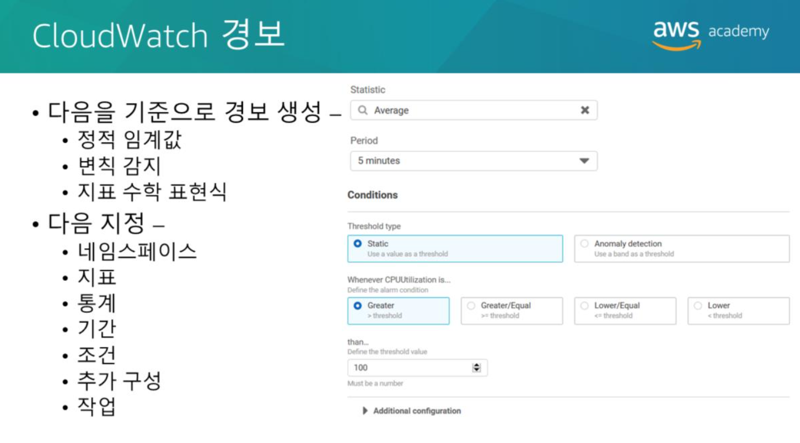
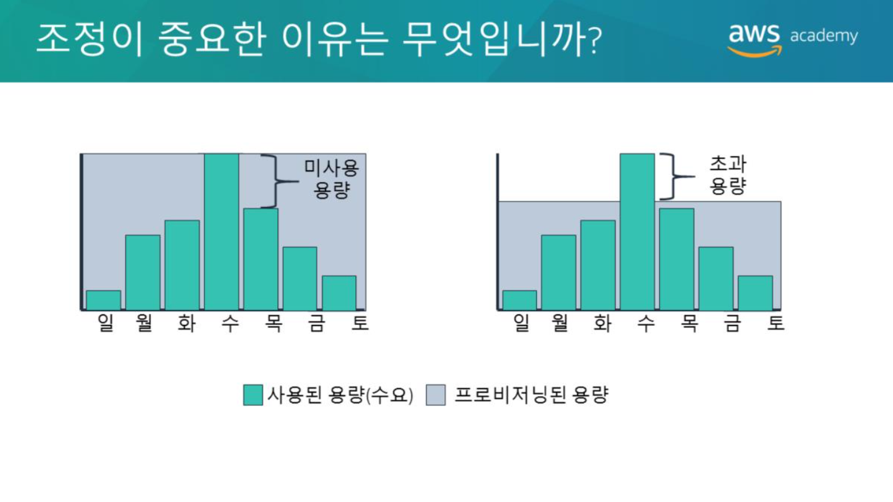
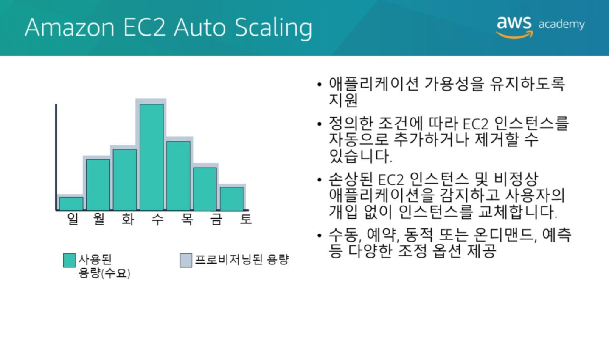

# Elastic Load Balancing
  
현대의 트래픽이 많은 웹사이트는 사용자 또는 고객의 동시 요청이 수십만건(또는수백만건)으로 제공되어야 하며 올바른 텍스트, 이미지, 동영상 또는 애플리케이션데이터를 빠르고 안정적으로 반환해야합니다. 
일반적으로 이러한 대용량 볼륨을 제공하려면 추가 서버가 필요합니다. 
Elastic Load Balancing은 수신되는 애플리케이션 또는 네트워크 트래픽을 단일 가용영역 또는 여러 가용영역의 Amazon Elastic Compute Cloud(Amazon EC2) 인스턴스, 컨테이너, IP(인터넷프로토콜) 주소 및 Lambda 함수와 같은 여러 대상에 분산하는 AWS 서비스입니다. 
Elastic Load Balancing은 시간이 지나면서 애플리케이션의 트래픽이 변경됨에 따라 로드밸런서를 조정합니다. 
또한 대부분의 워크로드를 지원하도록 자동으로 확장할 수 있습니다. 

  
**Application Load Balancer**는 **애플리케이션 레벨(개방형 시스템간 상호연결 또는 OSI, 모델계층7)에서** 작동합니다. 
요청의 콘텐츠를 기반으로 Amazon Elastic Compute Cloud(Amazon EC2) 인스턴스, 컨테이너, IP(인터넷프로토콜) 주소, Lambda 함수 등의 대상으로 트래픽을 라우팅합니다. 
**HTTP(Hypertext Transfer Protocol)및 보안 HTTP(HTTPS) 트래픽의 고급 로드밸런싱에 적합합니다.** 
Application Load Balancer는 마이크로 서비스 및 컨테이너기반 애플리케이션을 비롯하여 최신 애플리케이션 아키텍처를 제공하는 것을 목표로 하는 고급 요청 라우팅 기능을 제공합니다. 
Application Load Balancer는 항상 최신 SSL/TLS(Secure Sockets Layer/Transport Layer Security) 암호 및 프로토콜이 사용되도록 하여 애플리케이션의 보안을 간소화하고 개선합니다.  

**Network Load Balancer**는 **네트워크 전송레벨(OSI 모델계층4)에서** 작동하며 IP 프로토콜 데이터에 따라 연결을 대상(EC2 인스턴스, 마이크로서비스및컨테이너)으로 라우팅 합니다. 
**TCP(Transmission Control Protocol) 및 UDP(User Datagram Protocol) 트래픽의 로드밸런싱에 적합합니다.** 
Network Load Balancer는 **매우 짧은 지연시간을 유지하면서 초당 수백만개**의 요청을 처리할 수 있습니다. 
Network Load Balancer는 **갑작스러운 일시적 네트워크 트래픽 패턴을 처리하는데 최적화** 되어있습니다.  

**Classic Load Balancer**는 여러 EC2 인스턴스에 기본 로드밸런싱을 제공하며, **애플리케이션 레벨과 네트워크 전송 레벨 모두에서** 작동합니다. 
Classic Load Balancer는 HTTP, HTTPS, TCP 및 SSL을 사용하는 애플리케이션의 로드밸런싱을 지원합니다. 
Classic Load Balancer는 이전 구현 버전 입니다.  
가능한 경우 전용 Application Load Balancer 또는 Network Load Balancer를 사용하는 것이 좋습니다. 

  
로드밸런서는 클라이언트에서 오는 트래픽을 허용하고, 하나 이상의 가용영역에서 등록된 대상(예: EC2 인스턴스)으로 요청을 라우팅 합니다. 
하나 이상의 **리스너**를 지정하여 수신 트래픽을 허용하도록 로드밸런서를 구성합니다. 
리스너는 연결 요청을 확인하는 프로세스로, 클라이언트와 로드밸런서 간의 연결을 위한 프로토콜 및 포트번호로 구성됩니다. 
마찬가지로 로드밸런서와 대상간의 연결을 위한 프로토콜 및 포트번호로 구성됩니다. 
또한 등록된 대상의 상태를 모니터링 하는데 사용되는 상태확인을 수행하도록 로드밸런서를 구성할 수도 있습니다. 
그러면 로드밸런서가 **정상적인 인스턴스에만 요청을 전송합니다.** 
로드밸런서가 비정상 대상을 감지하면, 해당 대상으로 트래픽 라우팅을 중단합니다. 
그런 다음 대상이 다시 정상으로 감지되면 트래픽을 해당 대상으로 다시 라우팅 합니다. 
로드밸런서 유형이 구성되는 방법에는 주요 차이점이 있습니다. 
Application Load Balancer 및 Network Load Balancer를 사용할 때는 **대상 그룹에 대상을 등록하고 대상 그룹으로 트래픽을 라우팅합니다.** 
Classic Load Balancer를 사용하는 경우 로드밸런서에 **인스턴스를 등록합니다.**  

  
로드밸런서를 사용하는 여러가지 이유는 다음과 같습니다. 
* **애플리케이션의 고가용성 및 향상된 내결함성 실현**  
  – Elastic Load Balancing은 여러 가용영역의 정상 대상간에 트래픽을 고르게 분산합니다. 단일가용영역에 있는 하나 이상의 대상이 정상상태가 아닐경우, Elastic Load Balancing은 다른 가용영역에 있는 정상상태인 대상으로 트래픽을 라우팅합니다. 대상이 정상상태로 복구되면 로드밸런싱기능은 대상에 대한 트래픽을 자동으로 재개합니다.
    
* **컨테이너 애플리케이션의 자동로드밸런싱**  
  – Elastic Load Balancing의 향상된 컨테이너 지원을 통해 이제 동일한 EC2 인스턴스의 여러 포트에 걸쳐 로드밸런싱 할 수 있습니다. 또한 완전관리형 컨테이너 상품을 제공하는 Amazon Elastic Container Service(Amazon ECS)와의 완벽한 통합도 활용할 수 있습니다. 
  서비스를 로드밸런서에 등록하기만 하면 Amazon ECS가 Docker 컨테이너의 등록 및 등록취소를 투명하게 관리합니다. 
  로드밸런서는 포트를 자동으로 탐지하여 동적으로 스스로를 재구성합니다.  
  
* **애플리케이션 자동조정**  
  – Elastic Load Balancing은 Amazon CloudWatch 및 Amazon EC2 Auto Scaling과 연동되므로 고객의 수요에 맞춰 애플리케이션을 조정할 수 있습니다. 
  Amazon CloudWatch 경보는 EC2 인스턴스중 하나의 지연시간이 사전 구성된 임계값을 초과할 경우 EC2 인스턴스 플릿에 대해 Auto Scaling을 트리거할 수 있습니다. 
  그러면 Amazon EC2 Auto Scaling이 새 인스턴스를 프로비저닝하고, 애플리케이션은 다음 고객요청을 처리할 수 있는 준비상태가 됩니다. 
  로드밸런서는 EC2 인스턴스를 등록하고 필요에 따라 트래픽을 인스턴스로 보냅니다.  

* **Virtual Private Cloud(VPC) 에서 Elastic Load Balancing 사용**  
  – Elastic Load Balancing을 사용하여 VPC에 퍼블릭 진입점을 생성하거나, VPC 내 애플리케이션 티어 간에 요청트래픽을 라우팅할 수 있습니다. 
  로드밸런서에 보안그룹을 할당해 허용된 소스목록에 대해 어떤 포트를 열 것 인지 제어할 수 있습니다. 
  Elastic Load Balancing은 VPC와 연동되므로 기존의 모든 네트워크 ACL(네트워크액세스제어목록)과 라우팅 테이블이 추가적인 네트워크 제어기능을 계속 제공합니다. 
  VPC에서 로드밸런서를 만들때 로드밸런서를 퍼블릭으로 설정할지(기본값) 아니면 내부용으로 설정할지 지정할 수 있습니다. 
  내부를 선택하면 로드밸런서에 연결하기 위한 인터넷 게이트웨이가 필요하지 않으며 로드밸런서의 DNS(Domain Name System) 레코드에서 로드밸런서의 사설IP 주소가 사용됩니다.
  
* **하이브리드 로드밸런싱 지원**  
  – Elastic Load Balancing을 사용하면 동일한 로드밸런서를 사용하여 AWS와 온프레미스 리소스 전체에서 로드밸런싱 할 수 있습니다. 
  예를들어 AWS와 온프레미스 리소스 모두에 애플리케이션 트래픽을 분산시켜야 하는 경우, 모든 리소스를 같은 대상 그룹에 등록하고 해당 대상 그룹을 로드밸런서에 연결하면 됩니다. 
  아니면 AWS에 하나의 로드밸런서와 온프레미스 리소스에 다른 로드밸런서, 즉 두 개의 로드밸런서를 사용하여 AWS와 온프레미스 리소스 전체에서 DNS 기반 가중치 로드 밸런싱을 사용할 수도 있습니다. 
  하이브리드 로드밸런싱을 사용하여 하나는 VPC에 있고 다른 하나는 온프레미스 위치에 있는 별개의 애플리케이션을 활용할 수도 있습니다. 
  VPC 대상을 하나의 대상 그룹에 넣고 온프레미스 대상을 또 다른 대상 그룹에 넣은 후 콘텐츠 기반 라우팅을 사용하여 트래픽을 각 대상 그룹으로 라우팅할 수 있습니다.
  
* **HTTP(S)를 통한 Lambda 함수 호출**  
  – Elastic Load Balancing은 HTTP(S) 요청서비스를 위한 Lambda 함수 호출을 지원합니다. 
  이를 통해 사용자는 웹 브라우저를 포함하여 HTTP 클라이언트에서 서버리스 애플리케이션에 액세스할 수 있습니다. 
  Lambda 함수를 대상으로 등록하고 Application Load Balancer의 콘텐츠 기반 라우팅 규칙에 대한 지원을 이용하여 요청을 다른 Lambda 함수로 라우팅할 수 있습니다. 
  서버 및 서버리스 컴퓨팅을 사용하는 애플리케이션에 대해 Application Load Balancer를 공통 HTTP 엔드포인트로 사용할 수 있습니다. 
  Lambda 함수를 사용하여 웹 사이트 전체를 구축하거나 EC2 인스턴스, 컨테이너, 온프레미스 서버 및 Lambda 함수를 결합하여 애플리케이션을 만들 수 있습니다.

# Amazon CloudWatch
  
AWS를 효율적으로 사용하려면 AWS 리소스에 대한 통찰력이 필요합니다. 예를들어 다음 정보를 파악해야 할 수 있습니다.  
* 더 많은 Amazon EC2 인스턴스를 언제 시작해야하는가?  
  
* 용량이 충분하지 않아서 애플리케이션의 성능 또는 가용성이 영향을 받고있는가?  
  
* 인프라에서 실제로 사용되고 있는 부분은 얼마나 되는가? 이 정보를 어떻게 캡처해야 하는가?  

  
Amazon CloudWatch를 사용하여 이 정보(인프라에서 실제로 사용되고 있는 부분)를 캡처할 수 있습니다.
Amazon CloudWatch는 DevOps 엔지니어, 개발자, SRE(사이트안정성엔지니어) 및 IT 관리자를 위해 구축된 모니터링 및 관찰 기능 서비스입니다. 
CloudWatch는 AWS 리소스와 AWS에서 실행되는 애플리케이션을 실시간으로 모니터링합니다. 
CloudWatch를 사용하여 리소스 및 애플리케이션에 대해 측정할 수 있는 변수인 지표를 수집하고 추적할 수 있습니다. 
계정의 모든 Amazon CloudWatch 지표를 모니터링하는 경보를 생성하고 해당 경보를 사용하여 **자동으로 Amazon Simple Notification Service(Amazon SNS) 주제로 알림을 보내거나 Amazon EC2 Auto Scaling 또는 Amazon EC2 작업을 수행할 수 있습니다.** 
예를들어 EC2 인스턴스의 CPU 사용률, Elastic Load Balancing 요청 지연 시간, Amazon DynamoDB 테이블 처리량, Amazon Simple Queue Service(Amazon SQS) 대기열 길이 또는 AWS 청구서의 요금에 대한 경보를 생성할 수 있습니다. 
또한 사용자 지정 애플리케이션 또는 인프라에 해당하는 사용자 지정 지표에 대한 경보도 생성할 수 있습니다.
**또한 Amazon CloudWatch Events를 사용하여 수신 이벤트(또는AWS 환경의변경사항)와 일치하는 규칙을 정의하고 이를 대상으로 라우팅하여 처리할 수 있습니다.** 
대상에는 Amazon EC2 인스턴스, AWS Lambda 함수, Kinesis 스트림, Amazon ECS 작업, Step Functions 상태시스템, Amazon SNS 주제, Amazon SQS 대기열 및 기본 제공 대상이 포함될 수 있습니다. 
CloudWatch Events는 운영변경시 이를 알아차립니다. CloudWatch Events는 환경에 응답하기 위한 메시지를 전송하고, 함수를 활성화하고, 변경을 수행하고, 상태 정보를 기록하는 등 이러한 운영 변경에 응답하고 필요에 따라 교정조치를 취합니다. 
CloudWatch를 사용하면 시스템 전체의 리소스 사용률, 애플리케이션 성능 및 운영상태를 파악할 수 있습니다. 
사전 약정이나 최소 비용이 없으며 단순하게 사용량에 따라 비용을 지불하면 됩니다. 매달말에 사용한만큼 요금이 청구됩니다.  

  
CloudWatch 지표를 기준으로 단일 CloudWatch 지표 또는 수학 표현식의 결과를 감시하는 CloudWatch 경보를 생성할 수 있습니다. 
정적 임계값, 이상 탐지 또는 지표 수학 표현식을 기준으로 CloudWatch 경보를 생성할 수 있습니다.
정적 임계값을 기준으로 경보를 생성할 때는 경보를 통해 **감시할 CloudWatch 지표를 선택**하고 **해당 지표의 임계값을 선택**합니다. 
지표가 지정된 수의 평가기간에 대한 임계값을 위반할 경우 경보가 ALARM 상태가됩니다. 
정적 임계값을 기준으로 하는 경보의 경우 다음을 지정해야합니다.  
* 네임스페이스  
  – 네임스페이스에는 사용자가 원하는 CloudWatch 지표(예: AWS/EC2)가 포함됩니다.  
  
* 지표  
  – 지표는 측정하려는 변수(예: CPU 사용률)입니다.  
  
* 통계  
  – 통계는 평균, 합계, 최소값, 최대값, 샘플수, 사전 정의된 백분위수 또는 사용자 지정 백분위수일 수 있습니다.  
  
* 기간  
  – 기간은 경보의 평가 기간 입니다. 경보가 평가되면 각 기간이 하나의 데이터 포인트로 집계됩니다.  
  
* 조건  
  – 정적 임계값에 대한 조건을 지정할 때는 지표가 임계값보다 Greater(큼), Greater or Equal(크거나같음), Lower or Equal(작거나같음) 또는 Lower(작음)인 경우를 모두 지정하고 임계값도 지정합니다.
  
* 추가구성정보  
  – 이 정보에는 위반할 경우 경보가 트리거 되는 평가 기간내의 데이터 포인트 수와 CloudWatch가 경보를 평가할 때 누락된 데이터를 처리하는 방법이 포함됩니다.  
  
* 작업  
  – Amazon SNS 주제에 알림을 보내거나 Amazon EC2 Auto Scaling 작업 또는 Amazon EC2 작업을 수행하도록 선택할 수 있습니다.

# Amazon EC2 Auto Scaling
  
조정은 애플리케이션의 컴퓨팅 용량을 늘리거나 줄이는 기능입니다. 
조정이 중요한 이유를 이해하기 위해 리소스 요구사항이 다양한 워크로드의 예를 살펴보겠습니다. 
이 예에서는 수요일에 가장 많은 리소스 용량이 필요하고, 일요일에는 가장 적은 리소스 용량이 필요합니다. 
이때 선택할 수 있는 옵션중 하나는 항상 가장 높은 수요(이 예에서는 수요일)를 충족할 수 있도록 충분한 용량을 할당하는 것입니다. 
그러나 이 상황에서는 대부분의 요일에 실행하는 리소스의 활용도가 낮아지게 됩니다. 
이 옵션을 사용하면 비용이 최적화되지 않습니다. 또 다른 옵션은 더 적은용량을 할당하여 비용을 줄이는 것입니다. 
이 상황에서는 특정 요일에 용량이 부족하게 됩니다. 용량 문제를 해결하지 않으면 애플리케이션의 성능이 저하되거나 사용자가 전혀 사용할 수 없게될 수도 있습니다. 

