# AWS 공동 책임 모델
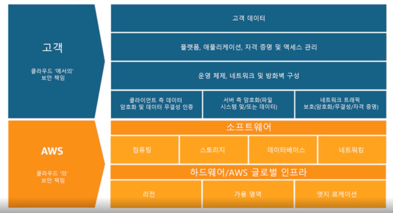  
보안과 규정 준수는 AWS와 고객의 공동 책임이다. 
클라우드 보안(인프라나 소프트웨어 서비스에 대한 책임)은 AWS에게 있지만, 
클라우드 내의 리소스나 데이터 애플리케이션(배포하는 항목) 보안에 대한 책임은 고객에게 있다.  

AWS는 애플리케이션과 데이터를 보호하기 위한 도구를 제공한다. 그러나 이러한 도구를 사용해서 보호할 책임은 고객에게 있다.

## AWS의 책임 : 클라우드의 보안
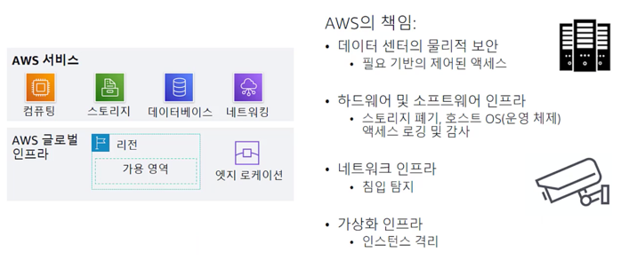  
AWS는 이중화와 침입탐지를 비롯한 리소스가 구축된 물리적 인프라의 보안에 대한 책임이 있다.
AWS가 이러한 인프라를 제공하므로 고객은 컴퓨팅, 스토리지, 데이터베이스, 네트워킹 등 다양한 서비스를 사용할 수 있다.  

AWS는 가상화 인프라가 고객 워크로드 간의 격리기능을 제공하도록 보장한다.  
ex) 한 고객의 EC2 인스턴스는 다른 고객의 컴퓨팅 환경으로부터 격리된다.

## 고객의 책임 : 클라우드에서의 보안
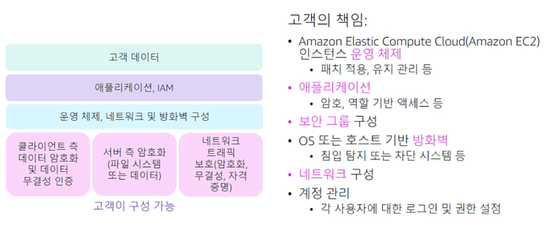  

AWS 클라우드에 저장하도록 선택하는 데이터, 해당 데이터를 사용해야 하는 서비스 그리고 데이터가 저장될 지리적 위치를 고려해야 한다.
고객은 전송중인 데이터와 저장된 데이터를 암호화 할 수 있다.  

## 서비스 특성 및 보안 책임
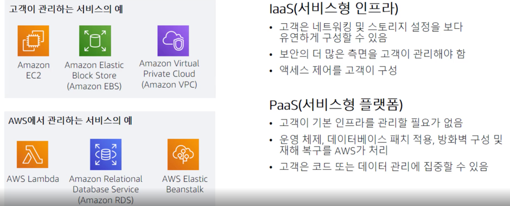  
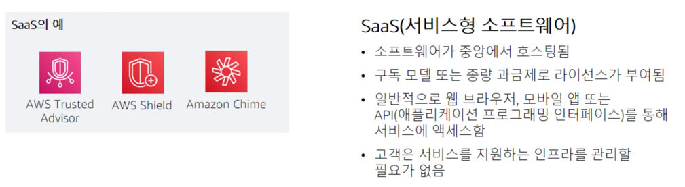  

Amazon EC2는 가상화된 서버가 제공되고 해당 가상 서버 관리를 완벽하게 제어할 수 있다는 점에서 서비스형 인프라로 분류된다.  
-> 서비스형 인프라를 사용할 경우 고객이 매우 높은 수준의 제어 권한을 가지므로 생성하고 관리하는 리소스의 보안에 대한 책임은 고객에게 있다.  

서비스형 플랫폼이란 인프라를 사용하는 서비스를 의미한다. 하지만 이런 인프라는 고객에게 표기되지 않고 클라우드 공급자가 관리한다.  
ex) Amazon Relational Database Service  
서버와 운영체제를 운영 및 업데이트하고 백업을 자동화한다는 점에서 서비스형 플랫폼으로 분류할 수 있다.  

서비스형 소프트웨어는 즉시 사용가능한 완전한 소프트웨어 솔루션을 제공하는 서비스를 말한다. 소프트웨어가 중앙에서 호스팅되므로 고객은 서비스를 지원하는 인프라를 관리할 필요가 없다.
서비스형 소프트웨어로 제공될 때 라이선스 모델은 보통 구독 또는 종량과금제이다. 

# AWS IAM (Identity and Access Management)
## IAM
IAM은 사용자, 그룹, 역할 및 액세스 제어를 정의하는데 사용되며 요금이 부과되지 않는 글로벌 서비스(모든 리전에서 사용할 수 있음)이다.
IAM을 사용하면 정책일 사용하여 모든 AWS 서비스에 대한 액세스를 제어함으로써 시스템 관리자, 데이터베이스 관리자, 스토리지 관리자, 보안 관리자 등의 운영 그룹을 정의할 수 있다.
IAM은 사용자, 역할 또는 특정 리소스에 대한 액세스 인증과 확인을 처리한다.

## IAM 필수 구성요소
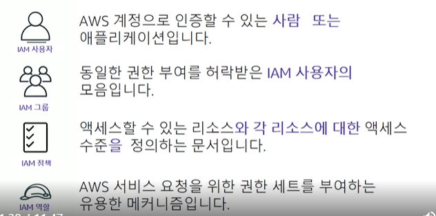  
1. IAM 사용자    
사용자는 일반적으로 AWS 계정에 액세스하도록 허용된 사람이다. 각 사용자에게는 공백이 없는 고유한 이름이 부여되어야 하며, 식별할 수 있는 수단(암호)이 할당되어야 한다.
   
2. IAM 그룹  
기본적으로 고객이 그룹을 정의하고 액세스 정책을 적용한다. 그 다음 정책을 각 사용자에게 직접 연결할 필요 없이 그룹에 사용자를 추가하거나 제거할 수 있다.  
   * 한 사용자가 여러 그룹에 속할 수 있다.
   * 그룹은 중첩할 수 없다.
   
3. IAM 정책(policy)  
정책은 하나 이상의 서비스에 대한 액세스를 정의하는 문서이다. 정책은 사용자 및 그룹과 독립적으로 생성된다. 생성된 정책을 연결하면 해당 정책에서 정의하는 액세스 제어가 활성화된다.
   
4. IAM 역할(role)  
IAM 역할은 특정 권한이 있는 계정에 생성할 수 있는 IAM 자격 증명이다.
역할은 AWS 서비스에 대한 임시 액세스 권한을 임시적으로 부여하는 매커니즘이다. (sudo와 비슷)
역힐은 리소스에 대한 액세스 권한을 선택한 사용자 또는 애플리케이션에만 임시적으로 부여한다.  
   * IAM 사용자와 유사한점
    1. 권한 정책을 연결할 수 있는 AWS 자격 증명 : 해당 권한은 자격 증명을 사용하여 AWS에서 수행할 수 있는 작업과 수행할 수 없는 작업을 결정
   * IAM 사용자와 다른점
    1. 한 사람에게 고유하게 연결되는 IAM 사용자와 달리 IAM 역할은 필요한 모든 사람이 수임할 수 있다.
    2. IAM 역할에는 암호 또는 액세스 키와 같은 표준 장기 자격 증명이 연결되지 않는다. 대신에 역할을 수임한 사람에게 역할 세션에 대한 임시 보안 자격 증명이 제공된다.    
   
## 액세스 유형
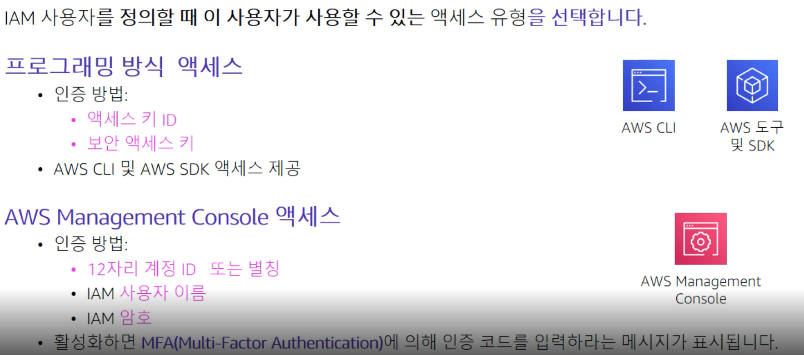  
1. 프로그래밍 방식 액세스  
사용자는 AWS CLI 또는 AWS SDK를 사용하여 AWS API를 호출할 때 액세스 ID와 보안 액세스 키(키 페어)를 제시해야한다.
   
2. Management Console 액세스  
일반적으로 사용자는 최소한 사용자 이름과 암호를 입력해야 한다. 만약 해당 사용자에 대해 멀티 팩터 인증이 활성화된 경우 MFA 코드(추가 인증 수단)를 입력해야 한다.
   
## 권한부여  
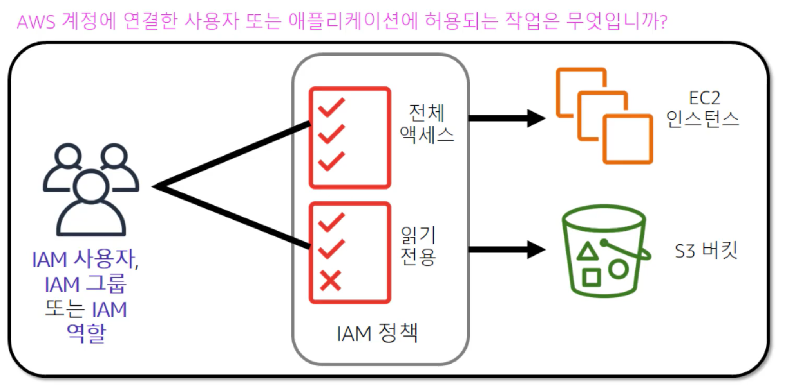  
권한부여는 사용자 또는 서비스에 부여할 권한을 결정하는 프로세스다. 사용자는 인증 후 서비스에 액세스할 수 있는 권한을 부여받아야 한다.  

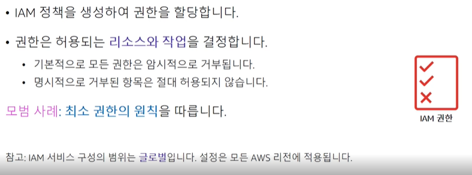  
기본적으로 IAM 사용자에게는 액세스 권한이 없다. 필요에 따라 정책을 적절하게 정의 및 연결하여 사용자에게 명시적으로 부여해야 한다.
필요 이상으로 권한을 부여하지 않는다. 사용자가 필요한 만큼만 권한을 부여한다. 이것을 **최소 권한의 원칙**이라고 한다.  

## IAM 정책  
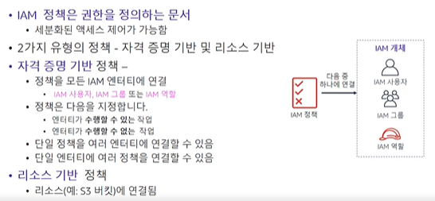  
IAM 정책은 JSON 형태의 문서이다. 정책은 AWS의 서비스에 대한 액세스를 허용하거나 거부하는 권한을 나열한다.
IAM 정책에는 두 가지 유형이 있다.  
1. 자격 증명 기반 정책  
IAM 사용자, 역할, 또는 그룹과 같은 **보안 주체 또는 자격 증명**에 연결할 수 있는 권한 정책이다.  
   
2. 리소스 기반 정책  
S3 버킷과 같은 **리소스**에 연결하는 권한 정책.  
   
### 예제
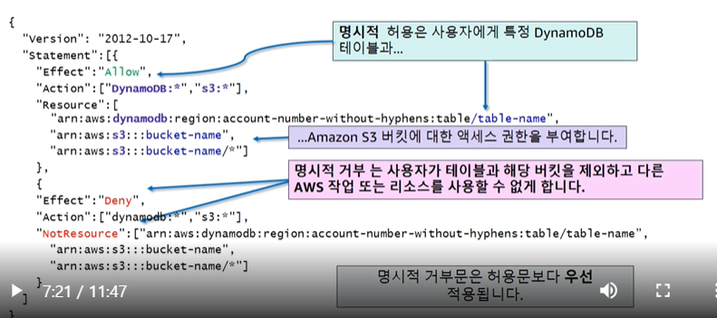  
- 명시적으로 허용하지 않은 모든 작업은 거부된다. (묵시적 거부)  
- 명시적으로 거부한 작업은 항상 거부된다.  
- 정책을 통해 명시적으로 허용해야 허가된다.  
- 허용문과 거부문이 상충하는 경우 거부문이 항상 우위를 점한다.