# 네트워킹 기본 개
## 네트워크
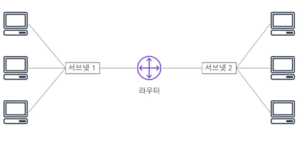  
컴퓨터 네트워크는 통신하기 위해 2대 이상의 머신이 함께 연결된 것이다.
네트워크는 **서브넷**이라는 논리적 분할을 할 수 있다.
네트워킹에는 **라우터 또는 스위치**와 같은 네트워킹 디바이스가 필요하다.

## IP Address
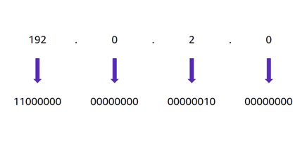  
네트워크의 각 머신에는 고유한 인터넷 프로토콜 주소가 할당된다.
즉, 머신을 **고유하게 식별**하기 위한 번호이다.
IP 주소는 10진수 체계의 A~D클래스 사이에 .(점)으로 구분되어 있고 이들을 **8비트 2진수 체계**(2^8=256가지의 10진수표현가능)로 변환한다.
즉, 각 클래스는 0~255까지의 수가 표현가능하고 IP주소는 총 32비트로 구성되어 있다.
32비트 IP주소를 IPv4주소라고 한다.  
IPv6는 128비트를 사용한다. 16비트 클래스(0~ffff)가 8개 존재한다.  

## CIDR (클래스 없는 도메인 간 라우팅)
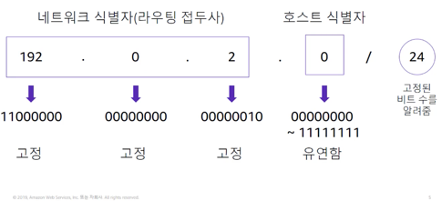  
네트워크를 설명하고 IP 주소를 그룹화하는 일반적인 방식은 클래스 없는 도메인 간 라우팅 (CIDR)이다.
CIDR 주소는 네트워크의 첫 번째 주소에 해당하는 IP 주소로 표현된다. 그다음에는 '/'문자가 온다.
'/'문자 뒤에는 네트워크 식별자에 대해 고정 또는 할당해야 하는 라우팅 접두사의 비트 수를 알려준다.
(24일경우 24비트가 네트워크 그룹임을 알려주므로, A, B, C클래스가 네트워크, D클래스는 호스트)  

## OSI (Open Systems Interconnection) 모델
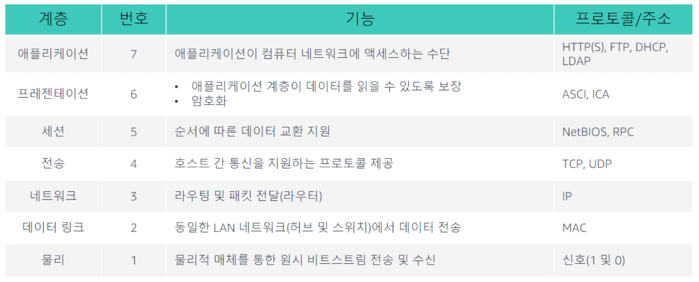  
OSI 모델은 네트워크를 통해 이동하는 데이터를 설명하는 데 사용되는 개념적 모델이다.
7계층으로 구성되며 각 계층에서 데이터를 전송하는 데 사용되는 공통 프로토콜 및 주소를 보여준다.
예를 들어 허브 및 스위치는 2계층 (데이터 링크 계층)에서 작동한다.
라우터는 3계층 (네트워크 계층)에서 작동한다.  

OSI 모델을 사용하면 클라우드와 기본 네트워킹 통신이 어떻게 이루어지는지 효과적으로 이해할 수 있다.

# Amazon VPC (Virtual Private Cloud)
물리적 네트워크의 개념은 대부분 클라우드 기반 네트워크에도 적용된다. 클라우드에서는 네트워크를 설정하는 데 있어서의 복잡성이 제어, 보안 및 사용성에 영향을 주지 않도록 추상화되어 있다.  
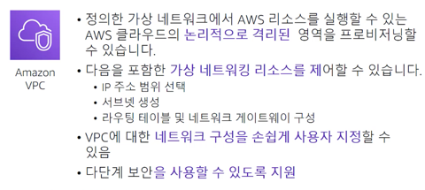  
* 논리적으로 격리된 공간 안에 가상 머신 및 기타 리소스를 배치할 수 있다.  
* VPC에서는 IPv4와 IPv6를 모두 사용하여 리소스와 애플리케이션에 안전하게 액세스할 수 있다.  
* 퍼블릭 인터넷에 액세스할 수 있는 웹 서버를 구축하기 위해 VPC를 서브넷으로 분할하고 퍼블릭 서브넷을 생성할 수 있다. 
  퍼블릭 인터넷 액세스가 전혀 없는 프라이빗 서브넷에 데이터베이스나 애플리케이션 서버 같은 백엔드 시스템을 배치할 수 있다. (네트워크 구성을 손쉽게 지정)
  
* 마지막으로 보안 그룹 및 네트워크 액세스 제어 목록을 비롯한 다중 보안 계층을 사용하여 각 서브넷에서 Amazon Elastic Compute Cloud (EC2) 인스턴스에 대한 액세스를 제어할 수 있다.

## VPC 및 서브넷
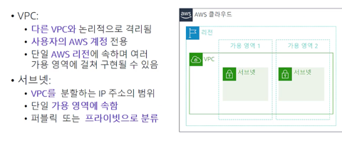  
VPC는 논리적으로 격리되어 고객전용 계정으로 구성된다. VPC는 **단일 리전**에 속하며 **여러 가용 영역**에 걸쳐 구현될 수 있다.
VPC를 생성한 후 하나 이상의 서브넷으로 분할할 수 있다. 서브넷은 자체 IP 주소 범위를 가진 VPC의 격리된 세그먼트를 나타낸다.  

**서브넷은 단일 가용 영역**에 속한다. 여러 가용 영역들 안에 서브넷을 생성하여 고가용성을 실현할 수 있다.
서브넷은 퍼블릭 또는 프라이빗일 수 있다. 퍼블릭 서브넷은 인터넷에 직접 액세스할 수 있지만, 프라이빗 서브넷은 인터넷에 직접 액세스할 수 없다.  

## IP 주소 지정
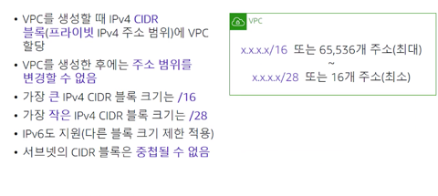  
IP 주소는 VPC 내의 리소스가 서로 토인하고 인터넷을 통해 다른 리소스와도 통신할 수 있게 해준다. VPC를 생성할 때 VPC에 IPv4 CIDR 블록 즉, 프라이빗 IPv4 주소의 범위를 할당한다.
VPC를 생성한 후에는 주소 범위를 변경할 수 없으므로 신중해야 한다.  

32 - 16 = 16 : 2^16 = 65,536  
32 - 28 = 4 : 2^4 = 16  

실제로 활용할 수 있는 이 최대 및 최소 블록 수를 기억하는 것이 중요하다.  
IPv6 CIDR 블록을 VPC와 서브넷에 연결하고 그 블록에 속한 IPv6 주소를 VPC의 리소스에 할당할 수 있다.
서브넷의 CIDR 블록은 VPC의 CIDR 블록과 동일할 수 있다. 즉, 서브넷이 전체 VPC와 동일할 수 있다. 하지만 자체 CIDR 블록이 있는 서브넷을 사용하여 VPC를 세분화할 수도 있다.
이 같은 구조 덕분에 여러 개의 서브넷을 정의할 수 있다. VPC에 2개 이상의 서브넷을 만들 경우 서브넷의 CIDR 블록이 서로 중첩되지 않아야 한다. 동일한 VPC에 동일한 IP 주소가 존재해서는 안된다.  

## 예약된 IP 주소
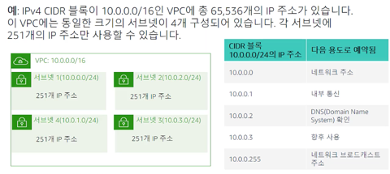  
서브넷을 생성할 때, 서브넷에는 자체 CIDR 블록이 필요하다. 
지정한 각 CIDR 블록에 대해 AWS는 해당 블록 내에 5개의 IP 주소를 예약하며 해당 주소는 사용할 수 없다.
서브넷에는 이론적으로 256개의 주소가 할당되지만, 5개의 예약된 주소로 인해 실질적으로 사용가능한 주소는 251개다.

## 퍼블릭 IP 주소 유형
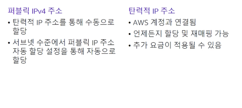  
VPC를 생성하면 해당 VPC의 모든 가상 머신에 자동으로 프라이빗 IP 주소가 할당된다.
또한 서브넷의 자동 할당 퍼블릭 IP 주소 속성을 수정하여 인스턴스를 생성할 때 가상 머신에 할당할 퍼블릭 IP 주소를 요청할 수도 있다.  

탄력적 IP 주소는 고정 퍼블릭 IPv4 주소이다. 계정의 어떤 VPC에 대해서든 탄력적 IP 주소를 인스턴스 또는 네트워크 인터페이스와 연결할 수 있다.
탄력적 IP 주소를 사용하면 주소를 VPC의 다른 인스턴스에 신속하게 다시 매핑하여 인스턴스의 장애를 감출 수 있다.
탄력적 IP 주소를 네트워크 인터페이스와 연결하면 인스턴스에 직접 연결하는 것보다 이점이 있다. 즉, 장애 발생 시 네트워킹 인터페이스의
모든 속성을 한 인스턴스에서 다른 인스턴스로 한 번에 옮길 수 있다.
탄력적 IP 주소를 사용할 경우 추가 요금이 발생할 수 있다. 따라서 더 이상 필요하지 않을 때 릴리스하는 것이 중요하다.  

## 탄력적 네트워크 인터페이스 
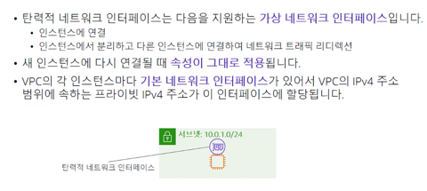  
탄력적 네트워크 인터페이스는 VPC의 인스턴스에 연결하거나 분리할 수 있는 가상 네트워크 인터페이스이다.
네트워크 인터페이스 속성은 다른 인스턴스에 다시 연결될 때 그대로 적용된다. 
네트워크 인터페이스를 인스턴스 간에 이동하면 네트워크 트래픽이 새 인스턴스로 리디렉션된다.
VPC의 각 인스턴스에는 주 네트워크 인터페이스라는 기본 네트워크 인터페이스가 있다. 이 인터페이스에는 파리이빗 IPv4 주소가 자동으로 할당되며 VPC의 IPv4 주소 범위내에 있다. 
기본 네트워크 인터페이스는 인스턴스에서 분리할 수 없다. 추가 네트워크 인터페이스를 생성하여 VPC의 모든 인스턴스에 연결할 수 있다.
연결 가능한 네트워크 인터페이스의 수는 사용중인 인스턴스 유형에 따라 달라진다.

## 라우팅 테이블 및 경로
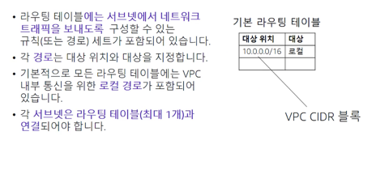  
라우팅 테이블에는 서브넷 안팎으로 네트워크 트래픽을 전달하는 경로라는 규칙 세트가 포함되어 있다.
각 경로는 대상 위치와 대상을 지정한다. 대상 위치는 서브넷에서 트래픽을 전달하려는 CIDR 블록이다. 대상은 트래픽이 전송되는 처리 리소스이다.
기본적으로 생성하는 모든 라우팅 테이블에는 로컬 경로가 포함되어 있다. 이는 VPC의 내부 통신용이다. 경로를 추가하여 라우팅 테이블을 사용자 지정할 수 있다.
로컬 경로 테이블 항목은 삭제할 수 없다. 이 항목은 내부 통신에 사용되며 고정되어 있고 변경되지 않는다.
VPC 내의 각 서브넷은 라우팅 테이블과 연결되어야 한다. 기본 라우팅 테이블은 VPC에 자동으로 할당되는 라우팅 테이블로, 사용자 지정 라우팅 테이블과 명시적으로 연결되지 않은 모든 서브넷의 라우팅을 제어한다.
서브넷은 한 번에 하나의 라우팅 테이블에만 연결할 수 있지만 여러 서브넷을 같은 라우팅 테이블에 연결할 수 있다. 즉, 라우팅 테이블을 여러 서브넷에 사용할 수 있지만, 서브넷과 라우팅 테이블 간의 매핑은 1대 1로 이루어진다.

# VPC 네트워킹

# VPC 보안

# Amazon Route 53

# Amazon CloudFront
