# 컴퓨팅
## 컴퓨팅 서비스 개요
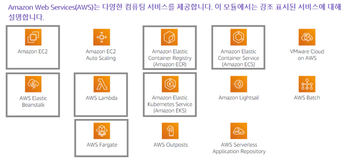  
AWS는 이 모듈에서 다루는 많은 컴퓨팅 서비스를 제공한다.  
* Amazon Elastic Compute Cloud (EC2)  
크기 조정이 가능한 가상 머신을 제공한다.  
  
* Amazon EC2 Auto Scaling  
EC2 인스턴스를 자동으로 시작하거나 종료하는 조건을 정의할 수 있도록 하여 애플리케이션 가용성을 지원한다.

* Amazon Elastic Container Registry (ECR)  
Docker 이미지를 저장하고 검색하는 데 사용된다.  
  
* Amazon Elastic Container Service (ECS)  
Docker를 지원하는 컨테이너 오케스트레이션 서비스이다.  
  
* VMware Cloud on AWS  
맞춤형 하드웨어 없이 하이브리드 클라우드를 프로비저닝할 수 있다.  
  
* AWS Elastic Beanstalk  
감편하게 웹 애플리케이션을 실행하고 관리할 수 있는 서비스
  
* AWS Lambda  
서버리스 컴퓨팅 솔루션으로 사용한 컴퓨팅 시간에 대해서만 비용을 지불한다.
  
* Amazon Elastic Kubernetes Service (EKS)  
AWS 에서 관리형 Kubernetes를 실행할 수 있다.
  
* Amazon Lightsail  
애플리케이션 또는 웹 사이트를 구축할 수 있는 간편한 서비스를 제공한다.

* AWS Batch  
규모에 관계없이 배치 작업을 실행할 수 있는 도구를 제공
  
* AWS Fargate  
서버 또는 클러스터를 관리해야 하는 부담이 적은 컨테이너를 실행하는 서비스를 제공  
  
* AWS Outpost  
온프레미스 데이터 센터에서 엄선된 AWS 서비스를 실행할 수 있도록 지원
  
* AWS Serverless Application  
Repository를 사용하면 서버리스 애플리케이션을 검색, 배포 및 게시할 수 있다.  
  
## 컴퓨팅 서비스 분류
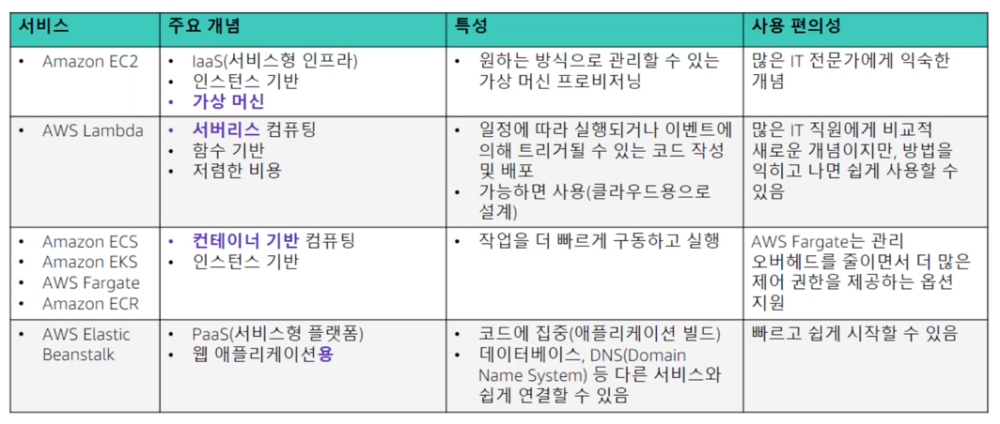  
컴퓨팅 서비스는 크게 가상 머신을 제공하는 컴퓨팅 서비스인 **서비스형 인프라**, **서버리스 컴퓨팅**, **컨테이너 기반 컴퓨팅**, 웹 애플리케이션을 위한 **서비스형 플랫폼**으로 정의되는 4가지 범주중 하나에 포함된다.
* 서비스형 인프라  
e.g) Amazon EC2  
  이 범주의 서비스는 유연성을 제공하며 서버 관리 작업의 많은 부분을 사용자가 맡아야 한다.
  운영체제는 물론 실행하는 서버의 크기 및 리소스 기능도 사용자가 선택한다.  
  
  
* 서버리스 컴퓨팅  
e.g) AWS Lambda (관리가 전혀 필요하지 않은 컴퓨팅 플랫폼)  
  AWS Lambda를 사용하면 서버를 프로비저닝하거나 관리하지 않고도 코드를 실행할 수 있다.
  사용한 컴퓨팅 시간ㅇ네 대한 요금만 지불한다. 서버리스 컴퓨팅의 인기가 높아지는 이유는 **클라우드 네이티브 아키텍처를 지원하기** 때문이다.
  클라우드 네이티브 아키텍처에서는 동일한 워크로드의 실행을 보장하기 위해 서비스를 상시 실행하는 것보다 저렴한 비용으로 대규모 확장 및 축소를 수행할 수 있다.  
  
* 컨테이너 기반 컴퓨팅  
e.g) Amazon Elastic Container Service, Amazon Elastic Kubernetes Service, AWS Fargate, Amazon Elastic Container Registry  
  컨테이너는 프로비저닝 프로세스에서 **운영 체제를 추상화**하기 때문에 가상머신보다 더 빠르게 프로비저닝된다.  
  
* 서비스형 플랫폼  
e.g) AWS Elastic Beanstalk (웹 애플리케이션을 위한)  
  AWS Elastic Beanstalk는 필요한 모든 애플리케이션 서비스를 제공하므로 배포가 가속화된다. 
  OS, 애플리케이션 서버 및 기타 인프라 구성 요소를 AWS가 관리하므로 사용자는 애플리케이션 코드 개발에 집중할 수 있다.  
  
## 최적의 컴퓨팅 서비스 선택
  
단일 컴퓨팅 솔루션으로 시작한 다음 애플리케이션 설계의 사용량 패턴 또는 변경에 따라 설계를 완전히 변경할 수도 있다.

## Amazon EC2
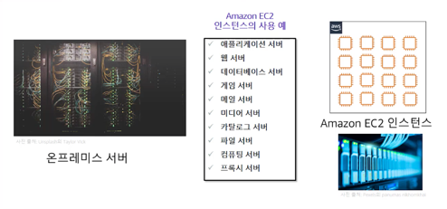  
Amazon EC2는 온프레미스 서버에서 실행하는 것과 동일한 애플리케이션을 호스팅할 수 있는 가상머신을 제공한다.
안전하고 크기 조정이 가능한 컴퓨팅 용량을 클라우드에서 사용할 수 있다.  

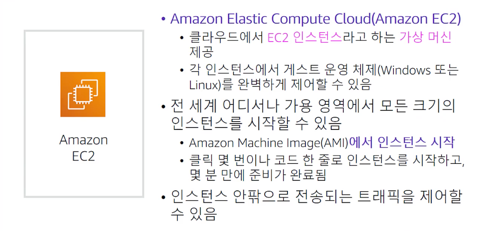  
EC2는 가상머신 템플릿인 AMI (Amazon Machine Image)에서 시작된다. 인스턴스의 인바운드/아웃바운드 트래픽은
보안 그룹을 통해 제어할 수 있다.  

## EC2 인스턴스 고려사항
1. AMI  
   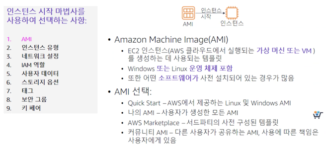
   AMI를 선택하는 것. AMI는 템플릿으로 생각하면 된다.  
   예를 들어 웹 서버로 사용할 인스턴스를 시작할 때 선택하는 AMI는 애플리케이션 서버를 호스팅할 인스턴스를 배포할 때 선택하는 AMI와 다를 수 있다.
   하나의 AMI에서 여러 인스턴스를 시작할 수도 있다.  
   사용예제)  
   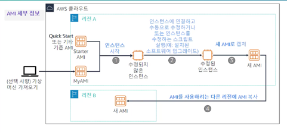  
   (캡처 이후) AMI를 생성할 때 Amazon EC2는 인스턴스를 중지하고 루트 볼륨 스냅샷을 생성한 다음 이 스냅샷을 AMI로 등록한다.
   AMI가 등록되면 AMI를 사용하여 동일한 AWS 리전에서 새 인스턴스를 시작할 수 있다.
   
2. 인스턴스 유형  
     
   인스턴스 유형을 선택하는 것.  
   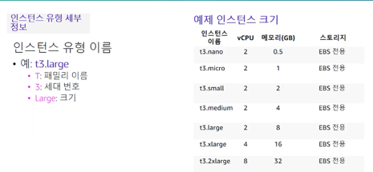  
   인스턴스의 이름은 **패밀리 이름, 세베 번호, 크기**로 구성되어 있다. 이 이름들을 통해 요구사항에 적절한 이름을 선택하면 된다.  
   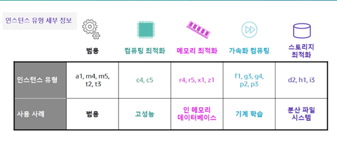  
   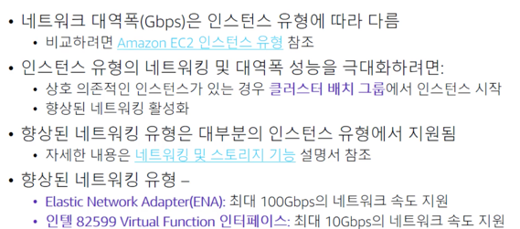  
   워크로드의 CPU, RAM 및 스토리지 요구 사항을 고려하는 것 외에 네트워크 대역폭 요구 사항을 고려하는 것도 중요하다.  
   ex) a1.medium 인스턴스는 초당 최대 10기가비트를 제공하지만, p3dn.24xlarge 인스턴스는 초당 최대 100기가비트를 제공한다.  
   
   다수의 새 인스턴스가 시작되는 경우 Amazon에서는 이러한 인스턴스를 기반 하드웨어에 분산하려고 애쓰며 모두 동일한 하드웨어에 배치하지 않는다.
   그러나 워크로드의 요구사항을 충족하기 위해 상호 의존적인 인스턴스를 배치하는 경우라면 배치 그룹을 사용할 수 있다.  
   예를들어 인스턴스 3개를 모두 동일한 가용영역에 배포하도록 지정하여 인스턴스 간 네트워크 지연 시간을 줄이고 네트워크 처리량을 늘릴수 있다.
   
3. 네트워크 설정 지정  
   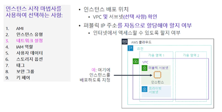  
   AMI와 인스턴스 유형을 선택한 후에는 EC2 인스턴스를 배포할 네트워크 위치를 지정해야 한다.
   인스턴스 시작 마법사를 시작하기 전에 **리전**을 선택해야 한다. 리전 내에서 기존 서브넷 또는 기존 VPC에 인스턴스를 배치하도록 지정할 수 있다.
   마법사는 새 VPC를 생성하거나 원하는 경우 새 서브넷을 생성할 수 있는 링크도 제공한다.
   위치를 따로 지정하지 않으면 인스턴스는 기본 VPC에 배치된다. 기본 VPC에서 인스턴스를 시작하는 경우 AWS는 **기본적으로 퍼블릭 IP 주소**를 할당한다.
   기본이 아닌 VPC에서 인스턴스를 시작하는 경우 이 VPC에서 시작된 인스턴스에서 **퍼블릭 IP를 수신할지 여부는 서브넷의 속성에 따라** 결정된다.
   
4. IAM 역할 연결 (선택사항)  
   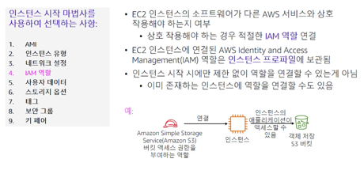  
   일반적으로 EC2 인스턴스는 다른 AWS 서비스에 대한 API 호출을 수행해야 하는 애플리케이션을 실행하는 데 사용된다.
   이러한 사용 사례를 지원하려면 AWS에서 IAM 역할을 생성하고 EC2 인스턴스에 연결할 수 있다. 
   이 기능이 없으면 애플리케이션에서 다른 AWS 서비스를 호출할 때 사용할 AWS 자격 증명을 EC2 인스턴스에 배치하고 싶을 수 있다.
   **하지만 EC2 인스턴스에 AWS 자격 증명을 저장해서는 안된다.** 대신 IAM 역할을 EC2 인스턴스에 연결한다.  
   **인스턴스 프로파일은 IAM 역할에 대한 컨테이너**이다. 
   AWS Management Console을 사용하여 Amazon EC2의 역할을 생성하는 경우 콘솔이 자동으로 인스턴스 프로파일을 생성하여 해당 역할과 동일한 이름을 부여한다.
   *이미 실행중인 인스턴스에도 역할을 연결할 수 있다.*  
   
5. 사용자 데이터 스크립트 (선택사항)  
   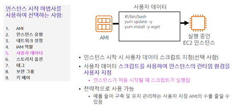  
   EC2 인스턴스를 생성할 때 사용자 데이터를 인스턴스에 전달할 수 있는 옵션을 사용할 수 있다.
   사용자 데이터를 사용하여 인스턴스 시작 시 설치 및 구성 작업을 자동으로 완료할 수 있다. 
   예를 들어 사용자 데이터 스크립트를 실행하여 인스턴스의 운영체제를 패치 및 업데이트하거나 소프트웨어 라이선스 키를 가져와 설치하거나
   추가 소프트웨어를 설치할 수 있다. Windows 인스턴스의 경우 사용자 데이터 스크립트는 명령 프롬프트 창(배치 명령) 또는 Windows PowerShell과 호환되는 형식으로 작성되어야 한다.
   EC2 인스턴스가 생성될 때 부팅 프로세스의 마지막 단계에서 사용자 데이터 스크립트가 실행된다. 기본적으로 사용자 데이터는 **인스턴스가 처음 시작될 때만** 실행된다.
   사용자 데이터 스크립트를 전략적으로 사용하여 구축 및 유지 관리가 필요한 사용자 지정 AMI의 수를 줄일 수 있다.
   
6. 스토리지 지정  
     
   EC2 인스턴스를 시작할 때 스토리지 옵션을 구성할 수 있다. 
   예를 들어 Windows 또는 Linux 같은 게스트 **운영 체제가 설치된 루트 볼륨**의 크기를 구성할 수 있다.
   인스턴스를 시작할 때 추가 **스토리지 볼륨을 연결**할 수도 있다.
   일부 AMI는 기본적으로 2개 이상의 스토리지 볼륨을 시작하여 루트 볼륨과 분리된 스토리지 옵션을 제공하도록 구성된다.  
   스토리지 옵션)
   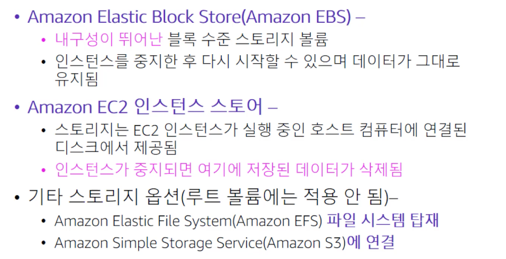  
   여기서 중요한 점은 인스턴스 스토어는 **휘발성 메모리**라는 점이다. 고로 인스턴스가 중지되면 데이터가 유지되지 않는다.  
   그리고, EFS, S3는 루트 볼륨으로써 사용할 수 없다. (Elastic Block Store, 인스턴스 스토어만이 루트 볼륨으로 사용가능)  
   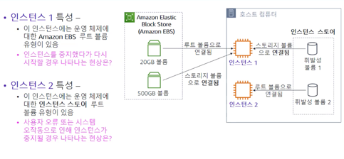  
   인스턴스 1의 경우에는 중지후 시작할 때, 휘발성 볼륨 1(인스턴스 스토어)이 초기화된다. 하지만 나머지 볼륨들은 유지된다.  
   반면, 인스턴스 2의 경우에는 운영체제가 휘발성 볼륨 2(인스턴스 스토어)에 저장되어 있기 때문에 운영체제가 초기화되어 재시동이 불가능하다.  
   **인스턴스 2와 같이 인스턴스 스토어가 루트 볼륨으로 사용되는 경우 Amazon EC2 API 호출로 중지할 수 없다.** 인스턴스 OS 내에서 종료하거나 오류로 인해 중지된다.  
   
7. 태그 추가  
   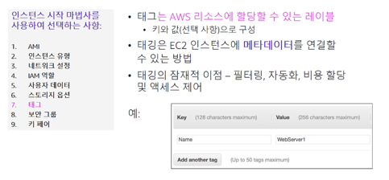  
   태그는 EC2 인스턴스와 같은 AWS 리소스에 할당하는 레이블이며 각 태그는 사용자가 정의하는 키와 선택적 값으로 구성된다.
   태그를 사용하면 AWS 리소스를 다양한 방식으로 분류할 수 있다. 예를 들어 용도, 소유자 또는 환경별로 인스턴스에 태그를 지정할 수 있다.
   태깅은 EC2 인스턴스에 메타데이터를 연결하는 방법이다. 예를 들어 EC2 인스턴스에 일반적으로 사용되는 태그는 Name이라는 태그 키와 WevServer1과 같이 인스턴스를 설명하는 태그값이다.
   Name 태그는 Amazon EC2 콘솔 인스턴스 페이지에 기본적으로 표시된다. 일관된 태그 키 세트를 사용하여
   리소스의 생성 및 관리를 용이하게 하는 태그 지정 전략을 개발하는 것이 모범사례이다.  
   
8. 보안 그룹 설정  
   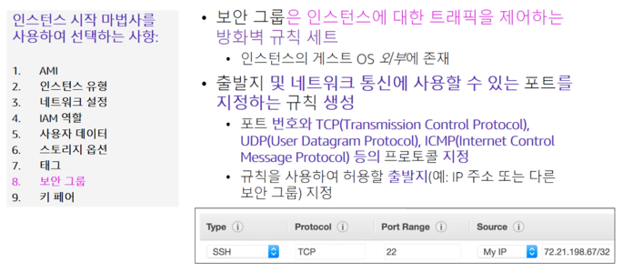  
   보안 그룹은 하나 이상의 인스턴스에 대한 발신 및 수신 네트워크 트래픽을 제어하는 가상 방화벽 역할을 한다.
   인스턴스를 시작할 때 하나 이상의 보안 그룹을 지정할 수 있다. 그렇지 않으면 기본 보안 그룹이 지정된다.
   각 보안 그룹에 규칙을 추가할 수 있다. 규칙은 연결된 인스턴스의 수신 또는 발신 트래픽을 허용한다. 
   트래픽이 인스턴스에 도달하려고 시도하면 해당 인스턴스와 연결된 모든 보안 그룹의 모든 규칙이 평가된다. 
   규칙을 정의할 때 네트워크 통신 (인바운드 규칙) 또는 대상 위치(아웃바운드 규칙)의 허용 가능한 소스를 지정할 수 있다.
   소스는 IP 주소, IP 주소 범위, 다른 보안 그룹, VPC 엔드포인트 또는 모든 위치(모든 소스가 허용됨)일 수 있다.
   기본적으로 보안그룹은 모든 아웃바운드 트래픽을 허용하는 아웃바운드 규칙을 포함한다. 이 예제에서 인바운드 트래픽 규칙은 요청의 소스가 MyIP인 경우
   규칙이 TCP 포트 22번을 통한 Secure Shell (SSH) 트래픽을 허용함을 보여준다. My IP 주소는 규칙을 정의할 때
   현재 AWS 클라우드에 연결되어 있는 IP 주소를 확인하여 계산된다.
   
9. 키 페어 식별 또는 생성  
   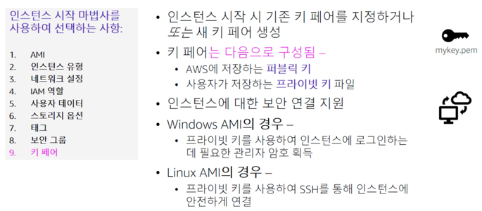  
   마법사를 통해 EC2 인스턴스를 시작할 때 마지막으로 선택해야 할 중요한 사항은 키 페어를 지정하는 것이다.
   키 페어는 퍼블릭 키와 프라이빗 키로 구성된다. 키 페어는 EC2 인스턴스에 대한 보안 연결을 지원한다.
   EC2 인스턴스를 생성할 때 기존 키 페어를 선택하거나, 키 페어 없이 진행하거나 새 키 페어를 생성할 수 있다.
   [Launch Instances(인스턴스 시작)]를 선택하고 EC2 인스턴스를 생성하기 전에 이 결정을 먼저 내려야 한다.
   새 키 페어를 생성하는 경우 이를 다운로드하여 안전한 위치에 저장한다. 새 프라이빗 키를 다운로드하여 저장할 수 있는 유일한 기회는 생성 시점에만 있다.  
   Windows 인스턴스에 연결하려면 프라이빗 키를 사용하여 관리자 암호를 획득한 다음 RDP라고 하는 원격 데스크톱 프로토콜을 사용하여
   EC2 인스턴스의 Windows 데스크톱에 로그인한다. Windows 시스템에서 Amazon EC2 인스턴스로의 SSH 연결을 설정하려면
   PuTTY와 같은 도구를 사용할 수 있다. 이 도구에는 동일한 프라이빗 키가 필요하다.  
   Linux 인스턴스에 로그인하려면, 예를 들어 SSH를 사용하여 로그인하는 경우에도 연결을 설정할 때 프라이빗 키를 제공해야 한다.  
   
### Amazon EC2 콘솔
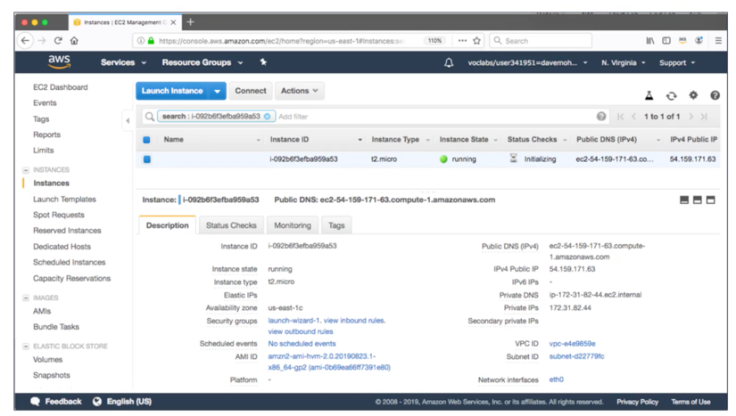  
[Launch Instance(인스턴스 시작)]를 선택하고 [View Instance(인스턴스 보기)]를 선택하면 위와 같은 화면이 표시된다.
시작할 때 지정한 설정 중 다수가 [Description(설명)] 패널에 표시된다. 제공되는 인스턴스에 대한 정보로는 IP 주소 및 
DNS 주소 정보, 인스턴스 유형, 인스턴스를 시작하는 데 사용한 AMI, AMI ID, VPC ID, 서브넷 ID 등이 있다.  
   
### CLI를 통한 인스턴스 시작
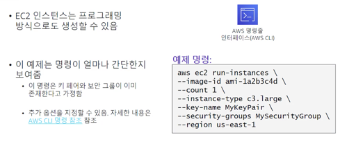  
인스턴스 시작 마법사에서만 EC2 인스턴스를 시작할 수 있는 것은 아니다. AWS Command Line Interface 또는 AWS SDK를 사용하여
프로그래밍 방식으로 EC2 인스턴스를 시작할 수도 있다.  
위 예제를 살펴보자. aws는 AWS 명령줄 유틸리티를 호출한다. ec2는 EC2 서비스를 호출한다. run-instances는 실행할 하위 명령이다.
나머지 명령은 인스턴스를 시작하는 데 필요한 여러 파라미터를 지정한다.  
--image-id는 AMI ID를 나타낸다. 모든 AMI에는 고유한 ID가 있다.  
--count를 보면 단일 명령으로 2개 이상의 인스턴스를 시작할 수 있음을 알 수 있다.  
--instance-type은 생성할 인스턴스의 유형이다.  
--key-name의 경우 이 예제에서는 MyKeyPair가 이미 존재한다고 가정한다.  
--security-groups에서도 MySecurityGroup이 이미 존재한다고 가정한다.  
--region에서는 AWS 리전에 AMI가 있으므로 AWS CLI에서 AMI 및 다른 참조된 리소스를 찾을 수 있는 리전을 지정해야 한다.  
이 리전은 EC2 인스턴스가 시작될 리전이기도 하다.  

### Amazon EC2 LifeCycle
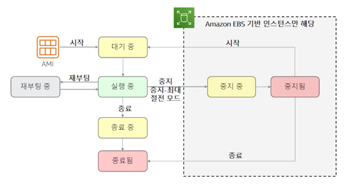  
인스턴스 수명 주기에 걸친 다양한 인스턴스 상태에 대해 알아보자. 
AMI에서 인스턴스를 시작한 후 인스턴스는 대기 중 상태에 있다가 실행 중 상태에 도달한다.
인스턴스를 중지하고 다시 시작한 경우에도 인스턴스는 처음에 대기 중 상태로 전환된다. 
실행 중인 인스턴스는 완전히 부팅되어 EC2 인스턴스에 액세스할 준비가 된 인스턴스이다.
실행 중인 모든 인스턴스는 재부팅을 할 수 있다. 재부팅된 인스턴스는 동일한 물리적 호스트에 유지되며
인스턴스의 퍼블릭 DNS 이름과 퍼블릭 IP 주소는 동일하게 유지된다.
인스턴스에 인스턴스 스토어 볼륨이 있는 경우 데이터는 이러한 볼륨에 유지된다. 
실행 중인 인스턴스도 종료할 수 있으며 이러한 인스턴스는 종료되기 전에 임시 종료 중 상태로 전환된다.
종료된 인스턴스느 가상 머신이 실제로 삭제되기 전에 Amazon EC2 콘솔에 잠시 표시된다. 하지만 종료된 인스턴스에 연결하거나
해당 인스턴스를 복구할 수는 없다.  
마지막으로, Amazon EBS 기반 인스턴스를 중지할 수 있다. 인스턴스는 완전히 중지된 상태가 되기 전에 중지 중 상태로 전환된다.
중지된 인스턴스에서 발생하는 비용은 실행 중인 인스턴스와 같지 않다. 
중지된 인스턴스를 시작하면 보류 상태로 전환되며 해당 인스턴스는 새 호스트 머신으로 이동한다.  
#### 최대 절전 모드
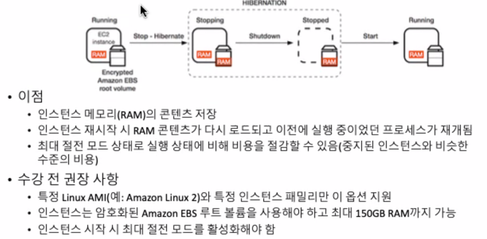

### 탄력적 IP 주소 사용 고려
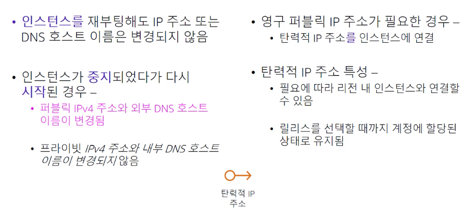  
퍼블릭 IP 주소는 인터넷을 통해 연결할 수 있는 IPv4 주소이다. 또한 퍼블릭 IP 주소가 할당된 각 인스턴스에는
외부 DNS 호스트 이름이 할당된다. EC2 인스턴스가 중지됨 또는 종료됨 상태에 도달하면 해당 인스턴스에 동적으로 할당된 퍼블릭 IP 주소가 해제된다.
인스턴스가 다시 시작되면 새 퍼블릭 IP 주소가 할당된다. 인스턴스에서 퍼블릭 IP 주소의 연결이 해제되면 
해당 퍼블릭 IP 주소가 퍼블릭 IP 주소 풀로 다시 해제되지만 해당 주소를 재사용하도록 지정할 수는 없다. 
**영구 퍼블릭 IP 주소가 필요한 경우에는 탄력적 IP 주소를 인스턴스에 연결해야 한다.**
이렇게 하려면 먼저 인스턴스가 있는 리전에 새로운 탄력적 IP 주소를 할당한다. 그리고 해당 주소를 인스턴스에 연결한다. 
퍼블릭 인터넷 주소가 부족하기 때문에 기본적으로 모든 AWS 계정에서 사용할 수 있는 탄력적 IP 주소는 **리전당 5개**로 제한된다.
하지만 이는 소프트 제한이므로 필요한 경우 한도 증가르 요청할 수 있다.  

### EC2 인스턴스 메타데이터
인스턴스 메타데이터는 인스턴스에 대한 데이터이다. 인스턴스에 연결되어 있는 동안
169.254.169.254/latest/meta-data를 입력하여 메타데이터를 볼 수 있다.
터미널 창에서 cURL 유틸리티를 사용하는 것과 같이 프로그래밍 방식으로 데이터를 읽을 수 있다.
IP 주소 169.254.169.254는 링크-로컬 주소이며, 해당 인스턴스에서만 유효하다.
인스턴스 메타데이터는 실행 중인 인스턴스와 관련하여 AWS Management Console에서 제공되는 것과 거의 동일한 정보를 제공한다.
인스턴스 시작 시 지정된 모든 사용자 데이터는 169.254.169.254/latest/user-data에서도 액세스가 가능하다.  

### 모니터링을 위한 Amazon CloudWatch
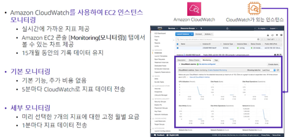  
Amazon EC2에서 원시 데이터를 수집하여 실시간에 가까운 지표로 처리하는 Amazon CloudWatch를 사용하여 인스턴스를 모니터링할 수 있다.
이러한 통계는 15개월동안 유지된다. EC2는 기본적으로 5분마다 CloudWatch로 지표 데이터를 전송하는 기본 모니터링을 제공한다.
인스턴스에 대한 지표 데이터를 1분 간격으로 CloudWatch로 전송하려면 세부 모니터링을 활성화하면 된다.

## Amazon EC2 비용 최적화
### Amazon EC2 요금 모델
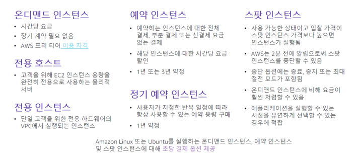  
Amazon은 EC2 인스턴스를 실행할 떄 선택할 수 있는 다양한 요금 모델을 제공한다.
- 온디맨드 인스턴스  
  AWS 프리티어가 적용된다. 선결제 금액이 가장 낮으며 가장 유연하다. 사전 약정이나 장기 계약 조건이 없다.  
  
- 전용 호스트  
전용 호스트는 고객 전용의 인스턴스 용량을 갖춘 물리적 서버이다. 전용 호스트에서는 Microsoft SQL Server 라이선스와 같은 기존 소프트웨어 라이선스를 사용할 수 있다.
  
- 전용 인스턴스  
단일 고객에게만 할당된 하드웨어의 VPC(Virtual Private Cloud)에서 실행되는 인스턴스이다.
  
- 예약 인스턴스  
예약 인스턴스를 사용하면 더 저렴한 시간당 비용으로 .. 할인된 이용 요금이 예약 인스턴스를 소유한 동안 고정으로 적용된다.
  예정된 예약 인스턴스를 사용하면 1년 또는 3년 약정으로 지정된 기간 동안 매일, 매주 또는 매월 반복되는 용량 예약을 구매할 수 있다.
  
- 정기 예약 인스턴스
  
- 스팟 인스턴스  
스팟 인스턴스를 사용하면 미사용 EC2 인스턴스 용량에 입찰하여 비용을 낮출 수 있다. 스팟 인스턴스의 비용은 공급과 수요에 따라 변동된다.
  
### Amazon EC2 요금 모델 : 이점
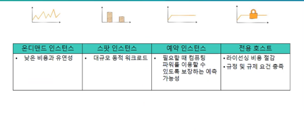  
온디맨드 인스턴스는 장기 계약 없이 저렴한 비용과 유연성을 제공한다. 스팟 인스턴스는 대폭 할인된 가격으로 대규모 용량을 제공한다. 
예약 인스턴스는 예측 가능하거나 안정적인 컴퓨팅 요구 사항에 적합하다. 전용 호스트는 라이선스 제한이 있거나 규정 준수 또는 규제 요구 사항을 충족해야 하는 경우 적합하다.  

### Amazon EC2 요금 모델 : 사용 사례
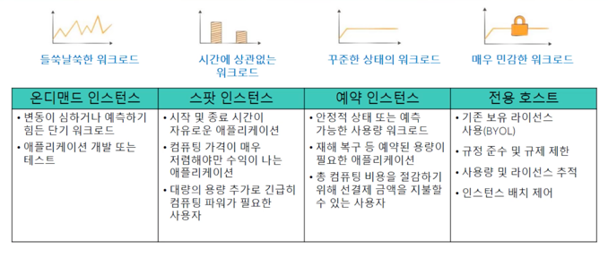  
온디맨드 인스턴스 요금은 워크로드 용량이 들쭉날쭉하거나 테스트를 실행해야 하는 경우 또는 개발 또는 테스트를 위한 애플리케이션을 단기간 실행해야 하는 경우 적합하다.
워크로드를 예측할 수 없거나 기간이 짧거나 들쭉날쭉하다면 온디맨드 인스턴스를 선택하는 것이 좋다.  
스팟 인스턴스는 애플리케이션이 중단으로 인한 영향을 크게 받지 않고 2분 전 경고와 함께 스팟 인스턴스가 중단되어도 괜찮은 경우 적합한 선택이다. 
기본적으로 스팟 인스턴스가 중단되면 인스턴스가 **종료**된다. 이 경우 인스턴스를 **중지하거나 최대 절전 모드로 전환**하도록 구성할 수 있다.
스팟 인스턴스의 일반적인 사용 사례에는 웹 서버, API 백엔드, 빅데이터 처리와 같은 내결함성 애플리케이션이 포함된다.  
예약 인스턴스는 사용량 패턴을 예측할 수 있는 장기 워크로드가 있는 경우 적합하다. 예를 들어 몇 개월 또는 몇 년간 일관적으로 실행할 예정인 서비스에 적합하다.  
전용 호스트는 기존 소켓당, 코어당 또는 VM당 라이선싱을 사용하고 있고 특정 기업 규정 준수 및 규제 요구 사항을 충족해야 하는 경우에 적합하다.  

### 비용 최적화의 4가지 원칙
  
1. 적절한 크기 선택  
적절한 균형의 인스턴스 유형을 선택해야 한다. 서버 크기를 축소하거나 서버를 해제하더라도 성능 요구 사항을 충족할 수 있는 경우가 있는데 이렇게 하면 비용이 절감된다.  
   AWS는 60개가 넘는 인스턴스 유형과 크기를 제공한다. 선택의 범위가 넓으므로 고객은 워크로드에 가장 적합한 인스턴스 유형을 선택할 수 있다.
   어디서부터 시작해야 할지 어떤 인스턴스가 애플리케이션에 적합한지 알기가 어려울 수 있지만 배포된 리소스를 검토하고 가능한 경우 리소스를 줄일 수 있는 기회를 찾아봐야 한다.  
   Amazon CloudWatch 지표를 사용하여 CPU, RAM, 스토리지 및 네트워크 사용률을 검토하고 축소가 가능한 인스턴스를 식별할 수 있다. 
   가장 경제적인 비용으로 여전히 성능 요구 사항을 충족할 수 있는 인스턴스 유형을 선택한다. 사용량 패턴이 일관적이라면 예약 인스턴스를 구매한다. 
   
2. 탄력성 개선  
유휴 상태의 서버 용량을 줄이도록 배포를 설계한다. 즉, 자동 조정을 사용하여 피크 로드를 처리하는 것과 같이 탄력적인 배포를 구현해야 한다.  
   탄력성은 클라우드의 핵심 원리 중 하나이지만 고객이 탄력성을 활용하여 비용 절감을 주도하려면 탄력성을 조작하는 방법을 배워야 하는 경우가 많다.
   탄력성의 한 가지 형태는 Amazon EBS 기반 EC2 인스턴스를 사용하지 않을 때 해당 인스턴스를 중지하거나 최대 절전 모드로 전환하는 것이다.
   중지 또는 최대 절전 모드 전환의 일반적인 대상으로는 비프로덕션 환경, 개발 워크로드 또는 테스트 워크로드가 있다. 
   프로덕션 워크로드의 경우 보다 정밀하고 세분화된 자동 조정 정책을 구성하면 수평적 확장을 활용하여 최대 용량 요구 사항을 충족할 수 있으므로
   최대 용량에 대한 비용을 계속 지불하지 않아도 된다. 도
   
3. 최적의 요금을 선택  
현재 사용량 패턴을 분석하면 적절한 요금 옵션 조합으로 EC2 인스턴스를 실행할 수 있다.  
   현재 및 예측 용량 수요에 맞춰 다양한 구매 유형을 조합하는 방법으로 요금을 최적화할 수 있다. 또한 애플리케이션 아키텍처를 고려하는 것이 좋다.
   예를 들어 애플리케이션에서 제공하는 기능을 EC2 가상 머신에서 실행해야 하는지, 아니면 AWS Lambda를 대신 사용하여 비용을 크게 줄일 수 있는지 여부를 평가한다.
   
4. 스토리지 선택 최적화  
사용하지 않는 스토리지 오버헤드를 줄이고 스토리지 성능 요구사항을 충족할 수 있는 더 저렴한 스토리지 옵션을 선택한다.  
   모범 사례는 스토리지 성능과 가용성을 유지하면서 비용을 절감하는 것이다. 이 모범 사례를 따르는 한 가지 방법은 EBS 볼륨의 크기를 조정하는 것이다. 
   예를 들어 최대 20GB의 스토리지 공간만 필요한 EC2 인스턴스에 처음에 500GB 볼륨을 프로비저닝한 경우 볼륨 크기를 줄여 비용을 절감할 수 있다.
   EBS 볼륨도 다양한 유형으로 제공된다. 성능 요구 사항을 충족하는 유형 중에서 가장 비용 효율적인 유형을 선택한다.
   EBS 스냅샷을 사용하여 데이터 백업을 생성하는 고객이 많은데 일부 고객은 더 이상 필요하지 않은 스냅샷을 삭제하지 않고 그대로 둔다. 
   **불필요한 스냅샷을 삭제하면 스토리지 비용을 절감할 수 있다.**  
   
   마지막으로 특정 데이터 유형에 가장 적합한 대상을 식별한다.  
   - 애플리케이션에 사용되는 데이터가 Amazon EBS에 무조건 있어야 하는지 검토한다.
   - Amazon S3를 스토리지로 대신 사용해도 문제가 없는지 검토한다.  
   
데이터 수명 주기 정책을 구성하여 비용을 절감할 수 있다. 예를 들어 자주 사용되지 않는 오래된 데이터를 Amazon Simple Storage Service Glacier와 같은 경제적인 스토리지 위치로 마이그레이션하는 작업을 자동화할 수 있다.  

### 측정, 모니터링 개선
  
태깅을 사용하면 어떤 리소스를 누가 어떤 용도로 사용하고 있는지에 대한 정보를 얻을 수 있다. 
결제 및 비용 관리 콘솔에서 비용 할당 태그를 활성화 하면 AWS 에서 할당된 태그를 바탕으로 비용 할당 보고서를 생성할 수 있다.
비즈니스 범주를 나타내는 태그를 적용하여 여러 서비스에 대한 비용을 정리한다. AWS 모범 사례에 따라 리소스를 프로비저닝할 수 있도록 실시간 지침을 제공하는 AWS Trusted Advisor와 같은 서비스를 사용하는 것도 좋다.
팀에서 아키텍처를 설계할 때 비용을 고려하는 문화를 장려하자. AWS Cost Explorer는 비용 그래프를 보는데 사용할 수 있는 무료 도구이다. 
마지막으로 비용 최적화 작업은 일반적으로 비용 최적화에 대한 책임을 개인이나 팀에 부여할 때 더 성공적으로 이루어진다.

## 컨테이너 서비스
## AWS Lambda
## AWS Elastic Beanstalk