# Amazon Elastic Block Store (Amazon EBS)
Amazon EBS는 Amazon EC2 인스턴스에서 사용할 수 있는 영구 블록 스토리지 볼륨을 제공한다.
영구 스토리지는 해당 디바이스의 전원이 차단된 후 데이터를 보존하는 데이터 스토리지 디바이스(비휘발성)이다.
각 Amazon EBS 볼륨은 **자동으로 가용 영역 내에 복제**되므로 구성 요소에 장애가 발생하더라도 안전하다. (내결함성)
Amazon EBS 볼륨은 워크로드 실행에 필요한 지연 시간이 짧고 일관된 성능을 제공한다.
Amazon EBS를 사용하면 몇 분 내에 사용량을 많게 또는 적게 확장할 수 있으며 프로비저닝한 부분에 대해서만 저렴한 비용을 지불한다.

## AWS 스토리지 옵션 : 블록 스토리지와 객체 스토리지 비교
  
스토리지 유형 간의 중요한 차이점 중 하나는 블록 수준 스토리지를 제공하는지 객체 스토리지를 제공하는지 여부이다.
블록 스토리지는 변경된 데이터만 업데이트 하는 장점이 있다. 일반적으로 블록 스토리지 솔루션은 더 빠르고 사용하는 대역폭은 적지만
객체 수준 스토리지보다 비용은 많이 드는 단점이 있다.  

## Amazon EBS
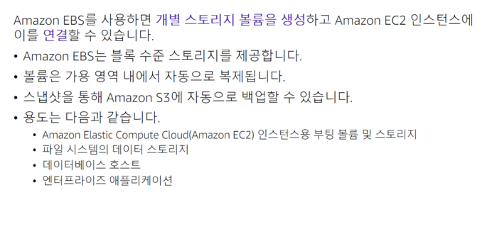  
Amazon EBS를 사용하면 개별 스토리지 볼륨을 생성하고 Amazon EC2 인스턴스에 연결할 수 있다.
Amazon EBS는 Amazon EC2 인스턴스를 위한 내구성이 뛰어난 분리 가능한 블록 수준 스토리지를 제공한다.
**볼륨이 인스턴스에 직접 연결되므로 데이터가 저장되고 사용되는 인스턴스의 지연 시간이 짧아진다. 고로 데이터베이스를 실행하기에 적합하다.**
Amazon EBS 볼륨의 백업을 **스냅샷**이라고 한다. 첫 번째 스냅샷을 **기준 스냅샷**이라고 하며 기준 스냅샷 이후의 다른 모든 스냅샷은 **이전 스냅샷과 다른 부분만 캡처**(블록 스토리지 방식)한다.
Amazon EBS 볼륨은 보통 EC2 인스턴스의 부트 볼륨 및 스토리지로 사용된다.  

## Amazon EBS 볼륨 유형
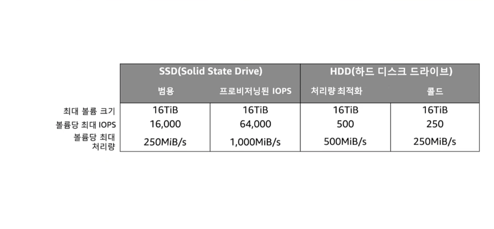  
워크로드에 가장 적합한 스토리지 유형을 선택하면 스토리지 비용을 줄일 수 있다. 
프로비저닝된 IOPS SSD 기반 Amazon EBS 볼륨은 최고의 성능을 제공할 수 있다.
하지만 애플리케이션에 높은 성능이 필요하지 않거나 이만큼 높은 성능을 사용하지 않는 경우라면 범용 SSD로 충분하다.
추가 스토리지로 사용하려는 경우 또는 부트 볼륨 외의 사용 사례에는 비용이 저렴한 옵션이 적합할 수 있다.
인스턴스의 시스템 드라이브 또는 데이터베이스 애플리케이션용 스토리지 등 자주 업데이트해야 하는 데이터의 경우 Amazon EBS 볼륨을 기본 스토리지로 사용할 수 있다.
또한 연속 디스크 스캔을 수행하는 처리량이 많은 애플리케이션에도 사용할 수 있다. EC2 인스턴스의 **부팅 볼륨으로는 SSD만** 사용될 수 있다.

## Amazon EBS 기능
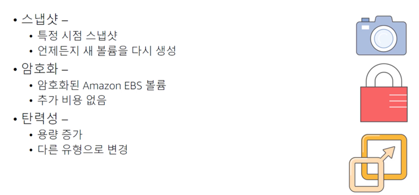  
Amazon EBS의 데이터 내구성을 훨씬 더 높은 수준으로 올리려면 볼륨의 특정 시점 스냅샷을 생성하고 스냅샷에서 언제든지 새 볼륨을 재생성할 수 있다.
또한 스냅샷을 공유하거나 **다른 AWS 리전으로 스냅샷을 복사**하면 재해 복구 보호를 한층 더 강화할 수 있다.
또한 추가 비용 없이 Amazon EBS 볼륨을 **암호화**할 수도 있다. 이렇게 하면 전송 중인 데이터가 암호화된다. 
EBS 볼륨의 용량을 동적으로 늘리고 다른 유형으로 변경 또한 가능하다. 즉, 하드 디스크 드라이브를 SSD로 변경하거나 50기가바이트 볼륨에서 16테라바이트 볼륨으로 늘릴 수 있다.
인스턴스를 중지할 필요 없이 크기 조정 작업을 동적으로 수행할 수 있다.  

## Amazon EBS : 볼륨, IOPS 및 요금
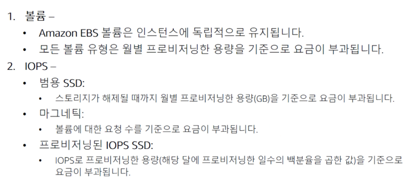  
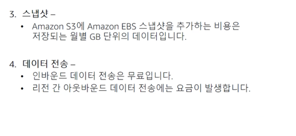  
여기에는 Amazon EBS 비용을 추정할 때 유의해야 할 며 가지 중요한 사항이 나와있다.
모든 EBS 볼륨 유형의 스토리지는 **스토리지 해제 시점까지 매월 프로비저닝 하는 용량(GB)을 기준**으로 요금이 청구된다.
범용 SSD 볼륨 요금에는 입/출력이 포함된다. 하지만 Amazon EBS 마그네틱 볼륨의 경우 **볼륨에 대한 요청 수**를 기준으로 I/O 요금이 부과된다.
프로비저닝된 IOPS SSD 볼륨의 경우 'IOPS에서 프로비저닝한 양'에 '해당 달에 프로비저닝한 일 수의 비율'을 곱한 만큼의 요금도 청구된다.
Amazon EBS 스냅샷을 선택하는 경우 스냅샷 요금은 **데이터가 저장된 각 월에 대해 기가바이트 단위로** 부과된다.
Amazon EBS 스냅샷을 복사하는 경우에는 **리전 간에 전송된 데이터에 대해 요금**이 부과된다.
스냅샷이 복사된 후에는 대상 리전의 스토리지에 표준 Amazon EBS 스냅샷 요금이 적용된다.

# Amazon Simple Storage Service (Amazon S3)  
Amazon S3는 **객체 수준**스토리지이다. 즉, 파일 일부를 변경하려면 파일을 변경한 다음 변경된 파일 전체를 다시 업로드 해야 한다.  
Amazon S3는 **버킷**이라고 하는 리소스 내 객체 단위(파일)로 저장된다. 기본적으로 Amazon S3의 데이터는 **여러 시설에 중복 저장**된다.  
Amazon S3에 저장되는 데이터는 특정 서버와 연결되지 않으므로 인프라를 직접 관리할 필요가 없다.  
**AWS Identity and Access Management 정책, Amazon S3 버킷 정책 및 객체별 액세스 제어 목록**을 사용하여 데이터에 액세스할 수 있는 사용자를 세부적으로 제어할 수 있다.
기본적으로 사용자 데이터는 공개적으로 공유되지 않는다. 서버 측 암호화를 활성화하면 전송중인 데이터와 유휴 데이터를 암호화할 수 있다.  
Amazon S3에는 이벤트 알림 기능이 포함되어 있다. 이 기능을 사용하면 버킷 객체가 업로드되거나 특정 버킷에서 객체가 삭제되는 등 특정 이벤트가 발생할 때 자동 알림을 보내도록 설정할 수 있다.
이러한 알림은 사용자에게 전송되거나 AWS Lambda 함수와 같은 **다른 프로세스를 트리거하는 데** 사용될 수도 있다.

## Amazon S3 스토리지 클래스  
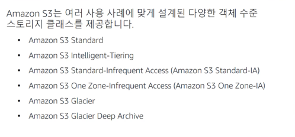  
Amazon S3는 여러 사용 사례에 맞게 설계된 다양한 객체 수준 스토리지 클래스를 제공한다.  
**Amazon S3 Standard** : 자주 액세스하는 데이터를 위한 고가용성, 높은 내구성 및 성능을 제공하도록 설계되어있다. 
Amazon S3 Standard는 짧은 지연 시간 및 높은 처리량을 제공하기 때문에 콘텐츠 배포 및 빅 데이터 분석과 같은 다양한 사용 사례에 적합하다.  
**Amazon S3 Standard-Infrequent Access** : 액세스 빈도가 낮지만 필요할 때 빠르게 액세스해야 하는 데이터를 위한 스토리지 클래스다. 
Standard의 탁월한 내구성, 높은 처리량 및 짧은 지연 시간을 저렴한 기가바이트당 스토리지 요금과 기가바이트당 검색 요금으로 제공하도록 설계되었다.
장기 스토리지 및 재해 복구 파일용 데이터 스토어에 적합하다.  
**Amazon S3 One Zone-Infrequent Access** : 액세스 빈도가 낮지만 필요할 때 빠르게 액세스해야 하는 데이터를 위한 스토리지 클래스다.  
최소 3개의 가용 영역에 데이터를 저장하는 다른 Amazon S3 스토리지 클래스와 다르게 Amazon S3 One Zone-Infrequent Access는 단일 가용 영역에 데이터를 저장한다.
그러므로 Standard-Infrequent Access보다 비용이 저렴하다. 보조 백업 사본을 저장하거나 이미지 카탈로그의 썸네일 버전과 같이 쉽게 재생성할 수 있는 데이터를 저장하기에 적합하다.  
**Amazon S3 Intelligent-Tiering** : 가장 비용 효과적인 액세스 계층으로 **데이터를 자동으로 이동하여** 비용을 최적화하도록 설계되었다.
Amazon S3는 소액의 객체별 월 요금으로 Amazon S3 Intelligent-Tiering에서 객체의 액세스 패턴을 모니터링하고 연속 30일 동안 액세스하지 않은 객체를 Infrequent-Access 계층으로 이동한다.
Infrequent-Access 계층의 객체에 액세스하면 이 객체는 자동으로 Standard Access 계층으로 다시 이동한다. 
Intelligent-Tiering 스토리지 클래스는 수명이 길고 액세스 패턴을 알 수 없거나 예측할 수 없는 데이터에 적합하다.  
**Amazon S3 Glacier** : 데이터 아카이빙을 위한 안전하고 내구력이 있으며 저렴한 스토리지 클래스다. Amazon S3 Glacier는 비용을 낮게 유지하는 동시에 변화하는 요구사항을 지원하기 위해 몇분에서 몇시간까지 소요되는 세 가지 검색 옵션을 제공한다.
Amazon S3 Glacier에 직접 객체를 업로드하거나 Amazon S3 수명 주기 정책을 사용하여 Amazon S3 스토리지와 Amazon S3 Glacier간에 데이터를 전송할 수 있다.  
**Amazon S3 Glacier Deep Archive** : 비용이 가장 저렴한 스토리지 클래스다. 일년에 한두번 액세스되는 데이터의 장기 보존 및 디지털 보존을 지원한다. 
규제가 엄격한 산업(금융, 의료 등)을 위해 설계되었다. 그 밖에도 백업 및 재해 복구 사용 사례에도 활용될 수 있다. 마그네틱 테이프 시스템 대신 사용할 수 있는 비용 효율적이고 관리하기 쉬운 대체 솔루션이다.  

## Amazon S3 버킷 URL
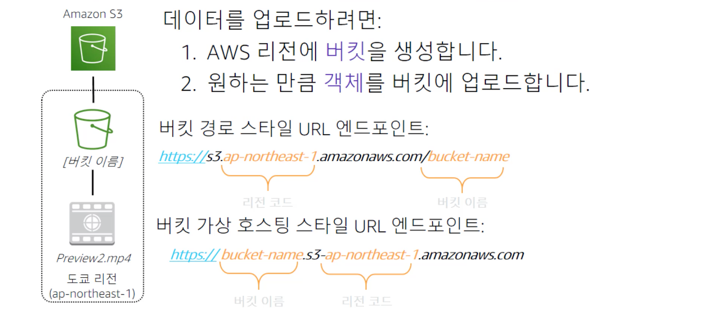  
S3 버킷에 대해 자세히 알아보자. 버킷은 객체를 위한 논리적 컨테이너이다. 계정에는 하나 이상의 버킷이 포함될 수 있다.
버킷의 객체를 생성, 삭제 및 나열할 수 있는 사용자는 고객이 제어한다. 고객은 버킷 및 객체에 대한 액세스 로그를 볼 수 있다.
또한 고객은 S3가 버킷과 버킷의 콘텐츠를 저장하는 지리적 리전을 선택할 수 있다. 이 예제에서는 Amazon S3를 사용하여 도쿄 리전에 버킷을 생성했다.
AWS 내에서 이 리전은 공식적으로 리전 코드 ap-northeast-1로 식별된다.  
경로 스타일 URL 엔드포인트는 일반적으로 객체에 액세스해야할 때 사용된다. 정적 데이터에 대한 웹 사이트로 사용할 때 사용된다.  
가상 호스팅 스타일 URL 엔드포인트는 버킷을 구조의 차이점에 유의하자. 이 예제에서 객체 Preview2.mp4는 버킷 내에 저장된다. 
파일의 URL에는 버킷 경로 스타일 엔드포인트의 끝에 객체 이름이 포함된다.

## 데이터가 리전에 중복으로 저장됨
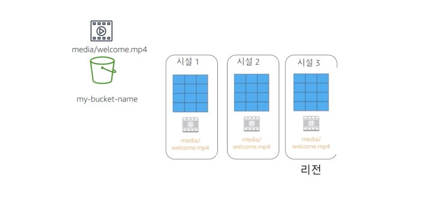  
Amazon S3에 버킷을 생성할 때 해당 버킷은 특정 AWS 리전에 연결된다. 
버킷에 데이터를 저장할 때 해당 데이터는 선택한 리전의 여러 AWS 시설에 중복 저장된다.
즉, 2개의 AWS 시설에서 동시에 데이터가 손실되는 경우에도 데이터가 안전하게 보호된다.  

## 원활한 확장을 고려한 설계
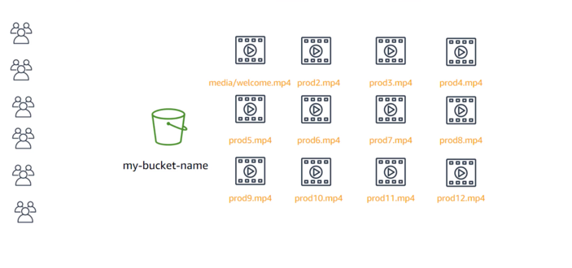  
Amazon S3는 데이터가 증가함에 따라 버킷의 스토리지를 자동으로 관리한다. 
스토리지나 처리량을 프로비저닝할 필요가 없으며 사용한 만큼만 비용이 부과된다.  

## 어디서나 데이터에 액세스
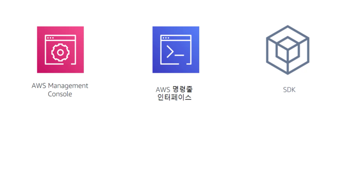  
콘솔, AWS Command Line Interface 또는 AWS SDK를 통해 Amazon S3에 액세스할 수 있다.
타사 백업 도구에서 버킷의 데이터에 직접 액세스할 수도 있다. 참고로, 이러한 유형의 액세스는 프로그래밍 방식의 액세스로 간주되며
타사 도구에 대한 키 페어를 프로비저닝해야 Amazon S3 서비스에 연결할 수 있다.  
HTTP 및 HTTP 액세스를 지원하는 엔드포인트는 글로벌로 고유해야 하며 DNS를 준수해야 한다.
즉, 버킷 이름은 모두 소문자여야 하며 문자, 숫자 및 대시의 조합만 포함해야 한다.  

## Amazon S3 일반 시나리오
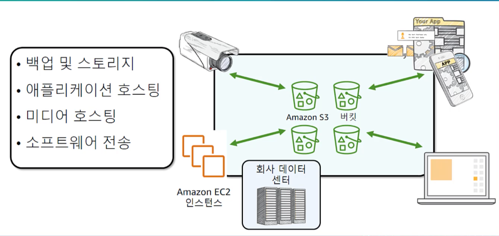  
사실상 무제한의 데이터를 저장하고 어디서나 해당 데이터에 액세스할 수 있는 유연성 덕분에 Amazon S3는 정적 웹 사이트 호스팅을 비롯한 다양한 시나리오에 적합하다.  
Amazon S3 버킷은 HTML, CSS, JS 및 기타 파일을 포함하여 웹 사이트의 정적 콘텐츠를 제공할 수 있다.  
S3의 가용성 및 재해 복구 기능을 강화하고 싶다면 교차 리전 복제를 지원하도록 구성하면 된다. 이렇게 하면 한 리전의 S3 버킷에 있는 데이터를 다른 S3 리전으로 자동 복제할 수 있다.

## Amazon S3 요금
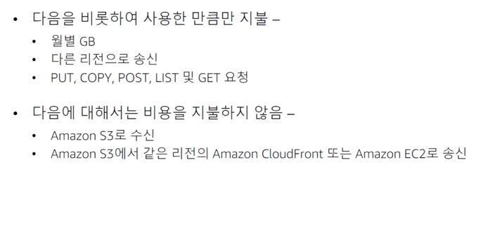  
S3의 요금은 리전과 수행한 특정 요청에 따라 달라진다. 
월별 기가바이트, 다른 리전으로 발신, PUT, COPY, POST, LIST 및 GET 요청을 비롯하여 사용한 한목에 대해서만 요금을 지불한다.
일반적으로 Amazon S3에서 수신하거나 S3에서 동일한 리전의 Amazon CloudFront 엣지 로케이션으로 발신한 데이터에는 요금이 부과되지 않는다.

## Amazon S3 : 스토리지 요금
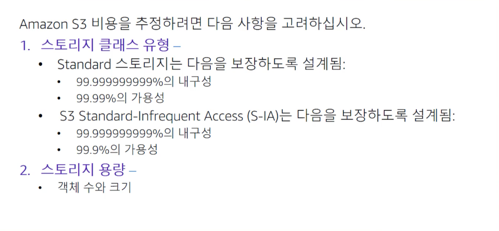  
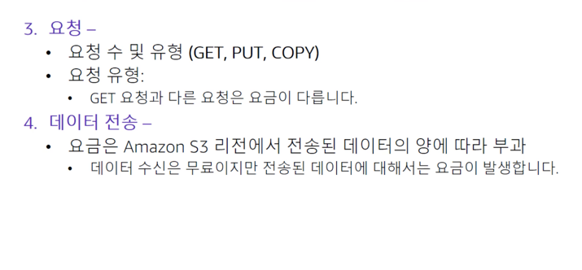  
스토리지 클래스 유형별로 요금이 다름, Amazon S3 버킷에 저장된 객체의 수와 크기에 따라 다름  
GET : 읽기 (버킷에 대한 쓰기 권한 필요)  
POST : 객체 추가 (버킷에 대한 쓰기 권한 필요)  
COPY : Amazon S3에 이미 저장된 객체의 복사본 (GET + POST 를 수행한 것과 같음)  
리전 밖으로만 전송되는 데이터에 대해 유료이다.

# Amazon Elastic File System (Amazon EFS)
# Amazon Simple Storage Service Glacier
