# Amazon Relational Database Service (Amazon RDS)
## 비관리형 서비스와 관리형 서비스 비교
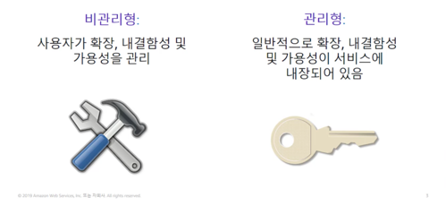  
AWS의 솔루션은 비관리형에 속하거나 관리형에 속한다.  
비관리형 서비스는 사용자가 지정하는 대로 개별적으로 프로비저닝된다. 
사용자는 서비스 소유자로써 **로드의 변화 오류 및 리소스를 사용할 수 없는 상황에서** 서비스의 응답 방법을 관리한다.
데이터베이스의 모든 부분을 제어하고 싶다면 Amazon EC2 인스턴스에 관계형 데이터베이스 관리 시스템(RDBMS)을 설치하면 된다.
이렇게 하면 사용자가 소유한 물리적 데이터 센터에서 데이터베이스를 실행하는 것과 매우 유사한 환경이 되는데 이것이 **비관리형 서비스**의 한 예이다.  
EC2 인스턴스에서 웹 서버를 시작했다고 가정해보자. Amazon EC2는 비관리형 솔루션이므로 크기 조정 솔루션을 사용하도록 지정하지 않는 한 웹 서버는 증가된 트래픽 로드를 처리하도록 확장되지도 않고 비정상 인스턴스를 정상 인슽언스로 대체하지도 않는다.
크기 조정 솔루션의 예로는 사용하는 Auto Scaling 서비스가 포함될 수 있다. 비관리형 서비스를 사용하는 데 따르는 이점은 솔루션에서 로드의 변화, 오류 및 리소스를 사용할 수 없게 되는 상황을 처리하는 방법을 더욱 **정교하게 제어**할 수 있다는 것이다.  
관리형 서비스를 위한 구성도 있다. 예를 들어 S3 버킷을 생성한 다음 버킷에 대한 권한을 설정할 수 있다. 그러나 관리형 서비스는 일반적으로 구성이 좀 더 간단하다. 
이제 독립적인 비관리형 관계형 데이터베이스를 실행할 때의 문제점을 살펴보자. 그런 다음 Amazon RDS가 이러한 문제를 어떻게 해결하는지 알아보자.  

## 관계형 데이터베이스의 문제점
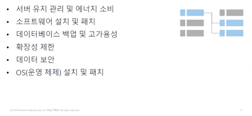  
자체 관계형 데이터베이스를 실행할 경우 서버 유지 관리, 에너지 소비, 소프트웨어, 설치 및 패치 적용, 데이터베이스 백업 등 여러 가지 관리 작업을 수행해야 한다.
또한 사용자는 고가용성을 보장하고 확장성, 데이터 보안, 운영 체제 설치 및 패치 적용을 계획할 책임이 있다. 이러한 모든 작업은 다른 업무에 투입해야 할 리로스를 소모하며 전문지식을 필요로 한다.  

## Amazon RDS
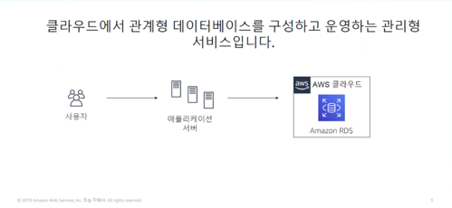  
비관리형, 독립형 관계형 데이터베이스를 실행할 때 문제점을 해결하기 위해 AWS는 지속적인 관리 없이 관계형 데이터베이스를 설정, 운영 및 확장하는 서비스인 RDS를 제공한다.
Amazon RDS를 사요하면 데이터 및 애플리케이션 최적화에 집중할 수 있다.  

## 관리형 서비스 책임
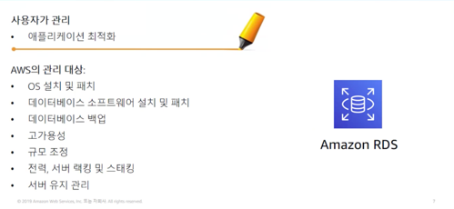  

## Amazon RDS DB 인스턴스
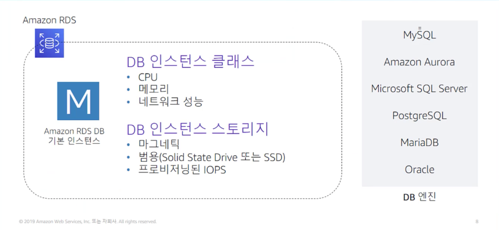  
Amazon RDS의 기본적인 구성 요소는 데이터베이스 인스턴스이다. 데이터베이스 인스턴스는 여러 사용자가 생성한 데이터베이스를 포함할 수 있는 **격리된 데이터베이스 환경**이다.
데이터베이스에는 독립 실행형 데이터베이스 인스턴스에서 사용하는 것과 동일한 도구 및 애플리케이션을 사용하여 액세스할 수 있다. 데이터베이스를 설정할 때 데이터베이스에 필요한 **인스턴스 클래스**와 **스토리지 유형**을 선택한다.
데이터베이스 인스턴스와 스토리지는 성능 특성과 가격에 있어서 다르다.  
데이터베이스 인스턴스를 생성하려면 실행할 **데이터베이스 엔진**을 지정해야 한다.  

## Virtual Private Cloud의 Amazon RDS
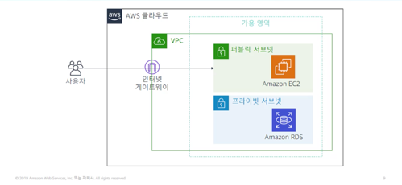  
RDS 구현을 구성하는 방법은 다양하다. 예를 들어 Amazon VPC에서 인스턴스를 실행할 수 있다.
VPC를 사용하면 가상 네트워크 환경을 완벽하게 제어할 수 있다. 자체 IP 주소 범위를 선택하고 서브넷을 생성하며 라우팅 및 액세스 제어 목록을 구성하여 데이터베이스에 대한 액세스를 제어할 수 있다.
Amazon RDS의 기본기능은 VPC에서 실행되는지 여부에 상관없이 동일하다. 일반적으로 **데이터베이스 인스턴스는 프라이빗 서브넷에 격리**되어 있으며 사용자가 선택한 애플리케이션에만 직접 액세스할 수 있다.  

## 다중 AZ 배포를 통한 고가용성
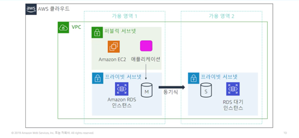
Amazon RDS의 가장 강력한 기능 중 하나는 **다중 AZ(Another Zone) 배포**를 사용하여 데이터베이스 인스턴스를 고가용성으로 구성할 수 있다는 것이다.
AZ 배포를 구성하기 위해 Amazon RDS가 동일한 VPC 내의 다른 가용 영역에 데이터베이스 인스턴스의 대기 복사본을 자동으로 생성한다. 
데이터베이스 복사본이 시드된 후에는 트랜잭션이 **대기 복사본으로 동기식으로 복제**된다.  
가용 영역 내에서 중단이 발생할 경우 데이터 인스턴스를 보호할 수 있다. 다중 AZ 배포에서 **기본 데이터베이스 인스턴스에 장애가 발생하면 Amazon RDS가 자동으로 대기 데이터베이스 인스턴스를 온라인 상태로 전환하여 새로운 기본 인스턴스로 만든다.**

## Amazon RDS 읽기 전용 복제본
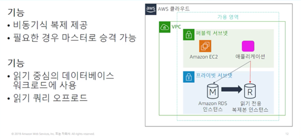  
Amazon RDS는 또한 MySQL, MariaDB, PstgreSQL 및 Amazon Aurora용 읽기 전용 복제본의 생성을 지원한다.
원보노 데이터베이스 인스턴스에 적용된 업데이트는 읽기 전용 복제본 인스턴스에 비동기식으로 복사된다. 
애플리케이션의 읽기 쿼리를 읽기 전용 복제본으로 라우팅하면 원본 데이터베이스 인스턴스에 대한 로드를 줄일 수 있다.  
읽기 작업 수가 많은 애플리케이션이 있는 경우 이 구성을 선택하는 것이 좋다. (뷰 같은 느낌..?)

## Amazon RDS가 적합한 사례
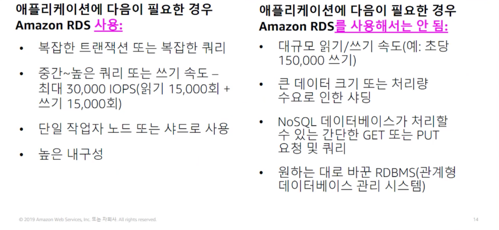

## Amazon RDS : 시간 단위 결제 및 데이터베이스 특성
  
Amazon RDS 비용을 추정할 때에는 **시간당 서비스 시간**을 고려하자. 이 서비스에서는 서비스가 실행된 시간을 기준으로 요금이 청구된다.
선택한 데이터베이스의 물리적 용량에 따라서도 부과되는 요금이 달라진다. 데이터베이스 엔진, 인스턴스 크기 및 메모리 클래스는 데이터베이스 RDS 인스턴스를 실행하는 비용에 영향을 미친다.

## Amazon RDS : DB 구매 유형 및 여러 DB 인스턴스
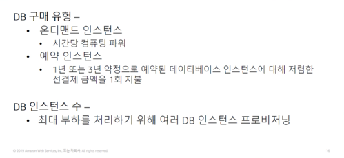  
데이터베이스 구매 유형도 비용에 영향을 미친다. 
온디맨드 인스턴스를 사용하는 경우에는 **데이터베이스 인스턴스가 실행되는 시간당 컴퓨팅 용량**에 대한 요금을 지불한다.
예약 인스턴스를 사용하면 1년 또는 3년 약정으로 예약하려는 각 데이터베이스 인스턴스에 대해 일회성 선결제 금액을 지불한다.
인스턴스 수 또한 비용에 영향을 미친다. 예를 들어 부하를 줄이기 위해 여러 데이터베이스 인스턴스를 프로비저닝할 수 있다.

## Amazon RDS : 스토리지
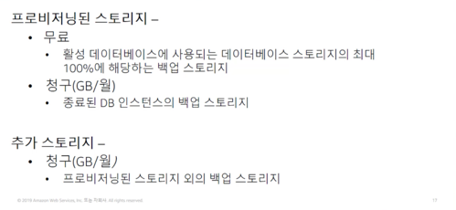  
최적의 스토리지를 구성하는 것도 비용에 영향을 미친다.
활성 데이터베이스 인스턴스에 대해 프로비저닝된 데이터베이스 스토리지의 최대 100% 까지는 백업 스토리지에 대한 추가 비용이 없다.
**데이터베이스 인스턴스가 종류된 후에는 백업 스토리지에 월별 GB당 요금이 청구된다.**

## Amazon RDS : 배포 유형 및 데이터 전송
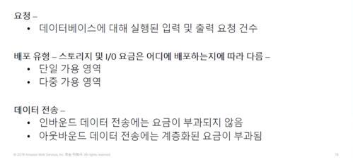  
마지막으로 데이터베이스에 수행할 입출력 요청 수와 데이터 전송을 고려해야 한다.
인바운드 데이터 전송은 무료이며 아웃바운드 데이터 전송 요금은 계층화되어 있다.
애플리케이션의 요구 사항에 따라 예약 인스턴스를 구매하면 비용을 최적화할 수 있다.

# Amazon DynamoDB
# Amazon Redshift
# Amazon Aurora
