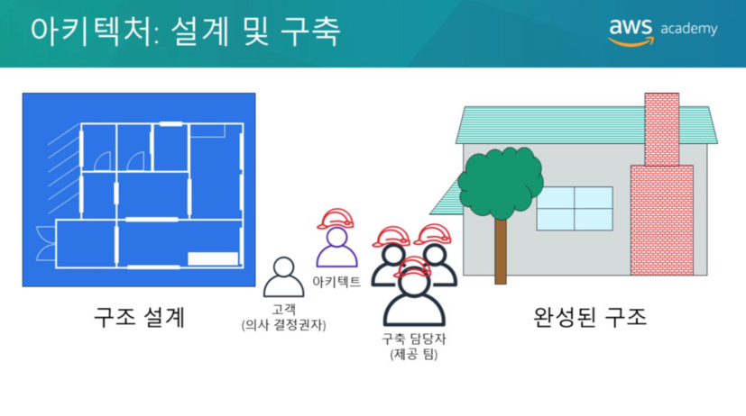
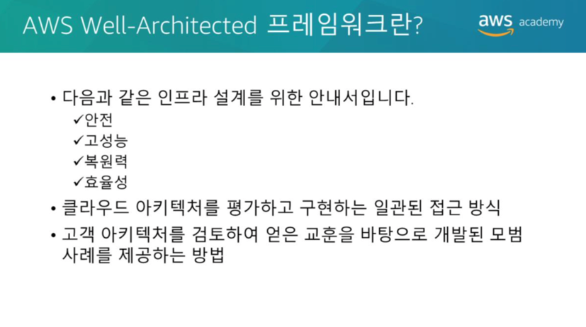
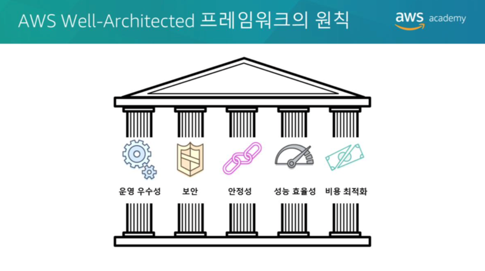
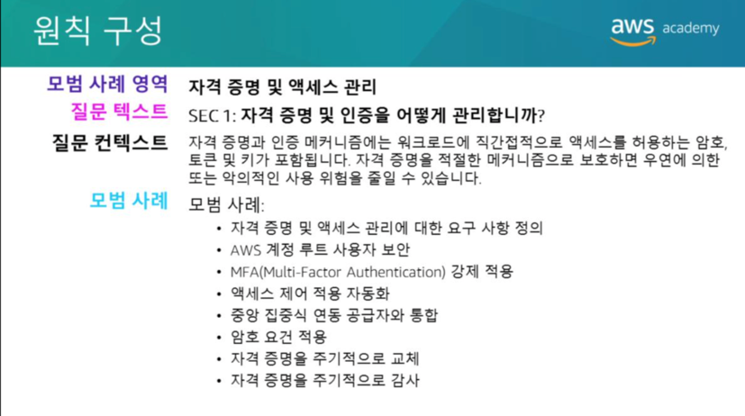
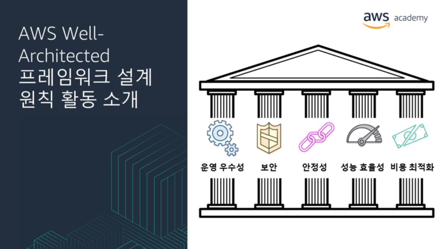
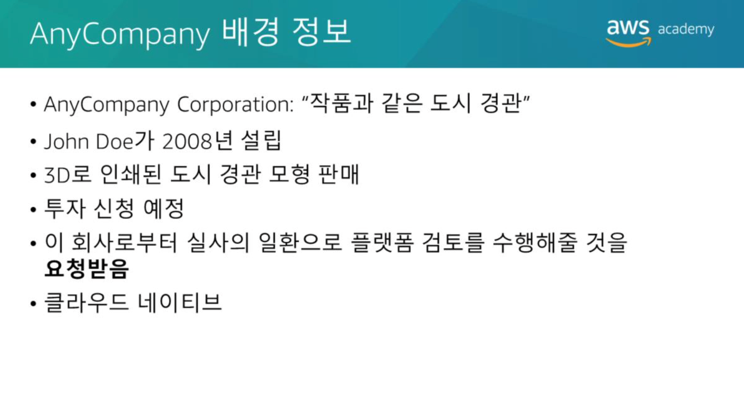
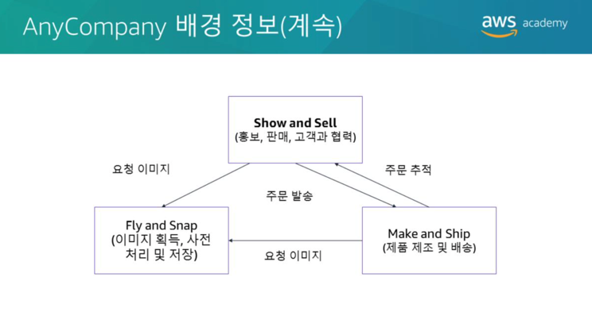
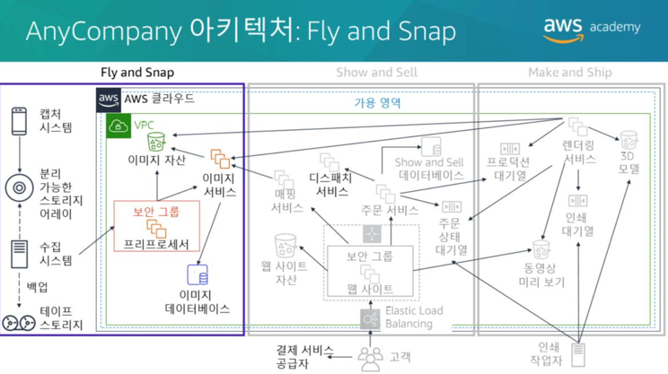

# Amazon Cloud Architecture
## AWS Well-Architected Framework
  
아키텍처는 큰 구조물을 설계하고 구축하는 예술이자 과학입니다. 
대규모 시스템의 아키텍트는 시스템의 규모와 복잡성을 관리해야 합니다. 
클라우드 아키텍트는 다음과 같은 일을 합니다.  
* 의사결정권자와 협력하여 비즈니스 목표와 개선이 필요한 기능을 식별합니다.
* 솔루션의 기술결과물이 비즈니스 목표와 일치하는지 확인합니다.
* 솔루션을 구현하는 제공팀과 협력하여 기술의 기능이 적절한지 확인합니다.   

Well-Architected 시스템을 갖추면 비즈니스 성공의 가능성이 크게 높아집니다.

  
AWS Well-Architected 프레임워크는 클라우드 애플리케이션 및 워크로드를 위한 최고수준의 보안, 고성능, 복원력 및 효율성을 갖춘 인프라를 구축하는데 도움이 되는 안내서입니다. 
이 프레임워크는 클라우드 아키텍처를 평가하고 구현하는데 도움이 될수 있는 기본적인 질문과 모범사례세트를 제공합니다. 
AWS는 수많은 고객의 AWS 기반 아키텍처를 검토한 끝에 Well-Architected 프레임워크를 개발했습니다.

  
AWS Well-Architected 프레임워크는 **운영우수성, 보안성, 안정성, 성능효율성, 비용최적화** 등 다섯가지 원칙으로 구성됩니다.

  
각 원칙에는 **설계원칙과 모범사례영역**이 포함되어 있습니다. 
기본질문세트는 각 모범사례영역에 있습니다. 
각 질문에는 약간의 컨텍스트와 모범사례목록이 제공됩니다.

  
이 모듈의 나머지 섹션에서는 각 원칙에 대한 AWS Well-Architected 프레임워크 설계원칙을 기준으로 가상회사의 아키텍처를 검토합니다. 

  
다음은 아키텍처를 검토할 회사의 배경입니다. 
AnyCompany Corporation은 2008년에 John Doe가 설립했습니다. 
이 회사는 주변의 개별건물과 나무를 보여주는 고급3D(3차원) 프린팅 도시경관모델을 판매합니다. 
도시경관은 컬러로 인쇄되며 벽돌, 지붕, 정원과 심지어 자동차까지 정확한 색으로 인쇄됩니다. 
이 회사는 IPO(기업공개) 전까지 성장자금을 지원하기 위한 민간투자를 신청하려고합니다. 
회장인 John과 이사회의 요청에 따라 여러분은 기술플랫폼을 독립적으로 검토하여 실사를 통과할 수 있는지 확인해야 합니다.
John은 처음부터 클라우드 컴퓨팅을 사용하는데 관심이 있었습니다. 
2008년에 AWS 계정을 만들고 Amazon Elastic Compute Cloud(Amazon EC2) 인스턴스를 처음으로 가동했습니다. 
AnyCompany 플랫폼의 아키텍처는 수년에 걸쳐 점진적으로 발전했습니다. 
이제 회사에서는 기술자 5명으로 구성된 팀이 조직의 모든 기술을 작성하고 운영합니다. 
동작에서 구조를 추출하는 핵심코드는 여전히 John이 작성하지만 나머지 팀원에게 AWS 계정 루트 사용자 자격증명을 주고 관리를 맡겼습니다.

  
AnyCompany Corporation에는 3개의 주요부서가 있습니다.
* Fly and Snap  
  - 이미지획득, 사전처리및저장 
    
* Show and Sell 
  - 홍보, 판매및고객지원 
    
* Make and Ship  
  – 제품제조 및 배송 
  
AnyCompany 플랫폼의 설계를 개괄적으로 보면 회사의 조직구조와 비슷합니다.

  
Fly and Snap  
경비행기에 탑재된 여러 디바이스(현재 카메라 및 비디오 카메라)가 지역의 명소를 비롯한 주요 도시의 이미지를 일정에 따라 캡처합니다. 
각 디바이스에서는 경비행기의 시계와 동기화된 시계로 타임스탬프가 기록된 이미지 자산이 생성됩니다. 
이미지 자산은 외부 스토리지 어레이가 있는 온보드 캡처머신으로 스트리밍됩니다. 
캡처머신은 경비행기의 비행시스템에 연결되며 GPS(글로벌 위치 확인 시스템) 데이터, 나침반 판독값 및 고도 같은 내비게이션 데이터를 지속적으로 캡처합니다.
기지로 돌아온 후에는 스토리지 어레이가 분리되고 수집베이로 들어갑니다. 
여기서 스토리지 어레이는 수집머신에 연결됩니다. 
수집머신은 스토리지 어레이의 압축아카이브를 생성하고 FTP(파일전송프로토콜)를 사용하여 EC2 인스턴스의 사전처리머신으로 아카이브를 전송합니다. 
스토리지어레이가처리된후아카이브는테이프에기록됩니다(백업용). 그런다음스토리지어레이가지워지고다음비행을위해준비됩니다. 테이프는타사백업공급자가오프사이트에보관합니다.사전처리머신은머신에업로드된새데이터세트를주기적으로처리합니다. 모든이미지자산을추출하여Amazon Simple Storage Service(Amazon S3)버킷에저장합니다. 이미지서비스에파일에대한알림을보내고비행정보를제공합니다. 이미지서비스는비행정보를사용하여모든비행시점의3D 방향및위치를계산한후이미지파일의타임스탬프에연결합니다. 이정보는Amazon S3에있는이미지자산에대한링크와함께Amazon EC2 기반의RDBMS(관계형데이터베이스관리시스템)에저장됩니다.
  