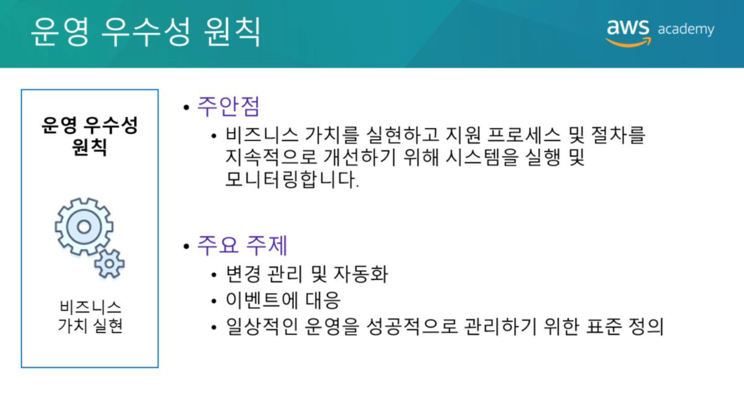
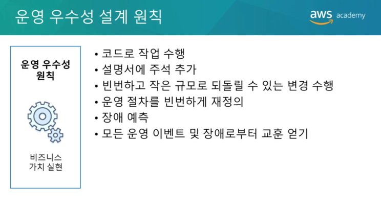
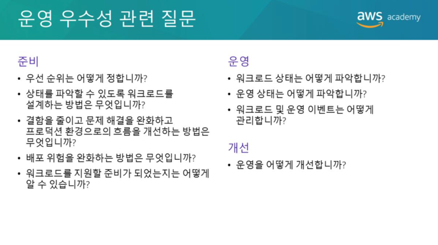
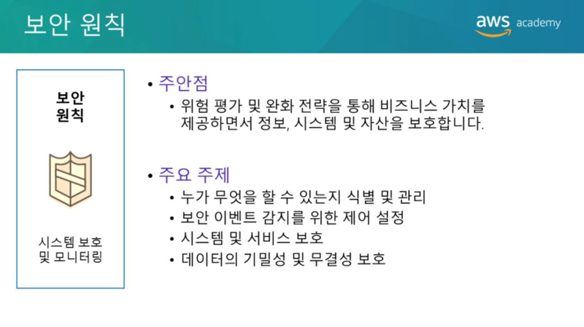
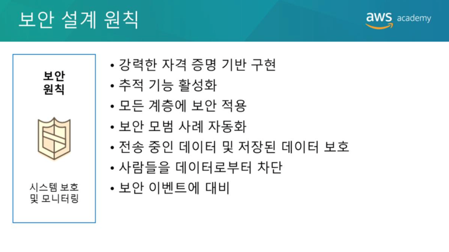
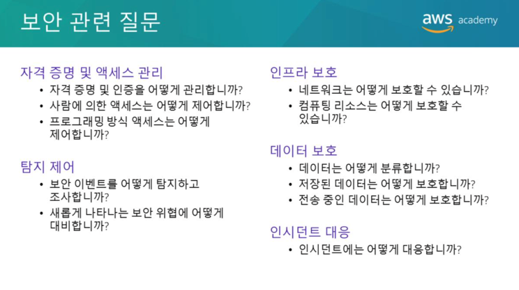

# Amazon Cloud Architecture
## AWS Well-Architected Framework
  
아키텍처는 큰 구조물을 설계하고 구축하는 예술이자 과학입니다. 
대규모 시스템의 아키텍트는 시스템의 규모와 복잡성을 관리해야 합니다. 
클라우드 아키텍트는 다음과 같은 일을 합니다.  
* 의사결정권자와 협력하여 비즈니스 목표와 개선이 필요한 기능을 식별합니다.
* 솔루션의 기술결과물이 비즈니스 목표와 일치하는지 확인합니다.
* 솔루션을 구현하는 제공팀과 협력하여 기술의 기능이 적절한지 확인합니다.   

Well-Architected 시스템을 갖추면 비즈니스 성공의 가능성이 크게 높아집니다.

  
AWS Well-Architected 프레임워크는 클라우드 애플리케이션 및 워크로드를 위한 최고수준의 보안, 고성능, 복원력 및 효율성을 갖춘 인프라를 구축하는데 도움이 되는 안내서입니다. 
이 프레임워크는 클라우드 아키텍처를 평가하고 구현하는데 도움이 될수 있는 기본적인 질문과 모범사례세트를 제공합니다. 
AWS는 수많은 고객의 AWS 기반 아키텍처를 검토한 끝에 Well-Architected 프레임워크를 개발했습니다.

  
AWS Well-Architected 프레임워크는 **운영우수성, 보안성, 안정성, 성능효율성, 비용최적화** 등 다섯가지 원칙으로 구성됩니다.

  
각 원칙에는 **설계원칙과 모범사례영역**이 포함되어 있습니다. 
기본질문세트는 각 모범사례영역에 있습니다. 
각 질문에는 약간의 컨텍스트와 모범사례목록이 제공됩니다.

  
이 모듈의 나머지 섹션에서는 각 원칙에 대한 AWS Well-Architected 프레임워크 설계원칙을 기준으로 가상회사의 아키텍처를 검토합니다. 

  
다음은 아키텍처를 검토할 회사의 배경입니다. 
AnyCompany Corporation은 2008년에 John Doe가 설립했습니다. 
이 회사는 주변의 개별건물과 나무를 보여주는 고급3D(3차원) 프린팅 도시경관모델을 판매합니다. 
도시경관은 컬러로 인쇄되며 벽돌, 지붕, 정원과 심지어 자동차까지 정확한 색으로 인쇄됩니다. 
이 회사는 IPO(기업공개) 전까지 성장자금을 지원하기 위한 민간투자를 신청하려고합니다. 
회장인 John과 이사회의 요청에 따라 여러분은 기술플랫폼을 독립적으로 검토하여 실사를 통과할 수 있는지 확인해야 합니다.
John은 처음부터 클라우드 컴퓨팅을 사용하는데 관심이 있었습니다. 
2008년에 AWS 계정을 만들고 Amazon Elastic Compute Cloud(Amazon EC2) 인스턴스를 처음으로 가동했습니다. 
AnyCompany 플랫폼의 아키텍처는 수년에 걸쳐 점진적으로 발전했습니다. 
이제 회사에서는 기술자 5명으로 구성된 팀이 조직의 모든 기술을 작성하고 운영합니다. 
동작에서 구조를 추출하는 핵심코드는 여전히 John이 작성하지만 나머지 팀원에게 AWS 계정 루트 사용자 자격증명을 주고 관리를 맡겼습니다.

  
AnyCompany Corporation에는 3개의 주요부서가 있습니다.
* Fly and Snap  
  - 이미지획득, 사전처리및저장 
    
* Show and Sell 
  - 홍보, 판매및고객지원 
    
* Make and Ship  
  – 제품제조 및 배송 
  
AnyCompany 플랫폼의 설계를 개괄적으로 보면 회사의 조직구조와 비슷합니다.

  
Fly and Snap  
경비행기에 탑재된 여러 디바이스(현재 카메라 및 비디오 카메라)가 지역의 명소를 비롯한 주요 도시의 이미지를 일정에 따라 캡처합니다. 
각 디바이스에서는 경비행기의 시계와 동기화된 시계로 타임스탬프가 기록된 이미지 자산이 생성됩니다. 
이미지 자산은 외부 스토리지 어레이가 있는 온보드 캡처머신으로 스트리밍됩니다. 
캡처머신은 경비행기의 비행시스템에 연결되며 GPS(글로벌 위치 확인 시스템) 데이터, 나침반 판독값 및 고도 같은 내비게이션 데이터를 지속적으로 캡처합니다.
기지로 돌아온 후에는 스토리지 어레이가 분리되고 수집베이로 들어갑니다. 
여기서 스토리지 어레이는 수집머신에 연결됩니다. 
수집머신은 스토리지 어레이의 압축아카이브를 생성하고 FTP(파일전송프로토콜)를 사용하여 EC2 인스턴스의 사전처리머신으로 아카이브를 전송합니다. 
스토리지어레이가처리된후아카이브는테이프에기록됩니다(백업용). 그런다음스토리지어레이가지워지고다음비행을위해준비됩니다. 테이프는타사백업공급자가오프사이트에보관합니다.사전처리머신은머신에업로드된새데이터세트를주기적으로처리합니다. 모든이미지자산을추출하여Amazon Simple Storage Service(Amazon S3)버킷에저장합니다. 이미지서비스에파일에대한알림을보내고비행정보를제공합니다. 이미지서비스는비행정보를사용하여모든비행시점의3D 방향및위치를계산한후이미지파일의타임스탬프에연결합니다. 이정보는Amazon S3에있는이미지자산에대한링크와함께Amazon EC2 기반의RDBMS(관계형데이터베이스관리시스템)에저장됩니다.
  ..(정리)

  
운영 우수성 원칙에는 비즈니스 가치를 실현하고 지원 프로세스 및 절차를 지속적으로 개선하기 위해 시스템을 실행 및 모니터링 하는 기능이 포함됩니다. 
변경 관리 및 자동화, 이벤트 응답, 일일 운영 관리를 위한 표준 정의와 같은 주제를 주로 다룹니다.

  
클라우드에서 운영 우수성을 달성할 수 있는 6가지 설계원칙은 다음과 같습니다.
* 코드로 작업수행  
  – 전체 워크로드(즉, 애플리케이션 및 인프라)를 코드로 정의하고 코드로 업데이트 합니다. 
  작업절차를 코드로 구현하고 이벤트에 대한 응답으로 자동 트리거 되도록 구성합니다. 
  코드로 작업을 수행하면 인적오류를 제한하고 이벤트에 일관되게 응답할 수 있습니다.
  
* 설명서 주석달기  
  – 빌드가 나올때 마다 주석이 추가된 설명서를 자동으로 생성합니다. 
  주석이 추가된 시스템은 사람과 시스템이 사용할 수 있습니다. 
  주석을 작업코드에 대한 입력으로 사용할 수 있습니다.
  
* 작은 규모의 취소 가능한 변경을 빈번하게 수행  
  – 구성요소의 주기적 업데이트가 가능하도록 워크로드를 설계합니다. 
  실패할 경우 되돌릴 수 있는 작은 단위로 변경을 수행합니다(가능한 경우 고객에게 영향을 주지않아야함).
  
* 작업 절차를 자주 개선  
  – 작업 절차를 개선할 수 있는 기회를 찾습니다. 
  워크로드 변화에 따라 절차를 적절히 변경합니다. 
  정기적인 게임 데이를 설정하여 모든 절차를 검토하고, 절차의 효과를 검증하며, 팀이 절차를 제대로 숙지하고 있는지 확인합니다.
  
* 실패예상  
  – 가능한 실패 원인을 식별하여 사전에 제거하거나 완화합니다. 
  실패 시나리오를 테스트하고 각 시나리오의 영향을 이해하고 있는지 확인합니다. 
  대응절차를 테스트하여 절차가 효과적이고 팀이 제대로 이행할 수 있는지 확인합니다. 
  정기적인 게임 데이를 설정하여 워크로드를 테스트하고 시뮬레이션된 이벤트에 대한 팀의 대응을 테스트합니다.
  
* 모든 운영 실패를 교훈으로 삼기  
  – 모든 운영 이벤트 및 실패에서 얻은 교훈을 통해 개선을 주도합니다. 
  배운 내용을 팀과 전체 조직에서 공유합니다.
  
  
운영 우수성에 대한 기본적인 질문은 **준비, 운영 및 개선**이라는 3가지 모범사례영역과 관련됩니다. 
운영팀에서 효과적이고 효율적으로 비즈니스 결과를 지원하려면 비즈니스 및 고객의 요구를 이해해야 합니다. 
운영팀은 운영 이벤트에 대응하는 절차를 만들고 사용하며 절차가 효과적으로 비즈니스 요구사항을 지원하는지 검증합니다. 
운영팀은 원하는 비즈니스 결과의 달성여부를 측정하는데 사용할 지표를 수집합니다. 
비즈니스 상황, 비즈니스 우선순위 및 고객의 요구사항은 시간에 따라 달라집니다. 
따라서 변화에 따라 개선이 가능한 운영절차를 설계하고 절차를 수행한 후 얻은 교훈을 절차에 포함하는 것이 중요합니다.

  
보안 원칙에서는 정보, 시스템 및 자산을 보호하면서 위험평가 및 완화 전략을 통해 비즈니스 가치를 실현하는 역량에 중점을 둡니다.
데이터의 기밀성 및 무결성 보호, 사용자가 수행할 수 있는 작업 식별 및 관리(또는권한관리), 시스템 보호 및 보안 이벤트 탐지 제어 설정과 같은 주제를 주로 다룹니다.

  
보안을 강화할 수 있는 7가지 설계 원칙은 다음과 같습니다.
* 자격 증명을 위한 강력한 기반 구현  
  – 최소 권한의 원칙을 구현하고 직무분리를 시행합니다. 
  AWS 리소스와의 모든 상호작용에 적절한 권한을 부여합니다. 
  권한 관리를 중앙 집중화하여 장기 자격 증명에 대한 의존을 줄이거나 제거합니다.
  
* 추적 기능 활성화  
  – 환경에서 수행되는 작업과 변경사항에 대한 실시간 모니터링, 알림 및 감사기능을 사용합니다. 
  로그와 지표를 시스템에 통합하여 자동으로 대응하고 조치를 취합니다.
  
* 모든 계층에서 보안 적용  
  – 심층 방어를 적용하고 아키텍처의 모든계층(예: 엣지 네트워크, 가상 프라이빗 클라우드, 서브넷 및 로드밸런서, 모든 인스턴스, 운영체제 및 애플리케이션)에 보안 제어를 적용합니다.
  
* 보안 모범 사례 자동화  
  – 보안 메커니즘을 자동화하여 확장 및 축소를 신속하고 경제적이며 안전하게 수행하는 기능을 개선합니다. 
  안전한 아키텍처를 생성하고, 버전이 관리되는 템플릿에서 코드로 정의되고 관리되는 제어기능을 구현합니다.
  
* 전송 데이터 및 유휴 데이터 보호  
  – 데이터를 민감도에 따라 분류하고 암호화, 토큰화 및 액세스 제어와 같은 메커니즘을 적절히 사용합니다.
  
* 데이터 액세스 차단  
  – 데이터에 직접 액세스 하거나 데이터를 수동으로 처리해야 하는 필요성을 줄이거나 이러한 필요를 없애는 메커니즘과 도구를 만듭니다.
  
* 보안 이벤트 대비  
  – 조직의 요구사항에 적합한 인시던트 관리 프로세스를 마련합니다. 
  인시던트 대응 시뮬레이션을 실행하고 자동화를 포함한 도구를 사용하여 탐지, 조사 및 복구속도를 높입니다.
  
  
보안에 대한 기본적인 질문은 **자격 증명 및 액세스 관리, 탐지 제어, 인프라 보호, 데이터 보호, 인시던트 대응**의 5가지 모범 사례 영역과 관련됩니다.
시스템을 설계하기 전에 보안사례를 설정해야 합니다. 
누가 무엇을 할 수 있는지 제어할 수 있어야 합니다. 
또한 보안 인시던트를 식별하고, 시스템과 서비스를 보호하며, 데이터 보호를 통해 데이터의 기밀성과 무결성을 유지할 수 있어야 합니다. 
올바르게 정의되고 시행되는 보안 인시던트 대응 프로세스가 있어야 합니다. 
이러한 도구와 기술은 재정적 손실을 방지하거나 규제의무를 준수하는 등의 목표를 지원한다는 점에서 중요한 역할을 합니다.

