# 컴퓨터 비전
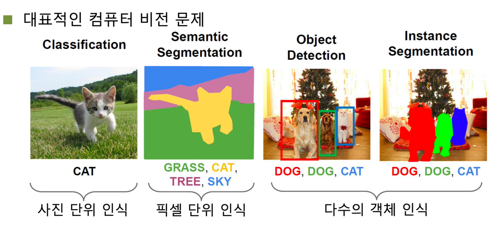  
* Classification  
  사진 한장으로부터 하나의 객체를 분류 및 인식하는 문제이다.
* Semantic Segmentation  
  Semantic Image Segmentation의 목적은 사진에 있는 **모든 픽셀을 해당하는 (미리 지정된 개수의) class로 분류**하는 것이다. 
  이미지에 있는 모든 픽셀에 대한 예측을 하는 것이기 때문에 dense prediction 이라고도 불린다. 
  여기서 주의해야하는 점은 semantic image segmentation은 같은 class의 instance 를 구별하지 않는다.
* Object Detection  
  Object Detection은 이미지로부터 다수의 인스턴스를 인식하고 해당 위치에 bounding box를 그린다.
  즉, 단순 classification뿐만 아니라 위치 정보도 포함하고 있다.
* Instance Segmentation  
  Semantic Segmentation은 모든 픽셀에 대해 클래스로써 분리할 뿐, 같은 같은 클래스에 속한 인스턴스에 대해서는 구분짓지 않는다.
  위 그림을 보면 같은 개(Dog)더라도 빨간색과 초록색으로 구분된 것을 확인할 수 있다.

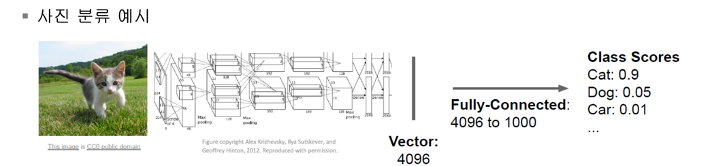  
위 그림은 AlexNet을 예시로 들었다. 이미지 한장에 대해 신경망을 거치고, 최종적으로 flatten과정을 통해 4096차원의 특징을 추출해냈다.
이 4096차원의 특징을 통해 1000개의 클래스별로 confidence score를 측정했다.  

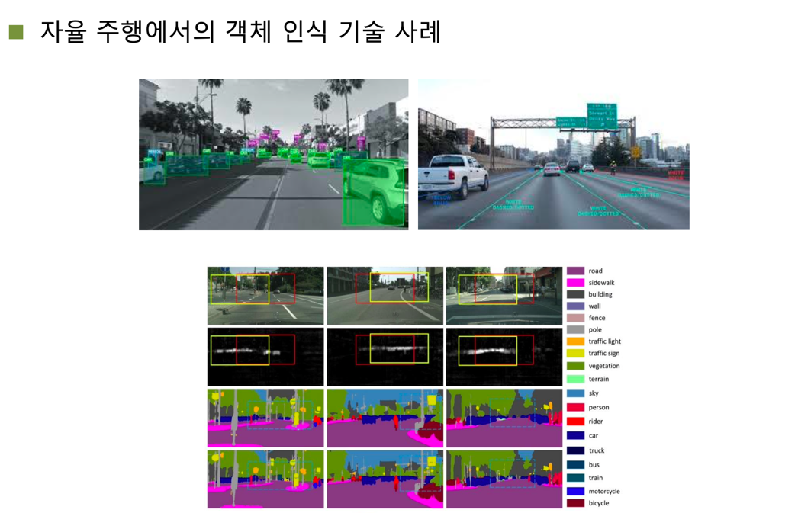  
위와 같은 비전 기술들은 자율 주행 기술에도 적용되고는 한다.  

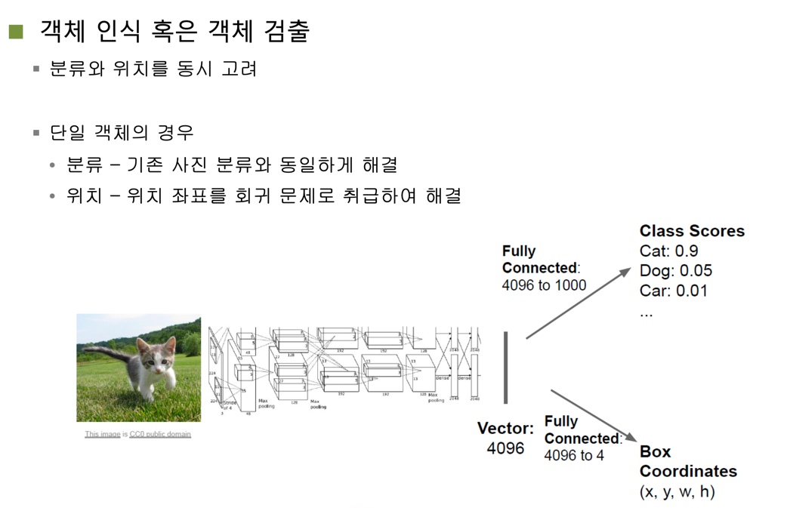  
위에서도 언급했듯이 Object Detection은 단순한 classification 뿐만 아니라 인스턴스의 위치정보도 고려해야 하기 때문에
Class Scores 이외에도 bounding box 좌표정보도 예측해야 한다.  

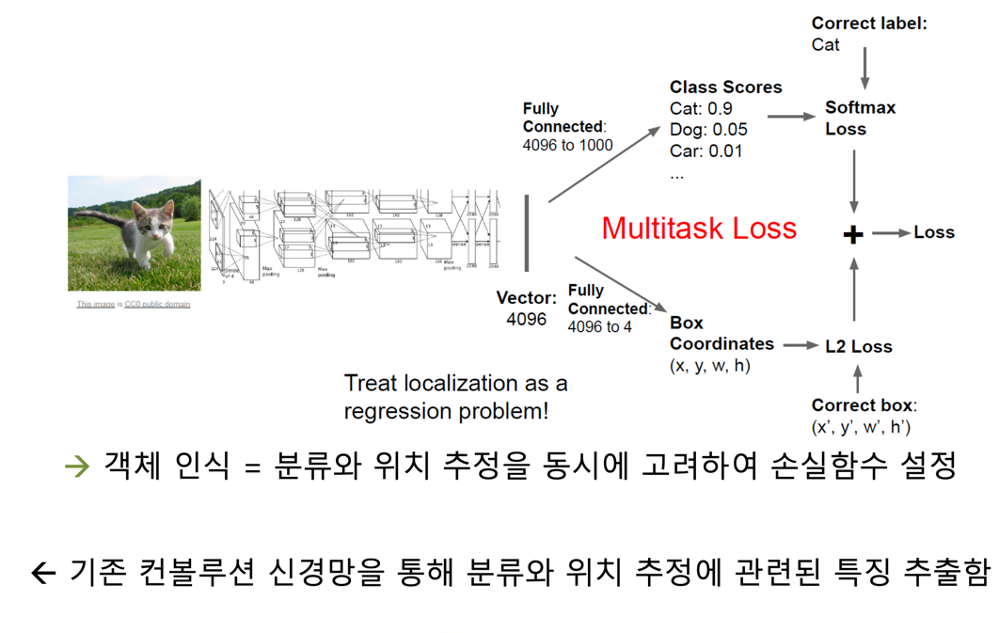  
Class Scores의 오차는 Softmax를 거쳐 나온 결과의 Cross-Entropy와 같은 손실함수를 적용한 것이고,
L2 Loss는 bounding box의 예측값과 실제값의 차이의 제곱의 합을 의미한다.  
참고 : https://mirae-kim.tistory.com/7  

Object Detection에서는 두 Loss function을 Multitask Loss라고 부르며 이를 최적화해나가는 방향으로 파라미터를 튜닝한다.  

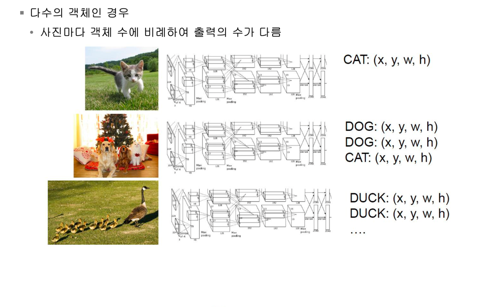  
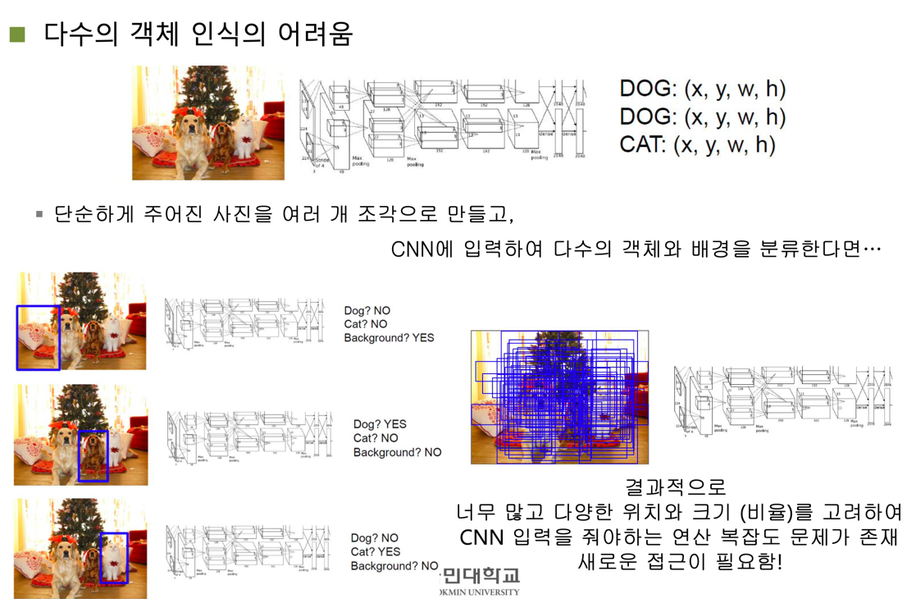  
그러나 다수의 객체를 인식하기 어려운 이유는 인스턴스에 걸리는 위치에 bounding box를 그리기 위해
사진의 영역들을 여러개로 분할하여 찾아야 하는데 일반적인 CNN의 경우 인스턴스의 위치를 고려하지 않고
무차별적으로 bounding box를 그려나가기 때문에 무한히 많은 경우의 수가 생기고 연산의 복잡도가 생긴다.  

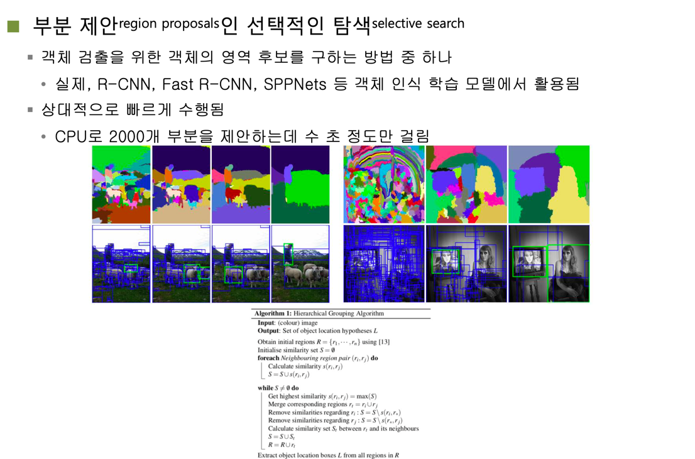  
그래서 무한히 많은 경우의 수를 유한하게 바꾸고자 인스턴스의 위치가 있을 만한 곳을 예측하여 제안하는
부분 제안(region proposals)인 선택적인 탐색(selective search) 방법이 적용되었다.
선택적으로 인스턴스를 탐색할 경우 무작정 모든 영역을 분할하여 보는게 아닌 선별하여 탐색하기 때문에
무수히 많은 경우는 생기지 않는다.  
선택적 탐색 알고리즘은 임의의 영역에 다른 색깔로 칠해놓은 다음 이들을 동일한 인스턴스라고 추정되는
영역들끼리 병합(merge)해나간다.

# R-CNN
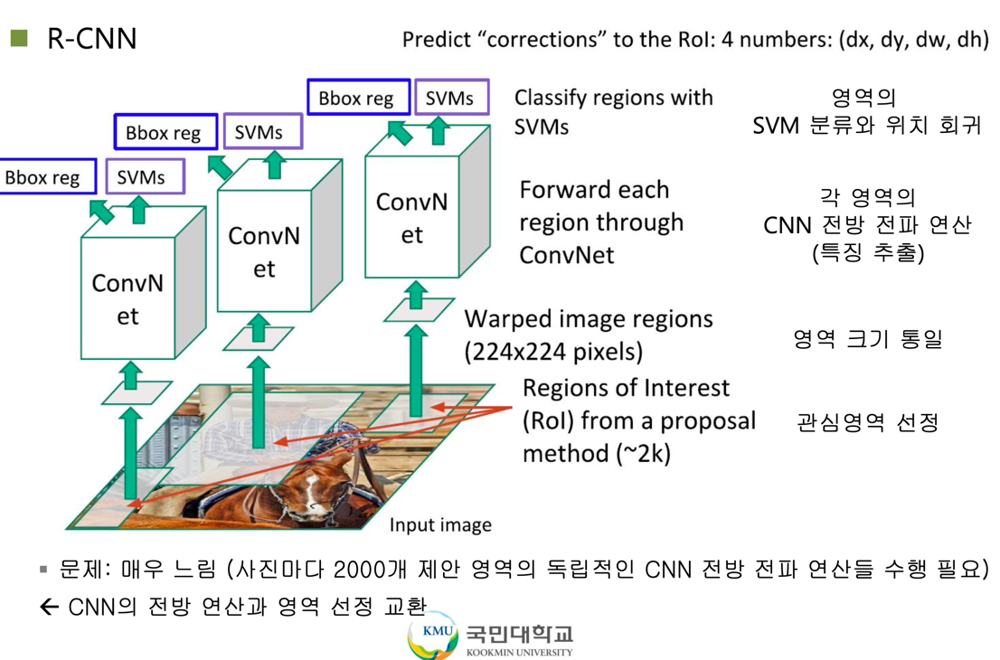  
선택적 탐색알고리즘을 통해 이미지의 관심영역(ROI, Region of Interest)를 추출한다.
그리고, ROI 풀링을 통해 관심영역을 백본 CNN 네트워크에 입력값으로써 동일한 크기를 갖도록 변형한다.
백본망을 거쳐서 나온 결과값은 Bbox reg(bounding box의 위치)와 SVMs(이미지 분류 결과)가 도출된다.

# Fast R-CNN
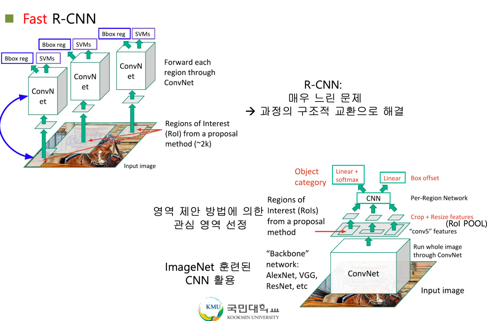  
R-CNN의 속도를 개선하기 위해 Fast R-CNN이 나왔다.
기존의 R-CNN은 각 관심영역별로 공통되는 레이어 마저도 각각 수행을 했다.
하지만, Fast R-CNN은 공통되는 CNN 백본망의 앞단 레이어를 한번만 수행하도록 묶었다.
그리하여 공통된 작업을 관심영역별로 반복하는 작업이 줄어들자 속도면에서 많은 개선을 할 수 있었다.  
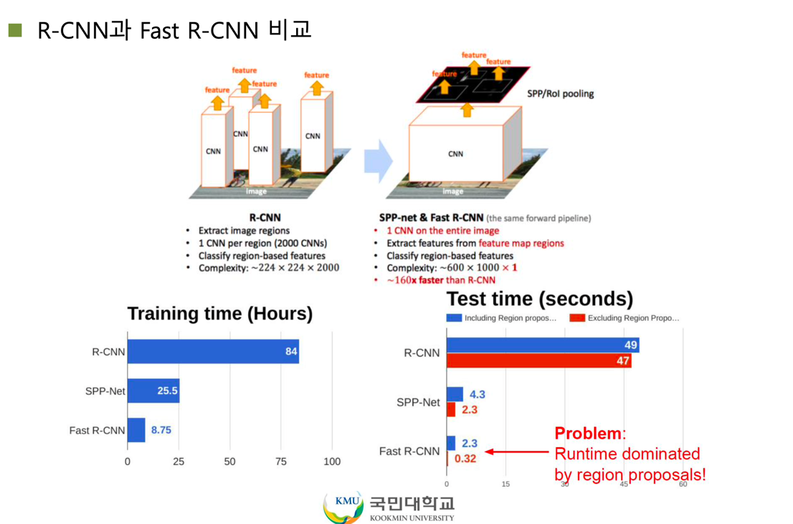

# Faster R-CNN
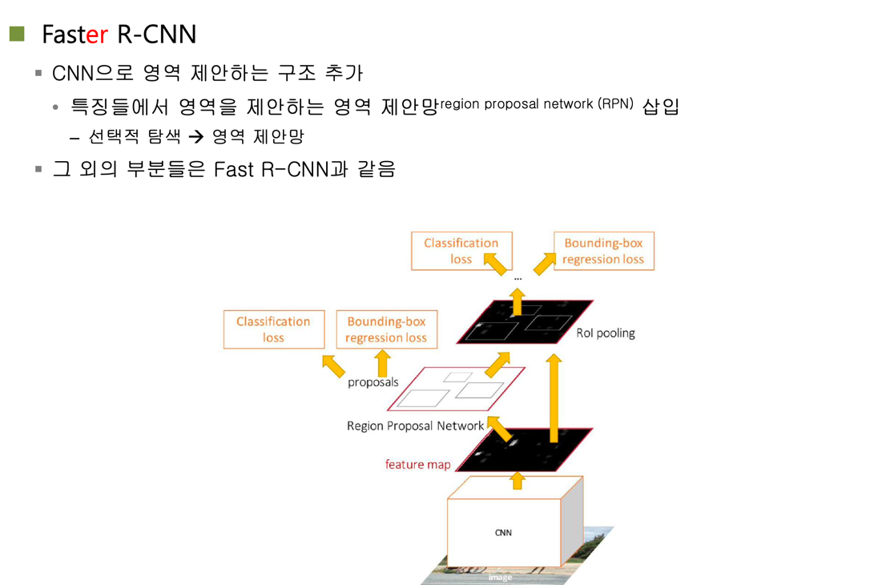  
물론 Fast R-CNN을 통해 관심영역을 추출해내는 것도 좋은 방법이지만, 여전히 2초라는 딜레이가 존재했다.
그래서 RPN(Region Proposal Network)을 따로 분류하여 관심영역을 추출하는 과정을 단축시켰다.
물론 RPN도 신경망이기 때문에 학습이 되었다는 전재하에서 이루어진다.

## Region Proposal Network
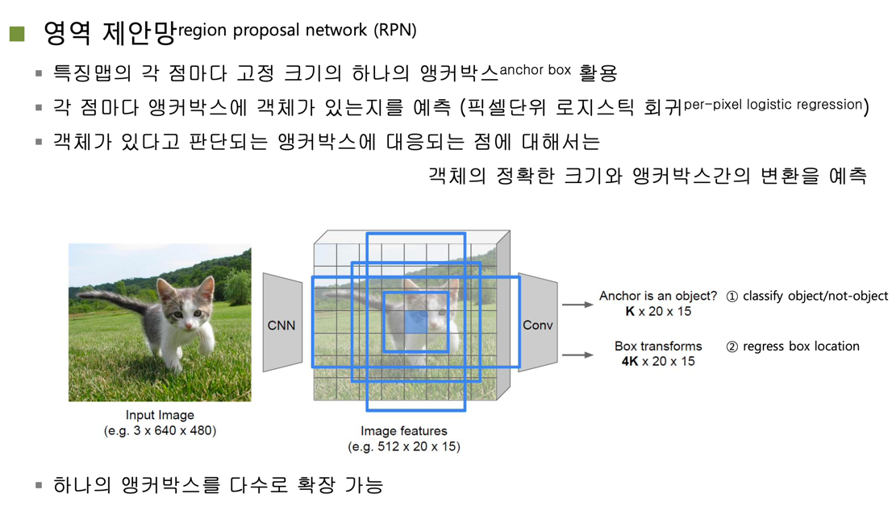
