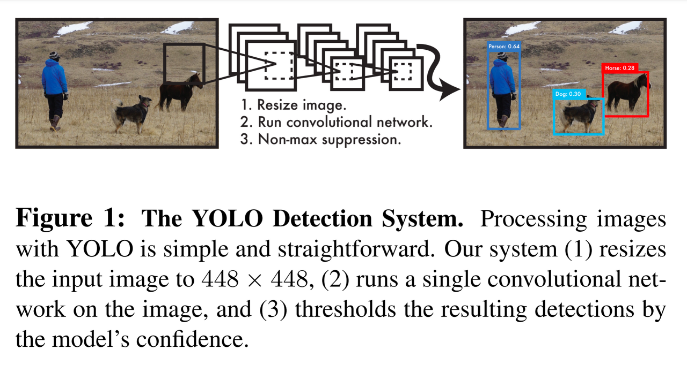

아래 두 모델은 기존 Faster R-CNN의 2스텝을 1스텝으로 변형한 모델들이다.
2스텝은 RPN을 통헤 영역을 제안하고, 클래스를 분류하는 단계를 의미한다.

# YOLO (You Only Look Once)  
(출처 : https://bkshin.tistory.com/entry/%EB%85%BC%EB%AC%B8-%EB%A6%AC%EB%B7%B0-YOLOYou-Only-Look-Once)  

* YOLO 연구진은 객체 검출(object detection)에 새로운 접근방식을 적용했습니다.
* 기존의 multi-task 문제를 **하나의 회귀(regression) 문제**로 재정의했습니다.
* YOLO는 이미지 전체에 대해서 하나의 신경망(a single neural network)이 **한 번의 계산만으로 bounding box와 클래스 확률(class probability)을 예측**합니다.  
-> bounding box란 객체의 위치를 알려주기 위해 객체의 둘레를 감싼 직사각형 박스를 말합니다. 클래스 확률이란 bounding box로 둘러싸인 객체가 어떤 클래스에 해당하는지에 관한 확률을 의미합니다.
* 객체 검출 파이프라인이 하나의 신경망으로 구성되어 있으므로 **end-to-end 형식**입니다.
* YOLO의 통합된 모델을 굉장히 빠릅니다. (1초에 45 프레임 처리, Fast YOLO는 1초에 155 프레임 처리)

## Introduction
YOLO 연구진은 객체 검출을 하나의 회귀 문제로 보고 절차를 개선했다.
이미지의 픽셀로부터 bounding box의 위치(coordinates), 클래스 확률(class probabilities)를 구하는 과정을 하나의 회귀로 재정의한 것이다.

1. **YOLO는 빠르다.**
  
   복잡한 검출 프로세스를 하나의 회귀 문제로 바꾸었다. 고로, 복잡한 파이프라인이 필요하지 않다.
   YOLO의 기본 네트워크는 Titan X GPU에서 배치 처리 없이 1초에 45 프레임을 처리한다.
   Fast YOLO에서는 1초에 150프레임까지 처리할 수 있다.  
   
2. **YOLO는 예측할 때 이미지 전체를 본다.**  
슬라이딩 윈도(sliding window)나 region proposal 방식과 달리, 훈련과 테스트 단계에서 이미지 전체를 본다.
   그리하여 클래스의 모양에 대한 정보 뿐만 아니라 **주변 정보까지 학습하여 처리**한다.
   반면, Fast R-CNN은 region proposal로 인해 제안된 영역만 보기 때문에 주변 정보까지는 처리하지 못한다.
   그래서 아무 물체가 없는 배경에 반점이나 노이즈가 있으면 그것을 물체로 인식한다. 이를 **background error**라고 한다.
   YOLO는 이미지 전체를 처리하기 때문에 background error가 Fast R-CNN비해 훨씬 적다. (대략 1/2)  
   
3. **YOLO는 물체의 일반적인 부분을 학습한다.**  
일반적인 부분을 학습하기 때문에 자연 이미지를 학습하여 그림 이미지로 테스트할 때, DPM(Deformable Parts Model)이나 R-CNN보다 성능이 뛰어나다.
   따라서 훈련 단계에서 보지 못한 새로운 이미지에 대해서도 더 강건(robust)하다.  
   하지만, 최신 객체 검출 모델에 비해 정확도가 다소 떨어진다. **속도와 정확성은 trade-off 관계**이다.
 
## Unified Detection
## Comparison to Other Detection Systems
## Experiments

# RetinaNet