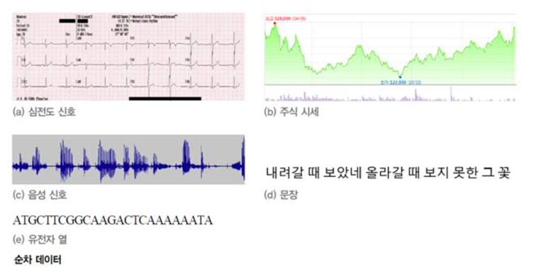
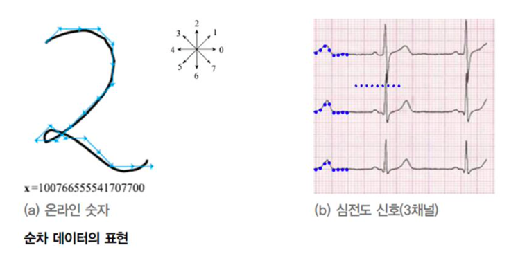
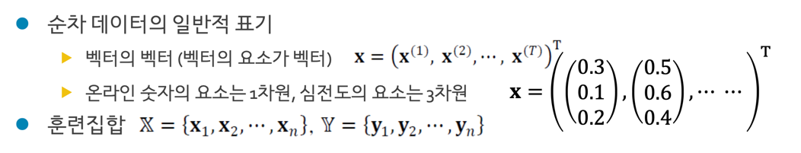
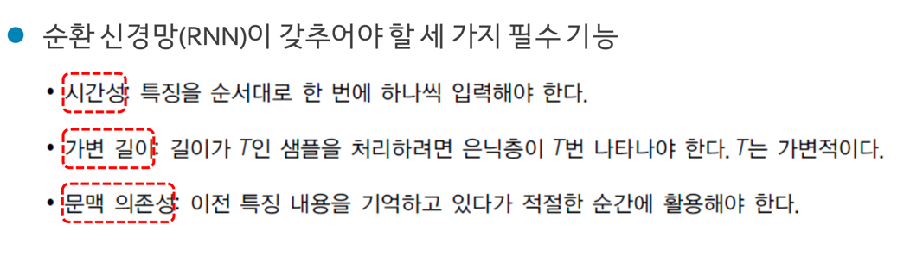
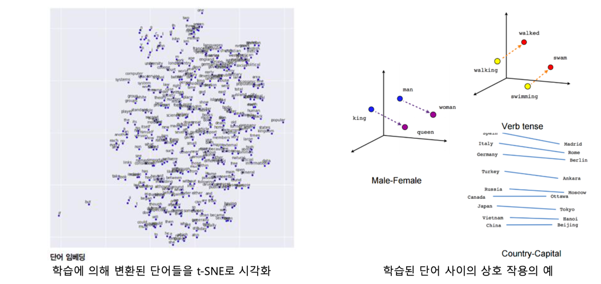

# 순환 신경망 (Recurrent Neural Network)
## 시간성 데이터 (time series data), 순차적 데이터 (sequential data)
이전까지 다룬 데이터들은 정적인 데이터고, 길이가 고정적이다. 반면에, 시간성 데이터는 동적이면서 길이가 가변적이다.
주로, 시간의 순서에 따라 나열된 데이터들을 의미한다.  

## 순차적 데이터 예시
  

## 순차적 데이터 표기
  
x는 순차적 데이터의 집합을 의미하며, 집합의 각 원소는 시간에 따라 순차적인 데이터 값을 나열한 것이다. 
해당 원소는 데이터의 차원수에 해당하는 데이터를 포함하고 있다. 그리고, 이들의 집합을 **전치**를 취한다.  
중요한 점은 **집합도 벡터를 의미하며, 집합의 원소들 또한 벡터라는 점이다.** (결국 벡터화를 해주어야 한다..)

## 순차적 데이터의 특징  
  

* **특징이 나타내는 순서가 중요**  
  예를 들어, "아빠가 방에 들어간다."라는 문장을 "아빠 가방에 들어간다."로 순서를 변형하면 의미가 크게 회손된다.

* **샘플마다 길이가 다름**  
  순환 신경망은 **은닉층에 순환 연결**을 부여하여 가변 길이 수용

* **문맥 의존성 (context dependency)**  
  비순차 데이터는 공분산이 특징 사이의 의존성을 나타냄. (지역성을 띄는 이미지같은 경우에는 한 시점의 서로 다른 요소들 사이에 영향이 공분산)  
  반면, 순차 데이터는 공분산이 의미가 없다. 대신 문맥 의존성이 중요하다. (현시점에서만 보면 서로 다른 요소가 관계를 띄는것 처럼 보일지 모르지만 이후의 시점에서는 서로 영향을 준다는 보장이 없음)  
  ex) “그녀는 점심때가 다 되어서야 .... 점심을 먹었는데, 철수는 ...”에서 “그녀는”과 “먹었는데”는 강한 문맥 의존성을 가짐  
  특히, 이 경우 둘 사이의 간격이 크므로 장기 의존성이라 부름 > LSTM 으로 처리

## Word Embedding
  
위에서 보았다시피, 순차적 데이터 또한 신경망에 학습시키려면 **벡터화**과정을 거쳐야 한다. 그래서 고차원의 단어들을 저차원의 공간으로 변환하는 과정을 의미한다.

## RNN(Recurrent Neural Network) 과 LSTM(Long-Short Term Memory)
순환 신경망은 주로 **시간성 정보**를 활용하여 순차 데이터를 처리하는 효과적인 학습 모델이다. 그러나, 데이터의 길이가 길어질수록
CNN의 Grandient Vanishing 현상처럼 RNN에서도 기억을 잃는 현상이 있다. 이를 보완한 모델이 LSTM이다.  

최근에는 순환 신경망을 생성 모델로 사용  
▪ 예, CNN과 LSTM이 협력하여 자연 영상에 주석 생성하는 문제를 해결
