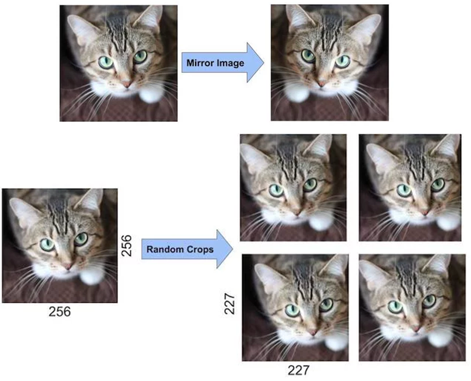

# AlexNet
AlexNet은 2012년에 개최된 **ILSVRC(ImageNet Large Scale Visual Recognition Challenge) 대회의 우승을 차지**한 컨볼루션 신경망(CNN) 구조이다. 
CNN의 부흥에 아주 큰 역할을 한 구조라고 말할 수 있다. AlexNet의 original 논문명은 "ImageNet Classification with Deep Convolutional Neural Networks"이다. 
이 논문의 첫번째 저자가 Alex Khrizevsky이기 때문에 그의 이름을 따서 AlexNet이라고 부른다. 

AlexNet의 기본구조의 특징은 **2개의 GPU로 병렬연산**을 수행하기 위해서 병렬적인 구조로 설계되었다는 점이 가장 큰 변화이다.  

## Overall structure
  
위 그림은 AlexNet의 구조도이다. **5개의 컨볼루션 레이어와 3개의 full-connected 레이어**로 구성되어 있다. 
두번째, 네번째, 다섯번째 컨볼루션 레이어들은 전 단계의 같은 채널의 특성맵들과만 연결되어 있는 반면, 
**세번째 컨볼루션 레이어는 전 단계의 두 채널의 특성맵들과 모두 연결되어 있다.**  

local response normalization는 수렴 속도를 높이기 위해 시행된다.

## Calculate feature map size
  
S : 보폭  
H : 이미지의 높이, P : Padding size, Fh = 필터의 높이  
W : 이미지의 너비, P : Padding size, Fw = 필터의 너비  
ex) ((55 + 2*1 - 5) / 2) + 1 = (52 / 2) + 1 = 26 + 1 = 27

## Activation function
AlexNet 이전에 사용되던 활성함수들은 하이퍼볼릭 탄젠트나 시그모이드와 같은 saturating nonlinearities가 사용되었는데
Rectified Linear Unit (ReLU)와 같은 non-saturating nonlinearity 활성함수를 사용하자 학습시간이 비약적으로 빨라졌다.

## Local response normalization (LRN)
신경생물학에서는 lateral inhibition 이라는 현상이 있다. 아래의 사진을 보자.  

검은 사각형을 보다보면 흰색 라인에 회색 점이 보이는 현상이 생긴다. (사람이라면) 이러한 현상을 말하는데,
이는 강한 신경세포의 신호가 인접한 신경세포들의 신호에도 영향을 주기 때문이다.
그래서 우리는 해당 커널(강한 신경세포에 대응)과 인접한 커널(주변의 약한 신경세포에 대응)들을 **정규화**시켜주어야 한다.  

  
이 수식은 LRN을 일반화한 것이다.  
* ai(x, y)는 i번째 커널의 (x, y)에 있는 가중치 값을 의미한다.  
* N은 커널의 수를 의미한다.  
* n은 i번째 커널에 인접한 커널의 수를 의미한다.  

여기서 시그마의 역할이 중요한데, (x, y)가 없다고 생각해보자. j는 **i번째의 인접한 n개의 커널의 범위를 의미하게 된다. (자기자신을 포함)**  
즉, **i번째 커널과 주변의 인접한 n-1개의 커널들의 (x, y)값을들 모아 정규화**하겠다는 의미이다.  

## Multiple GPUs
여러대의 GPU로 병렬처리를 하여 연산속도를 높였다.

## Overlapping pooling  
  
기존의 non-overlapping pooling 방식을 사용할 때는 stride를 커널이 겹치지 않도록 설정했다.
반면, AlexNet에서는 Overlapping max pooling을 진행했는데,
이는 특징을 더 세밀하게 보아 에러율이 낮아지는 장점은 있지만
그만큼 연산량이 늘어나는 단점이 있다.

## Dropout
  
AlextNet은 기존의 fully-connected 방식이 아닌 Dropout (일종의 규제 기술)을 사용하여
완전 연결된 퍼셉트론을 끊어내어 해당 퍼셉트론의 값을 0으로 치환했다. 이는 overfitting을 방지하는데 
효과가 있고, **테스트 시에는 다시 완전 연결상태로 진행한다.**

## Data argumentation
  
동일한 이미지들을 조금씩 변형시켜가며 학습하면 Overfitting을 방지하는 데 도움이 된다. 
Data Augmentation에는 이미지를 좌우 반전시키는 Mirroring 기법, 
이미지의 특정 부분을 무작위로 자르는 Random Crops 기법, 
RGB채널을 임의로 바꾸는 PCA Color Augmentation 기법 등이 있다. 
AlexNet을 만든 연구원들은 이러한 방법을 사용하여 데이터 양을 2048배로 늘렸다.

# VGGNet
VGGNet은 옥스포드 대학의 연구팀 VGG에 의해 개발된 모델로써, **2014년 이미지넷 이미지 인식 대회에서 준우승**을 한 모델이다. 
여기서 말하는 VGGNet은 16개 또는 19개의 레이어로 구성된 모델을 의미한다(VGG16, VGG19로 불림). 
AlexNet과 다른점이 있다면 **병렬적 구조로 이뤄지지 않았다.**  

## Depth
  
위 그림을 보면 알다시피 VGG 네트워크를 기점으로 **레이어의 깊이가 깊어질수록 에러율이 낮게 보이는 것**을 확인할 수 있다. 
이전까지는 8개의 레이어로 구성이 되었지만 VGG 네트워크부터는 16 혹은 19개의 레이어로 구성이 되고, GoogleNet은 22개, RestNet은 152개의 레이어로 구성이 되었다.

  
위 도표는 여러가지 구조를 토대로 실험한 것이다. A모델을 보면 11개의 레이어로 구성하였고,
A-LRN모델은 A모델에 LRN을 적용한 것이다. 하지만, 그닥 효과가 있지 않아서 레이어의 깊이를 늘려나가기 시작하자
에러율이 감소하였다.

## Number of weight
VGGNet의 구조를 깊이 들여다보기에 앞서 먼저 집고 넘어가야할 것이 있다. 
그것은 바로 3 x 3 필터로 두 차례 컨볼루션을 하는 것과 5 x 5 필터로 한 번 컨볼루션을 하는 것이 결과적으로 동일한 사이즈의 특성맵을 산출한다는 것이다(아래 그림 참고). 
3 x 3 필터로 세 차례 컨볼루션 하는 것은 7 x 7 필터로 한 번 컨볼루션 하는 것과 대응된다.

  

그러면 3 x 3 필터로 세 차례 컨볼루션을 하는 것이 7 x 7 필터로 한 번 컨볼루션하는 것보다 나은 점은 무엇일까? 
일단 가중치 또는 파라미터의 갯수의 차이다. 3 x 3 필터가 3개면 총 27개의 가중치를 갖는다. 
반면 7 x 7 필터는 49개의 가중치를 갖는다. CNN에서 가중치는 모두 훈련이 필요한 것들이므로, 가중치가 적다는 것은 그만큼 훈련시켜야할 것의 갯수가 작아진다. 따라서 학습의 속도가 빨라진다. 
동시에 층의 갯수가 늘어나면서 특성에 비선형성을 더 증가시키기 때문에 특성이 점점 더 유용해진다.  

-> 가중치의 수는 필터의 원소 수를 의미한다. (필터는 가중치의 집합이기 때문). 고로 3 x 3 필터(가중치 9개)로 3번의 컨볼루션 연산을 수행하면 27개((9개 * 3 = 27)의 가중치가 나온다.
반면, 7 x 7 필터는 한번밖에 사용하지 않았음에도 불구하고 필터의 변의 길이 제곱이므로 가중치의 수가 기하급수적으로 많아진다. 

## Overall structure
  

# GoogLeNet
GoogLeNet은 인셉션 모델이라고도 불린다.
인셉션 영화를 보면 마치 몽중몽을 꾸듯, GoogLeNet에서도 네트워크 안에 네트워크가 존재하는 **NIN**(Network in network)의 구조 때문이다.

## Background
2014년 당시, 딥러닝 모델은 일종의 한계에 다달았다. 
일반적으로, 네트워크의 성능을 향상시키는 직관적인 방법은 네트워크의 크기를 늘리는 것이었다. 
이 크기는 보통 넓이와 깊이를 의미하며, **넓이란 곧 노드의 갯수를 뜻한다. 즉 패러미터의 갯수**를 가리킨다. 
**깊이는 레이어의 계층 수**를 말한다.  

그러나 무작정 네트워크의 크기를 늘리는 것이 좋은 것은 아니다. 
**overfitting 현상**이 발생하거나 **컴퓨터의 리소스를 과다하게 점유**하거나 **gradient vanishing**과 같은 문제가 발생할 수도 있다.  

이러한 문제를 해결하기 위해 GoogLeNet 개발자는 **네트워크 구조에 대해 손을 보자**는 결론에 도달했다.

## Inception Module
  
GoogLeNet은 CNN과 다르게 **MLP(Convolution 연산 후 FC Layer 통과)의 개념**을 차용했다.
Convolution 연산 후에 풀링, 그 후에 FC Layer를 거치는 것을 하나의 모듈로 인식한다. 
이것이 하나의 전체적인 네트워크 구성과 유사하여, **Micro Network**라고도 부른다.

GoogLeNet에서는 MLP와 마찬가지로 **하나의 모듈로 완성되는 구조**를 만들고자 했다. 
잘 작동하는 하나의 모듈을 완성하게 되면, 네트워크는 단순히 모듈의 적층으로 구현될 수 있기 때문이다. 
때문에 이 모듈은 단일 구조로서 네트워크 학습을 이상적으로 구현할 수 있어야만 했습니다.

Serre는 < Robust object recognition with cortex-Like mechanisms >에서 뉴로사이언스의 영감을 받아 **복수 스케일의 Gabor filter**를 이용하여 네트워크를 구성했다. 
Gabor filter는 사물의 윤곽선을 추출하는 필터다. GoogLeNet에서는 **다양한 스케일의 필터를 활용하여 추상적인 정보를 인식**하고자 하는 점을 이용했다.

  
때문에 인셉션 모듈에서는 세 종류의 크기를 가진 필터가 사용되었다. 
1x1 Convolution filter는 input image의 공간적 정보를 비교적 잘 담아낼 수 있고, 
3x3과 5x5는 더 추상적이고 퍼져있는 정보를 보존한다.  
(커널의 크기가 넓어질수록 특징을 검출하는 범위가 넓어지기 때문)

# RestNet