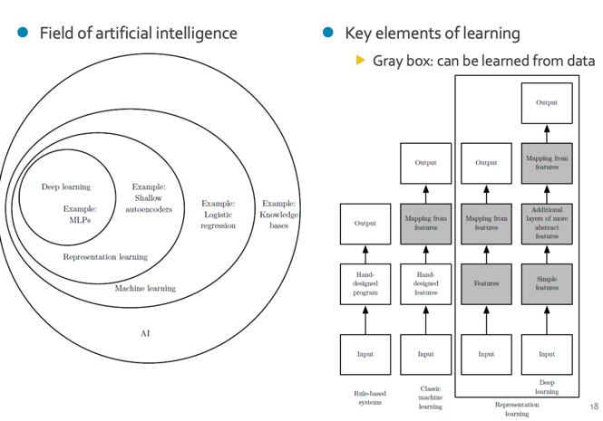
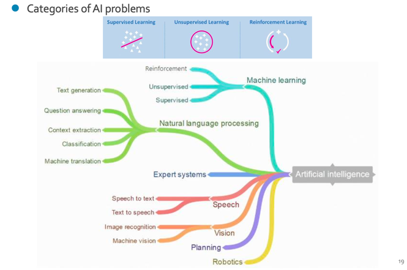
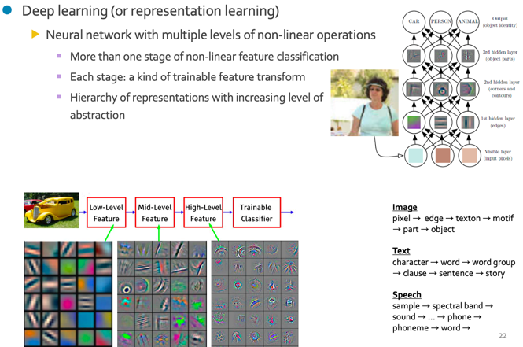
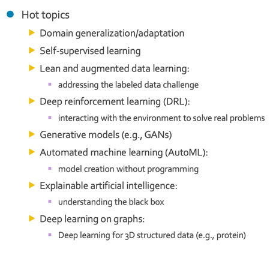
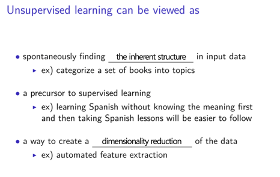
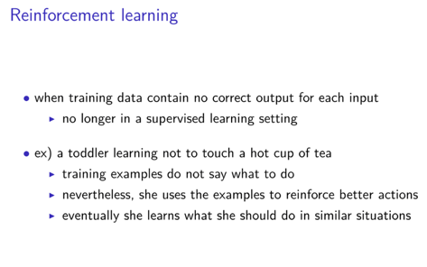
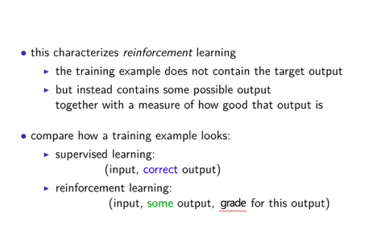
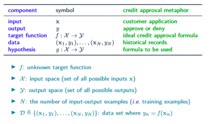

# AI (Artificial Intelligence : Definition)
the simulation of human intelligence processes by machines(computer system).  
인간의 지능을 컴퓨터시스템을 통해 시뮬레이션  

## Categorization
  
Machine learning은 크게 두 분류로 나눌 수 있다.  
1. Classic ML  
데이터의 특징(feature)를 사람이 손수 설계해줘야함.  
ex) SVM, Random Forest  
   
2. Representation Learning
데이터의 특징(feature)을 **시스템이 직접 도출**해낼 수 있음.  
Deep learning은 hidden layer를 통해 더 깊은 층으로 복잡한 target distribution을 도출해낼 수 있다.

## Categories of AI problem
  
* Supervised Learning  
학습 데이터의 라벨(정답)을 같이 학습시킨다. 주로 회귀(regression)나 분류(classification)문제를 해결하는데 적합하다.
  
* Unsupervised Learning  
라벨이 주어지지 않는다. 모델이 직접 데이터의 feature를 도출하여 clustering과 같은 과정을 겪어야 한다. 단점은 성능이 떨어진다는 점, 군집의 이름이 정해져 있지 않다.  
그러나 실제로 모든 데이터에 라벨링을 해주는 것은 불가능하므로 Self supervised learning이 연구되고 있는 추세이다.  
  참고 : https://velog.io/@tobigs-gm1/Self-Supervised-Learning
  
* Reinforcement Learning  
라벨이 주어진다. 하지만, 학습 방식에 Reward와 Punishment가 존재한다. 반복되는 학습을 통해 좋은 성과를 냈을 경우 Reward를 받는다.

## Deep learning
  
비선형연산 기반의 다중 뉴럴 네트워크. 레이어를 거듭할 수록 데이터의 특징(feature)를 조합하여 객체를 찾아나간다.  

## Hot topics

# Supervised learning
# Unsupervised learning
  
* approaches to unsupervised learning
- clustering(k-means, mixture models, hierarchical)
- hidden Markov models(HMMs)
- feature extraction(PCA, ICA, SVD)

# Reinforcement learning
  
  
상대적인 결과를 도출한다. 특정 상황에서는 A가 정답일 수 있지만, 다른 상황에서는 A가 정답이라는 보장이 없다. 
그래서 강화학습을 통해 상황에 따른 최선의 경우(그리디)를 학습한다.

# 표기 정리
  

# 참고
## 경사하강법 (Gradient Descent)
Loss function을 weight로 미분한 값은 w가 움직이는 양에 비례 혹은 반비례하게 L이 움직이는 값이다.