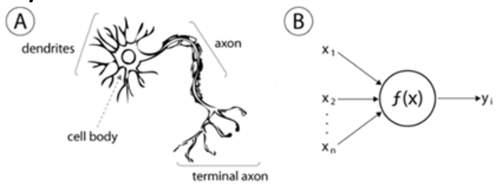
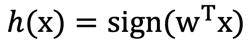
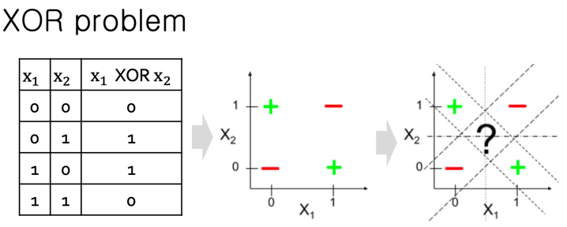
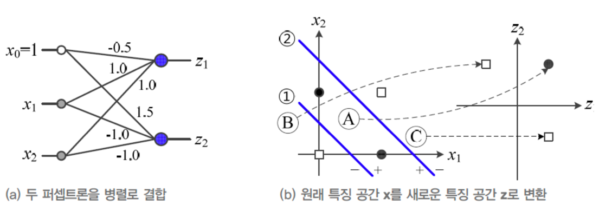

# AI (Artificial Intelligence : Definition)
the simulation of human intelligence processes by machines(computer system).  
인간의 지능을 컴퓨터시스템을 통해 시뮬레이션  

## Categorization
  
Machine learning은 크게 두 분류로 나눌 수 있다.  
1. Classic ML  
데이터의 특징(feature)를 사람이 손수 설계해줘야함.  
ex) SVM, Random Forest  
   
2. Representation Learning
데이터의 특징(feature)을 **시스템이 직접 도출**해낼 수 있음.  
Deep learning은 hidden layer를 통해 더 깊은 층으로 복잡한 target distribution을 도출해낼 수 있다.

## Categories of AI problem
  
* Supervised Learning  
학습 데이터의 라벨(정답)을 같이 학습시킨다. 주로 회귀(regression)나 분류(classification)문제를 해결하는데 적합하다.
  
* Unsupervised Learning  
라벨이 주어지지 않는다. 모델이 직접 데이터의 feature를 도출하여 clustering과 같은 과정을 겪어야 한다. 단점은 성능이 떨어진다는 점, 군집의 이름이 정해져 있지 않다.  
그러나 실제로 모든 데이터에 라벨링을 해주는 것은 불가능하므로 Self supervised learning이 연구되고 있는 추세이다.  
  참고 : https://velog.io/@tobigs-gm1/Self-Supervised-Learning
  
* Reinforcement Learning  
라벨이 주어진다. 하지만, 학습 방식에 Reward와 Punishment가 존재한다. 반복되는 학습을 통해 좋은 성과를 냈을 경우 Reward를 받는다.

## Deep learning
  
비선형연산 기반의 다중 뉴럴 네트워크. 레이어를 거듭할 수록 데이터의 특징(feature)를 조합하여 객체를 찾아나간다.  

## Hot topics

# Supervised learning
# Unsupervised learning
  
* approaches to unsupervised learning
- clustering(k-means, mixture models, hierarchical)
- hidden Markov models(HMMs)
- feature extraction(PCA, ICA, SVD)

# Reinforcement learning
  
  
상대적인 결과를 도출한다. 특정 상황에서는 A가 정답일 수 있지만, 다른 상황에서는 A가 정답이라는 보장이 없다. 
그래서 강화학습을 통해 상황에 따른 최선의 경우(그리디)를 학습한다.

# 표기 정리
  

# Perceptron
  
딥러닝의 발상은 인간의 두뇌를 모방하자 라는 아이디어에서 나왔다. 뇌는 신경세포(뉴런)의 집합으로써
뉴런을 programmable하게 대체하는 수단이 perceptron이다. perceptron은 linear transform과 non-linear transform의 조합이다.
linear transform은 가중치 matrix를 의미하고, non-linear transform은 activation function(sigmoid, ReLu, softmax ..)을 의미한다.  

  
가중치 matrix의 transpose와 inputs를 dot product(내적)을 수행한 값에 
비선형함수인 activation function의 parameter로 대입하면 activation function의 임계치가 넘어갈 경우 신호가 발생하는 구조이다.
이는 뉴런과 매우 흡사하다.  

여담으로 내적은 두 **벡터의 유사도**를 파악하는 것이다. 즉, x벡터를 w^T 벡터를 축으로 삼아 projection하여
x벡터가 w^T벡터와 유사한 정도를 파악하는 것이다.

# Multiple Layer Perceptron (MLP)
  
논리연산 XOR를 하나의 perceptron으로는 구현할 수 없다는 문제가 발생했다. 인간의 뇌도 그러하듯이
뉴런이 다수개로 뇌가 구성된다. 사람들은 perceptron을 병렬적으로 구성하여 이를 해결하고자 했다.
perceptron의 출력값을 매개로 새로은 perceptron의 input으로 대입하여 위와같은 문제를 해결했다.  

  
z1에 연결된 perceptron을 p1, z2에 연결된 perceptron을 p2라고 칭하겠다.  
p1은 OR 게이트 역할을 하여 (b)그림에서 1번 선형함수의 윗면적을 의미한다.  
p2는 NAND 게이트 역할을 하여 2번 선형함수의 아래면적을 의미한다.  
그리고 p1, p2의 AND 게이트를 할 경우 XOR를 구현할 수 있다.  

여기서 중요한점은 p1에 input에 대한 가중치 matrix는 (-0.5, 1.0, 1.0)
p2의 가중치 matrix는 (1.5, -1.0, -1.0)이다. 그리고 (b)그림을 보면 x1, x2축의 좌표계를
z1, z2축으로 변환하여 고차원의 데이터를 단순하게 추상화한 것이다. 여기서 불필요한 정보는 빠지기 마련이다.

# 참고
## 경사하강법 (Gradient Descent)
Loss function을 weight로 미분한 값은 w가 움직이는 양에 비례 혹은 반비례하게 L이 움직이는 값이다.